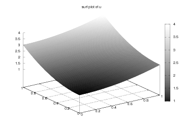

.. Automatically generated reST file from Doconce source 
   (http://code.google.com/p/doconce/)

A FEniCS Tutorial
=================

:Author: Hans Petter Langtangen

This document presents a FEniCS tutorial to get new users quickly up
and going with solving differential equations. FEniCS can be
programmed both in C++ and Python, but this tutorial focuses
exclusively on Python programming, since this is the simplest approach
to exploring FEniCS for beginners and since it actually gives
high performance. After having digested the examples in this tutorial,
the reader should be able to learn more from the FEniCS
documentation and from the demos and the FEniCS book *Automated
Scientific Computing*, edited by Logg, Mardal, and Wells.

.. _tut:fundamentals:

Fundamentals
============

FEniCS is a user-friendly tool for solving partial differential
equations (PDEs). The goal of this tutorial is get you started with
FEniCS through a series of
simple examples that demonstrate

  * how to define the PDE problem in terms of a variational problem

  * how to define simple domains

  * how to deal with Dirichlet, Neumann, and Robin conditions

  * how to deal with variable coefficients

  * how to deal with domains built of several materials (subdomains)

  * how to compute derived quantities like the flux vector field or
    a functional of the solution

  * how to quickly visualize the mesh, the solution, the flux, etc.

  * how to solve nonlinear PDEs in various ways

  * how to deal with time-dependent PDEs

  * how to set parameters governing solution methods for linear systems

  * how to create domains of more complex shape

The mathematics of the illustrations is kept simple to better focus
on FEniCS functionality and syntax. This means that we mostly use
the Poisson equation and the time-dependent diffusion equation
as model problems, often with input data adjusted such that we get
a very simple solution that can be exactly reproduced by any standard
finite element method over a uniform, structured mesh. This
latter property greatly enhances the verification of the implementations.
Occasionally we insert a physically more relevant example
to remind the reader that changing the PDE and boundary
conditions to something more real might often be a trivial task.

.. With the fundamentals explained, we move on to physically more
.. complicated problems, including systems of PDEs, and show how to build
.. more complete simulation codes.

FEniCS may seem to require a thorough understanding of the abstract
mathematical version of the finite element method as well as
familiarity with the Python programming language.  Nevertheless, it
turns out that many are able to pick up the fundamentals of finite
elements *and* Python programming as they go along with this
tutorial. Simply keep on reading and try out the examples. You will be
amazed of how easy it is to solve PDEs with FEniCS!

Reading this tutorial obviously requires access to a machine where the
FEniCS software is installed. The section :ref:`tut:app:install` explains
briefly how to install the necessary tools.

.. _tut:poisson1:bvp:

The Poisson equation
--------------------

.. index:: Poisson's equation

Our first example regards the Poisson problem,

.. math::

         
        - \nabla^2 u(\pmb{x}) &= f(\pmb{x}),\quad \pmb{x}\mbox{ in } \Omega, 
        \\
        u(\pmb{x}) &= u_0(\pmb{x}),\quad \pmb{x}\mbox{ on } \partial \Omega\thinspace . 
        
        

Here, :math:`u(\pmb{x})` is the unknown function, :math:`f(\pmb{x})` is a
prescribed function of space, :math:`\nabla^2` is the Laplace operator (also
often written as :math:`\Delta`), :math:`\Omega` is the spatial domain, and
:math:`\partial\Omega` is the boundary of :math:`\Omega`. A stationary PDE like
this, together with a complete set of boundary conditions, constitute
a *boundary-value problem*, which must be precisely stated before
it makes sense to start solving it with FEniCS.

In two space dimensions with coordinates :math:`x` and :math:`y`, we can write out
the Poisson equation in detail:

.. math::

        
        - {\partial^2 u\over\partial x^2} -
        {\partial^2 u\over\partial y^2} = f(x,y)\thinspace . 
        

The unknown :math:`u` is now a function of two variables, :math:`u(x,y)`, defined
over a two-dimensional domain :math:`\Omega`.

The Poisson equation arises in numerous physical contexts, including
heat conduction, electrostatics, diffusion of substances, twisting of
elastic rods, inviscid fluid flow, and water waves. Moreover, the
equation appears in numerical splitting strategies of more complicated
systems of PDEs, in particular the Navier-Stokes equations.

Solving a physical problem with FEniCS consists
of the following steps:

 1. Identify the PDE and its boundary conditions.

 2. Reformulate the PDE problem as a variational problem.

 3. Make a Python program where the formulas in the variational
    problem are coded, along with definitions of input data such as
    :math:`f`, :math:`u_0`, and a mesh for the spatial domain :math:`\Omega`.

 4. Add statements in the program for solving the variational
    problem, computing derived quantities such as :math:`\nabla u`, and
    visualizing the results.

We shall now go through steps 2--4 in detail.  The key feature of
FEniCS is that steps 3 and 4 result in fairly short code, while most
other software frameworks for PDEs require much more code and more
technically difficult programming.

.. _tut:poisson1:varform:

Variational Formulation
-----------------------

.. index:: variational formulation

FEniCS makes it easy to solve PDEs if finite elements are used for
discretization in space and the problem is expressed as a
*variational problem*. Readers who are not familiar with
variational problems will get a brief introduction to the topic in
this tutorial, but getting and reading
a proper book on the finite element method in addition is encouraged. The section :ref:`tut:appendix:books` contains a list of some suitable
books. 

.. index:: test function

.. index:: trial function

The core of the recipe for turning a PDE into a variational problem
is to multiply the PDE by a function :math:`v`, integrate the resulting
equation over :math:`\Omega`, and perform integration by parts of terms with
second-order derivatives. The function :math:`v` which multiplies the PDE
is in the mathematical finite element literature 
called a *test function*. The unknown function :math:`u` to be approximated
is referred to
as a *trial function*. The terms test and trial function are used
in FEniCS programs too.
Suitable
function spaces must be specified for the test and trial functions.
For standard PDEs arising in physics and mechanics such spaces are
well known.

In the present case, we first multiply the Poisson equation
by the test function :math:`v` and integrate,

.. math::

        
        
         -\int_\Omega (\Delta u)v dx = \int_\Omega fv dx\thinspace . 

Then we apply integration by parts to the integrand with
second-order derivatives,

.. math::

        
        
         -\int_\Omega (\Delta u)v dx
        = \int_\Omega\nabla u\cdot\nabla v dx - \int_{\partial\Omega}{\partial u\over
        \partial n}v ds ,
        

where :math:`{\partial u\over
\partial n}` is the derivative of :math:`u` in the outward normal direction at
the boundary.
The test function :math:`v` is required to vanish on the parts of the
boundary where :math:`u` is known, which in the present problem implies that
:math:`v=0` on the whole boundary :math:`\partial\Omega`.
The second term on the right-hand side of the last equation therefore
vanishes. It then follows that

.. math::

         \int_\Omega\nabla u\cdot\nabla v dx = \int_\Omega fv dx\thinspace . 
        
        

This equation is supposed to hold
for all :math:`v` in some function space :math:`\hat V`. The trial function :math:`u`
lies in some (possibly different) function space :math:`V`.
We say that the last equation is the *weak form* of the original
boundary value problem consisting of the PDE :math:`-\nabla^2u=f` and the
boundary condition :math:`u=u_0`.

The proper statement of
our variational problem now goes as follows: 
Find :math:`u \in V` such that

.. math::

         
          \int_{\Omega} \nabla u \cdot \nabla v dx =
          \int_{\Omega} fv dx
          \quad \forall v \in \hat{V}.
        

The test and trial spaces :math:`\hat{V}` and :math:`V` are in the present
problem defined as

.. math::

        
            \hat{V} &= \{v \in H^1(\Omega) : v = 0 \mbox{ on } \partial\Omega\}, \\
             V      &= \{v \in H^1(\Omega) : v = u_0 \mbox{ on } \partial\Omega\}\thinspace .
        

In short, 
:math:`H^1(\Omega)` is the mathematically well-known Sobolev space containing
functions :math:`v` such that :math:`v^2` and :math:`||\nabla v||^2` have finite integrals over
:math:`\Omega`. The solution of the underlying
PDE
must lie in a function space where also the derivatives are continuous,
but the Sobolev space :math:`H^1(\Omega)` allows functions with discontinuous
derivatives.
This weaker continuity requirement of :math:`u` in the variational 
statement,
caused by the integration by parts, has
great practical consequences when it comes to constructing
finite elements.

To solve the Poisson equation numerically, we need to transform the
continuous variational problem 
to a discrete variational
problem. This is done by introducing *finite-dimensional* test and
trial spaces, often denoted as
:math:`\hat{V}_h\subset\hat{V}` and :math:`V_h\subset{V}`. The
discrete variational problem reads: 
Find :math:`u_h \in V_h \subset V` such that

.. math::

         
          \int_{\Omega} \nabla u_h \cdot \nabla v dx =
          \int_{\Omega} fv dx
          \quad \forall v \in \hat{V}_h \subset \hat{V}\thinspace . 
        

The choice of :math:`\hat{V}_h` and :math:`V_h` follows directly from the
kind of finite elements we want to apply in our problem. For example,
choosing the well-known linear triangular element with three nodes
implies that
:math:`\hat V_h` and :math:`V_h` are the spaces of all piecewise linear functions 
over a mesh of triangles,
where the functions in :math:`\hat V_h`
are zero on the boundary
and those in :math:`V_h` equal :math:`u_0` on the boundary.

The mathematics literature on variational problems writes :math:`u_h` for
the solution of the discrete problem and :math:`u` for the solution of the
continuous problem. To obtain (almost) a one-to-one relationship
between the mathematical formulation of a problem and the
corresponding FEniCS program, we shall use :math:`u` for the solution of
the discrete problem and :math:`u_{e}` for the exact solution of the
continuous problem, *if* we need to explicitly distinguish
between the two.  In most cases we will introduce the PDE problem with
:math:`u` as unknown, derive a variational equation :math:`a(u,v)=L(v)` with :math:`u\in
V` and :math:`v\in \hat V`, and then simply discretize the problem by saying
that we choose finite-dimensional spaces for :math:`V` and :math:`\hat V`. This
restriction of :math:`V` implies that :math:`u` becomes a discrete finite element
function.  In practice this means that we turn our PDE problem into a
continuous variational problem, create a mesh and specify an element
type, and then let :math:`V` correspond to this mesh and element choice.
Depending upon whether :math:`V` is infinite- or finite-dimensional, :math:`u`
will be the exact or approximate solution.

It turns out to be convenient to
introduce the following unified notation for weak forms:

.. math::

        
        a(u, v) = L(v)\thinspace . 
        

In the present problem we have that

.. math::

        
        a(u, v) &= \int_{\Omega} \nabla u \cdot \nabla v dx,
        \\
        L(v) &= \int_{\Omega} fv dx\thinspace .  
        

From the mathematics literature,
:math:`a(u,v)` is known as a *bilinear form* and :math:`L(u)` as a 
*linear form*.
We shall in every problem we solve identify the terms with the
unknown :math:`u` and collect them in :math:`a(u,v)`, and similarly collect
all terms with only known functions in :math:`L(v)`. The formulas for :math:`a` and
:math:`L` are then coded directly in the program.

To summarize, before making a FEniCS program for solving a PDE,
we must first perform two steps:

  * Turn the PDE problem into a discrete
    variational problem: Find :math:`u\in V`
    such that :math:`a(u,v) = L(v)\quad\forall v\in \hat{V}`.

  * Specify the choice of spaces (:math:`V` and :math:`\hat V`),
    i.e., the mesh and type of finite elements.

.. _tut:poisson1:impl:

Implementation (3)
------------------

The test problem so far has a general domain :math:`\Omega` and general functions
:math:`u_0` and :math:`f`. However, 
we must specify :math:`\Omega`, :math:`u_0`, and :math:`f` prior to our first implementation.
It will be wise to construct a specific problem where we can easily check
that the solution is correct.
Let us choose :math:`u(x,y)=1 + x^2 + 2y^2` to be the solution of our
Poisson problem since the finite element method with linear elements
over a uniform mesh of triangular cells
should exactly reproduce a second-order polynomial
at the vertices of the cells, regardless of the size
of the elements. This property allows us to verify the code by
using very few elements and
checking that the computed and the exact solution equal to the 
machine precision.
Test problems with this property will be frequently constructed throughout
the present
tutorial. 
.. Should errors in the implementation arise, it is possible
.. to perform hand calculations of the intermediate steps in the finite
.. element method and compare with what the program gives.

Specifying :math:`u(x,y)=1 + x^2 + 2y^2` in the
problem from the section :ref:`tut:poisson1:varform` implies
:math:`u_0(x,y)= 1 + x^2 + 2y^2`
and :math:`f(x,y)=-6`.
We let :math:`\Omega` be the unit square for simplicity.
A FEniCS program for solving the Poisson equation in 2D 
with the given choices
of :math:`u_0`, :math:`f`, and :math:`\Omega` may look as follows (the complete code can be
found in the file ``Poisson2D_D1.py``):

.. code-block:: python

        """
        FEniCS tutorial demo program:
        Poisson equation with Dirichlet conditions.
        Simplest example of computation and visualization.
        
        -Laplace(u) = f on the unit square.
        u = u0 on the boundary.
        u0 = u = 1 + x^2 + 2y^2, f = -6.
        """
        
        from dolfin import *
        
        # Create mesh and define function space
        mesh = UnitSquare(6, 4)
        V = FunctionSpace(mesh, 'CG', 1)
        
        # Define boundary conditions
        u0 = Expression('1 + x[0]*x[0] + 2*x[1]*x[1]')
        
        def u0_boundary(x, on_boundary):
            return on_boundary
        
        bc = DirichletBC(V, u0, u0_boundary)
        
        # Define variational problem
        v = TestFunction(V)
        u = TrialFunction(V)
        f = Constant(-6.0)
        a = inner(grad(u), grad(v))*dx
        L = f*v*dx
        
        # Compute solution
        problem = VariationalProblem(a, L, bc)
        u = problem.solve()
        
        # Plot solution and mesh
        plot(u)
        plot(mesh)
        
        # Dump solution to file in VTK format
        file = File('poisson.pvd')
        file << u
        
        # Hold plot
        interactive()
        

We shall now dissect this FEniCS program in detail. The program 
is written in the Python programming language. 
You may either take a quick look at the 
`official Python tutorial <http://docs.python.org/tutorial/>`_
to pick up the basics of Python if you are unfamiliar with the language,
or you may learn enough Python as you go along with the examples in the
present tutorial. The latter strategy has proven to work for many newcomers
to FEniCS. (The requirement of using Python and an abstract
mathematical formulation of the finite element problem may seem
difficult for those who are unfamiliar with these topics.
However, the amount of mathematics and Python that is really demanded
to get you productive with FEniCS is quited limited.
And Python is an easy-to-learn language that you certainly will love
and use far beyond FEniCS programming.)
the section :ref:`tut:appendix:pybooks` lists some relevant Python books.

The listed FEniCS program defines a finite element mesh, the discrete
function spaces :math:`V` and :math:`\hat{V}` corresponding to this mesh and
the element type, boundary conditions
for :math:`u` (i.e., the function :math:`u_0`), :math:`a(u,v)`, and :math:`L(v)`.
Thereafter, the unknown
trial function :math:`u` is computed. Then we can investigate :math:`u` visually or
analyze the computed values.

The first line in the program,

.. code-block:: python

        from dolfin import *

imports the key classes ``UnitSquare``,
``FunctionSpace``, ``Function``, and so forth, from the DOLFIN library.
All FEniCS programs for solving PDEs by the finite element method
normally start with this line. DOLFIN is a software library with efficient 
and convenient C++ classes for finite element computing, and
``dolfin`` is a Python package providing access to this
C++ library from Python programs. 
You can think of FEniCS as an umbrella, or project name, for a set of
computational components, where DOLFIN is one important component for
writing finite element programs. DOLFIN applies other components
in the FEniCS suite under the hood, but newcomers to FEniCS
programming do not need to care about this.

.. index:: Mesh

.. index:: DOLFIN mesh

The statement

.. code-block:: python

        mesh = UnitSquare(6, 4)

defines a uniform finite element mesh over the unit square
:math:`[0,1]\times [0,1]`. The mesh consists of *cells*, 
which are triangles with
straight sides. The parameters 6 and 4 tell that the square is
first divided into :math:`6\cdot 4` rectangles, and then each rectangle
is divided into two triangles. The total number of triangles
then becomes 48. The total number of vertices in this mesh is
:math:`7\cdot 5=35`.
DOLFIN offers some classes for creating meshes over
very simple geometries. For domains of more complicated shape one needs
to use a separate *preprocessor* program to create the mesh. 
The FEniCS program will then read the mesh from file.

Having a mesh, we can define a discrete function space ``V`` over this mesh:

.. index:: FunctionSpace

.. code-block:: python

        V = FunctionSpace(mesh, 'CG', 1)

The second argument reflects the type of element, while the third
argument is the degree of the basis functions on the element.

.. index:: finite element specifications

.. index:: CG finite element family

.. index:: Lagrange finite element family

Here, ``'CG'`` stands
for Continuous Galerkin, implying the 
standard Lagrange family of elements.
Instead of ``'CG'`` we could have written ``'Lagrange'``.
With degree 1, we simply get the standard linear Lagrange element,
which is a triangle 
with nodes at the three vertices. 
Some finite element practitioners refer to this element as the
"linear triangle".
The computed :math:`u` will be continuous and linearly varying in :math:`x` and :math:`y` over
each cell in the mesh.
Higher-degree polynomial approximations over each cell are
trivially obtained by increasing the third parameter in
``FunctionSpace``. Changing the second parameter to ``'DG'`` creates a
function space for discontinuous Galerkin methods.

.. index:: TestFunction

.. index:: TrialFunction

.. index:: DirichletBC

.. index:: Dirichlet boundary conditions

In mathematics, we distinguish between the trial and test
spaces :math:`V` and :math:`\hat{V}`. The only difference in the present problem
is the boundary conditions. In FEniCS we do not specify the boundary
conditions as part of the function space, so it is sufficient to work
with one common space ``V`` for the test and trial functions in the
program:

.. code-block:: python

        v = TestFunction(V)
        u = TrialFunction(V)

The next step is to specify the boundary condition: :math:`u=u_0` on
:math:`\partial\Omega`. This is done by

.. code-block:: python

        bc = DirichletBC(V, u0, u0_boundary)

where ``u0`` is an instance holding the :math:`u_0` values,
and ``u0_boundary`` is a function (or object) describing whether a point lies
on the boundary where :math:`u` is specified. 

Boundary conditions
of the type :math:`u=u_0` are known as *Dirichlet conditions*, and also
as *essential boundary conditions* in a finite element context.
Naturally, the name of the DOLFIN class holding the information about
Dirichlet boundary conditions is ``DirichletBC``.

.. index:: Expression

The ``u0`` variable refers to an ``Expression`` object, which
is used to represent a mathematical function. The typical construction is

.. code-block:: python

        u0 = Expression(formula)

where ``formula`` is a string containing the mathematical expression.
This formula is
written with C++ syntax (the expression is 
automatically turned into an efficient, compiled
C++ function, see the section :ref:`tut:app:cpp:functions` for
details on the syntax). The independent variables in the function
expression are supposed to be available
as a point vector ``x``, where the first element ``x[0]``
corresponds to the :math:`x` coordinate, the second element ``x[1]``
to the :math:`y` coordinate, and (in a three-dimensional problem)
``x[2]`` to the :math:`z` coordinate. With our choice of
:math:`u_0(x,y)=1 + x^2 + 2y^2`, the formula string must be written
as ``1 + x[0]*x[0] + 2*x[1]*x[1]``:

.. code-block:: python

        u0 = Expression('1 + x[0]*x[0] + 2*x[1]*x[1]')

The information about where to apply the ``u0`` function as
boundary condition is coded in a function ``boundary``:

.. index:: boundary specification (function)

.. code-block:: python

        def u0_boundary(x, on_boundary):
            return on_boundary

A function like ``u0_boundary`` for marking the boundary must
return
a boolean value: ``True`` if the point
``x`` lies on the Dirichlet boundary and 
``False`` otherwise.
The argument ``on_boundary`` is ``True`` if ``x`` is on
the physical boundary of the mesh, so in the present case we can just return
``on_boundary``. 
The ``u0_boundary`` function will be called
for every discrete point in the mesh, which allows us to have boundaries
where :math:`u` are known also inside the domain, if desired.

One can also omit the ``on_boundary`` argument,
but in that case we need to test on the value of the coordinates
in ``x``:

.. code-block:: python

        def u0_boundary(x):
            return x[0] == 0 or x[1] == 0 or x[0] == 1 or x[1] == 1

As for the formula in ``Expression`` objects, ``x`` in the
``u0_boundary`` function represents a point in space with
coordinates ``x[0]``, ``x[1]``, etc. Comparing floating-point
values using an exact match test with ``==`` 
is not good programming practice, because small round-off errors in
the computations of the ``x`` values could make a test
``x[0] == 1`` become false even though ``x`` lies on the boundary.
A better test is to check for equality with a tolerance:

.. code-block:: python

        def u0_boundary(x):
            tol = 1E-15
            return abs(x[0]) < tol or \
                   abs(x[1]) < tol or \
                   abs(x[0] - 1) < tol or \
                   abs(x[1] - 1) < tol

Before defining :math:`a(u,v)` and :math:`L(v)` we have to specify the :math:`f` function:

.. code-block:: python

        f = Expression('-6')

When :math:`f` is constant over the domain, ``f`` can be
more efficiently represented as a ``Constant`` object:

.. code-block:: python

        f = Constant(-6.0)

Now we have all the objects we need in order to specify this problem's
:math:`a(u,v)` and :math:`L(v)`:

.. code-block:: python

        a = inner(grad(u), grad(v))*dx
        L = f*v*dx

In essence, these two lines specify the PDE to be solved.
Note the very close correspondence between the Python syntax
and the mathematical formulas :math:`\nabla u\cdot\nabla v dx` and
:math:`fv dx`.
This is a key strength of FEniCS: the formulas in the variational
formulation translate directly to very similar Python code, a feature
that makes it easy to specify PDE problems with lots of PDEs and
complicated terms in the equations.
The language used to express weak forms is called UFL (Unified Form Language)
and is an integral part of FEniCS.

Having ``a`` and ``L`` defined, and information about essential
(Dirichlet) boundary conditions in ``bc``, we can formulate a 
``VariationalProblem``:

.. code-block:: python

        problem = VariationalProblem(a, L, bc)

Solving the variational problem for the solution ``u`` is just a
matter of writing

.. code-block:: python

        u = problem.solve()

Unless otherwise stated, a sparse direct solver is used to solve the underlying
linear system implied by the variational formulation. The type
of sparse direct solver depends on which linear algebra package
that is used by default. If DOLFIN is compiled with PETSc, that package
is the default linear algebra backend, otherwise it is uBLAS.
The FEniCS distribution for Ubuntu Linux contains PETSc, and then
the default solver becomes the sparse LU solver from UMFPACK (which
PETSc has an interface to). We shall later in the section :ref:`tut:linsys`
demonstrate how to get
full control of the choice of solver and any solver parameters.

The ``u`` variable refers to a finite element function, called simply
a ``Function`` in FEniCS terminology. 
Note that we first defined ``u`` as
a ``TrialFunction`` and used it to specify ``a``.
Thereafter, we redefined ``u`` to be a ``Function`` representing
the computed solution. This redefinition of the variable ``u``
is possible in Python and a programming practice in FEniCS
applications.

The simplest way of quickly looking at ``u`` and the mesh
is to say

.. code-block:: python

        plot(u)
        plot(mesh)
        interactive()

The ``interactive()`` call is necessary for the plot to remain on the
screen. With the left, middle, and right 
mouse buttons you can rotate, translate, and zoom
(respectively) the plotted surface to better examine what the solution looks
like.

It is also possible to dump the computed solution to file, e.g., in the
VTK format:

.. code-block:: python

        file = File('poisson.pvd')
        file << u

The ``poisson.pvd`` file can now be loaded into any 
front-end to VTK, say ParaView or VisIt. The ``plot`` function from Viper
is intended for quick examination of the solution during program development.
More in-depth visual investigations of finite element solution will
normally benefit from using highly professional tools such as ParaView and
VisIt.

.. _tut:poisson1:verify1:

Examining the Discrete Solution
-------------------------------

We know that, in the particular boundary-value problem of the section :ref:`tut:poisson1:impl`, the computed solution :math:`u` should equal the exact
solution at the vertices of the cells.
An important extension of our first program is therefore to
examine the computed values of the solution, which is the focus of the
present section.

A finite element function like :math:`u` is expressed as a linear combination
of basis functions :math:`\phi_i`, spanning the space :math:`V`:

.. math::

        
        \sum_{j=1}^N U_j \phi_j \thinspace . 
        

By writing ``u = problem.solve()`` in the program, a linear system
will be formed from :math:`a` and :math:`L`, and this system is solved for the
:math:`U_1,\ldots,U_N` values. The :math:`U_1,\ldots,U_N` values are known

.. index:: degree of freedom

as *degrees of freedom* of :math:`u`. For Lagrange elements (and many other
element types) :math:`U_k` is simply the value of :math:`u` at the node 
with global number :math:`k`.
(The nodes and cell vertices coincide for linear Lagrange elements, while
for higher-order elements there may be additional nodes at
the facets and in the interior of cells.)

Having ``u`` represented as a ``Function`` object,
we can either evaluate ``u(x)`` at any vertex ``x`` in the mesh,
or we can grab all the values
:math:`U_j` directly by

.. code-block:: python

        u_nodal_values = u.vector()

The result is a DOLFIN ``Vector`` object, which is basically an
encapsulation of the vector object used in the linear algebra package
that is applied to solve the linear system arising form the
variational problem.
Since we program in Python it is convenient to convert the
``Vector`` object to a standard ``numpy`` array for further
processing:

.. index:: degrees of freedom array

.. index:: nodal values array

.. code-block:: python

        u_array = u_nodal_values.array()

With ``numpy`` arrays we can write "Matlab-like" code to analyze
the data. Indexing is done with square brackets: ``u_array[i]``,
where the index ``i`` always starts at ``0``.

The coordinates of the vertices in the mesh can be extracted
by

.. code-block:: python

        coor = mesh.coordinates()

For a $d$-dimensional problem, ``coor`` is an :math:`M\times d` 
``numpy`` array,
:math:`M` being the number of vertices in the mesh. Writing out the solution
on the screen can now be done by a simple loop:

.. code-block:: python

        for i in range(len(u_array)):
            print 'u(%8g,%8g) = %g' % \  
                  (coor[i][0], coor[i][1], u_array[i])

The beginning of the output looks like

.. code-block:: py

        u(       0,       0) = 1
        u(0.166667,       0) = 1.02778
        u(0.333333,       0) = 1.11111
        u(     0.5,       0) = 1.25
        u(0.666667,       0) = 1.44444
        u(0.833333,       0) = 1.69444
        u(       1,       0) = 2

For Lagrange elements of
degree higher than one, 
the vertices and the nodes do not coincide, and then
the loop above is meaningless.

.. index:: interpolation

.. index:: interpolate

For verification purposes we want to compare the values of ``u``
at the nodes, i.e., the values of the vector ``u_array``, with
the exact solution given by ``u0``. At each node, the difference
between the computed and exact solution should be less than a
small tolerance. The exact solution is given by the ``Expression``
object ``u0``, which we can evaluate directly as
``u0(coor[i])`` at the vertex with global number ``i``, or as
``u0(x)`` for any spatial point.
Alternatively, we can make a finite element field ``u_e``, representing
the exact solution, whose values at the nodes are given by the
``u0`` function. With mathematics, :math:`u_{\mbox{e}} = \sum_{j=1}^N  E_j\phi_j`, where
:math:`E_j=u_0(x_j,y_j)`, :math:`(x_j,y_j)` being the coordinates of node number :math:`j`.
This process is known as interpolation.
FEniCS has a function for performing the operation:

.. code-block:: python

        u_e = interpolate(u0, V)

The maximum error can now be computed as

.. code-block:: python

        u_e_array = u_e.vector().array()
        diff = abs(u_array - u_e_array)
        print 'Max error:', diff.max()
        
        # or more compactly:
        print 'Max error:', abs(u_e_array - u_array).max()

The value of the error should be at the level of the machine precision
(:math:`10^{-16}`).

To demonstrate the use of point evaluations of ``Function`` objects,
we write out the computed ``u`` at the center point
of the domain and compare it with the exact solution:

.. code-block:: python

        center = (0.5, 0.5)
        u_value = u(center)
        u0_value = u0(center)
        print 'numerical u at the center point:', u_value
        print 'exact     u at the center point:', u0_value

Trying a :math:`3\times 3` mesh, the output from the
previous snippet becomes

.. code-block:: py

        numerical u at the center point: [ 1.83333333]
        exact     u at the center point: [ 1.75]

The discrepancy is due to the fact that the center point is not a node
in this particular mesh, but a point in the interior of a cell,
and ``u`` varies linearly over the cell while
``u0`` is a quadratic function.

Mesh information can be gathered from the ``mesh`` object, e.g.,

  * ``mesh.num_cells()`` returns the number of cells (triangles) in the mesh, 

  * ``mesh.num_vertices()`` returns the number of vertices in the mesh 
    (with our choice of linear Lagrange elements this equals 
    the number of nodes)

Writing ``print mesh`` dumps a short, "pretty print" description
of the mesh (``print mesh`` actually displays the result of str(mesh)`,
which defines the pretty print):

.. code-block:: py

        <Mesh of topological dimension 2 (triangles) with 
        16 vertices and 18 cells, ordered>

and 

.. index:: pydoc

All mesh objects are of type ``Mesh`` so typing the command
``pydoc dolfin.Mesh``
in a terminal window
will give a list of methods (i.e., functions in a class) 
that can be called through any
``Mesh`` object. In fact, ``pydoc dolfin.X`` shows the
documentation of
any DOLFIN name ``X`` (at the time of this writing, some names
have missing or incomplete documentation).

We have seen how to extract the nodal values in a ``numpy`` array.
If desired, we can adjust the nodal values too. Say we want to
normalize the solution such that :math:`\max_j U_j = 1`. Then we
must divide all :math:`U_j` values
by :math:`\max_j U_j`. The following snippet performs the task:

.. code-block:: python

        max_u = u_array.max()
        u_array /= max_u
        u.vector()[:] = u_array
        print u.vector().array()

That is, we manipulate ``u_array`` as desired, and then
we insert this array into `u`'s ``Vector`` object.
The ``/=`` operator implies an
in-place modification of the object on the left-hand side: all
elements of the ``u_array`` are divided by the value ``max_u``.
Alternatively, one could write
``u_array = u_array/max_u``, which implies creating a new
array on the right-hand side and assigning this array to the
name ``u_array``.
We can equally well insert the entries of ``u_array`` into
`u`'s ``numpy`` array:

.. code-block:: python

        u.vector().array()[:] = u_array

All the code in this subsection can be found in the file ``Poisson2D_D2.py``.
.. We have commented out the ``plot`` and ``interactive`` calls in
.. this version of the program, but if you want plotting to happen, make
.. sure that ``interactive`` is called at the very end of the program.

.. _tut:poisson:membrane:

Formulating a Real Physical Problem
-----------------------------------

Perhaps you are not particularly 
amazed by viewing the simple surface of :math:`u` in the 
test problem from the sections :ref:`tut:poisson1:impl`
and :ref:`tut:poisson1:verify1`.
However, solving a real physical problem with a more interesting and amazing 
solution on the screen
is only a matter
of specifying a more exciting domain, boundary condition, and/or
right-hand side :math:`f`.

One possible physical problem regards the deflection
:math:`D(x,y)` of an elastic circular membrane
with radius :math:`R`, subject to a localized perpendicular pressure
force, modeled as a Gaussian function.
The appropriate PDE model is

.. math::

        
        -T\Delta D = p(x,y)\quad\hbox{in }\Omega = \{ (x,y)\,|\, x^2+y^2\leq R\},
        

with

.. math::

        
        p(x,y) = {A\over 2\pi\sigma}\exp{\left(
        - {1\over2}\left( {x-x_0\over\sigma}\right)^2
        - {1\over2}\left( {y-y_0\over\sigma}\right)^2
        \right)}\, . 
        

Here, :math:`T` is the tension in the membrane (constant), :math:`p` is the external
pressure load,
:math:`A` the amplitude of the pressure, :math:`(x_0,y_0)` the localization of
the Gaussian pressure function, and :math:`\sigma` the "width" of this
function. The boundary condition is :math:`D=0`.

We introduce a scaling with :math:`R` as characteristic length and
:math:`8\pi\sigma T/A` as characteristic size of :math:`D`.
(Assuming :math:`\sigma` large enough so that 
:math:`p\approx\hbox{const} \sim A/(2\pi\sigma)` 
in :math:`\Omega`, we can integrate an axi-symmetric version of the 
equation in the radial coordinate :math:`r\in [0,R]`
and obtain :math:`D=(r^2-R^2)A/(8\pi\sigma T)`,
which for :math:`r=0` gives a rough estimate of the size of :math:`|D|`: 
:math:`AR^2/(8\pi\sigma T)`.)
With this scaling we can derive the equivalent
dimensionless problem on the unit circle,

.. math::

        
        
        -\Delta w = 
        4\exp{\left(
        - {1\over2}\left( {Rx-x_0\over\sigma}\right)^2
        - {1\over2}\left( {Ry-y_0\over\sigma}\right)^2
        \right)},
        

with :math:`w=0` on the boundary. We have that :math:`D = AR^2w/(8\pi\sigma T)`.

A mesh over the unit circle can be created
by

.. code-block:: python

        mesh = UnitCircle(n)

where ``n`` is the typical number of elements in the radial direction.
You should now be able to figure out how to modify the
``Poisson2D_D1.py`` code to solve this membrane problem.
More specifically, you are recommended to perform the following extensions:

  * initialize :math:`R`, :math:`x_0`, :math:`y_0`, :math:`\sigma`, :math:`T`, and :math:`A` in the
    beginning of the program, 

  * build a string expression for :math:`p` with correct C++ syntax
    (use "printf" formatting in Python to build the expression),

  * define the ``a`` and ``L`` variables in the variational problem for
    :math:`w` and compute the solution, 

  * plot the mesh, :math:`w`, and the scaled pressure function 
    :math:`p` (the right-hand side of the scaled PDE),

  * write out the maximum real deflection :math:`D`
    (i.e., the maximum of the :math:`w` values times :math:`A/(8\pi\sigma T)`).

Use variable names in the program similar to the mathematical symbols
in this problem.

Choosing a small width :math:`\sigma` (say 0.01)
and a location :math:`(x_0,y_0)` toward the circular boundary
(say :math:`(0.6R\cos\theta, 0.6R\sin\theta)` for any :math:`\theta\in [0,2\pi]`),
may produce an exciting visual comparison of :math:`w` and :math:`p` that 
demonstrates the very smoothed elastic response to a peak force
(or mathematically, the smoothing properties of the inverse of the
Laplace operator).
You need to experiment with the mesh resolution to get a smooth
visual representation of :math:`p`.

In the limit :math:`\sigma\rightarrow\infty`, the right-hand side function
:math:`p` approaches the constant 4,
and then the solution should be :math:`w(x,y) = 1-x^2-y^2`.
Compute the absolute value of the
difference between the exact and the numerical solution
if :math:`\sigma \geq 50` and write out the maximum difference
to provide some evidence that the implementation is correct.

You are strongly encouraged to spend some time on doing 
this exercise and play around with
the plots and different mesh resolutions. 
A suggested solution to the exercise
can be found in the file ``membrane1.py``.

.. code-block:: python

        """
        FEniCS program for the deflection w(x,y) of a membrane:
        -Laplace(w) = p = Gaussian function, in a unit circle,
        with w = 0 on the boundary.
        """
        
        from dolfin import *
        
        # Set pressure function:
        T = 10.0  # tension
        A = 1.0   # pressure amplitude
        R = 0.3   # radius of domain
        theta = 0.2
        x0 = 0.6*R*cos(theta)
        y0 = 0.6*R*sin(theta)
        sigma = 0.025
        #sigma = 50  # verification
        pressure = '4*exp(-0.5*(pow((%g*x[0] - %g)/%g, 2)) '\
                   '     - 0.5*(pow((%g*x[1] - %g)/%g, 2)))' % \
                   (R, x0, sigma, R, y0, sigma)
        
        n = 40   # approx no of elements in radial direction
        mesh = UnitCircle(n)
        V = FunctionSpace(mesh, 'CG', 1)
        
        # Define boundary condition w=0
        
        def boundary(x, on_boundary):
            return on_boundary
        
        bc = DirichletBC(V, Constant(0.0), boundary)
        
        # Define variational problem
        v = TestFunction(V)
        w = TrialFunction(V)
        p = Expression(pressure)
        a = inner(grad(w), grad(v))*dx
        L = v*p*dx
        
        # Compute solution
        problem = VariationalProblem(a, L, bc)
        w = problem.solve()
        
        # Plot solution and mesh
        plot(mesh, title='Mesh over scaled domain')
        plot(w, title='Scaled deflection')
        p = interpolate(p, V)
        plot(p, title='Scaled pressure')
        
        # Find maximum real deflection
        max_w = w.vector().array().max()
        max_D = A*max_w/(8*pi*sigma*T)
        print 'Maximum real deflection is', max_D
        
        # Verification for "flat" pressure (big sigma)
        if sigma >= 50:
            w_exact = Expression('1 - x[0]*x[0] - x[1]*x[1]')
            w_e = interpolate(w_exact, V)
            w_e_array = w_e.vector().array()
            w_array = w.vector().array()
            diff_array = abs(w_e_array - w_array)
            print 'Verification of the solution, max difference is %.4E' % \
                  diff_array.max()
        
            # Create finite element field over V and fill with error values
            difference = Function(V)
            difference.vector()[:] = diff_array
            #plot(difference, title='Error field for sigma=%g' % sigma)
        
        # Should be at the end
        interactive()
        

.. _tut:poisson:gradu:

Computing Derivatives
---------------------

In many Poisson and other problems the gradient of the solution is
of interest. The computation is in principle simple:
since
:math:`u = \sum_{j=1}^N U_j \phi_j`, we have that

.. math::

         
        \nabla u = \sum_{j=1}^N U_j \nabla \phi_j\thinspace . 
        

Given the solution variable ``u`` in the program, ``grad(u)`` denotes
the gradient. However, the gradient of a piecewise continuous
finite element scalar field
is a discontinuous vector field
since the :math:`\phi_j` has discontinuous derivatives at the boundaries of
the cells. For example, using Lagrange elements of degree 1, :math:`u` is
linear over each cell, and the numerical :math:`\nabla u` becomes a piecewise
constant vector field. On the contrary,
the exact gradient is continuous.
For visualization and data analysis purposes
we often want the computed
gradient to be a continuous vector field. Typically,
we want each component of :math:`\nabla u` to be represented in the same
way as :math:`u` itself. To this end, we can project the components
of :math:`\nabla u` onto the
same function space as we used for :math:`u`.
This means that we solve :math:`w = \nabla u` approximately by a finite element 
method, using the the same elements for the components of 
:math:`w` as we used for :math:`u`. This process is known as *projection*.

.. index:: projection

Looking at the component :math:`\partial u/\partial x` of the gradient, we project
the (discrete) derivative
:math:`\sum_jU_j{\partial \phi_j/\partial x}` onto another function space
with basis :math:`\bar\phi_1,\bar\phi_2,\ldots` such that the derivative in
this space is expressed by the standard sum 
:math:`\sum_j\bar U_j\bar \phi_j`, for suitable (new) 
coefficients :math:`\bar U_j`.

The variational problem for :math:`w` reads: Find  :math:`w\in V^{(\mbox{g})}` such that

.. math::

        
        a(w, v) = L(v)\quad\forall v\in \hat{V^{(\mbox{g})}},
        

where

.. math::

        
        a(w, v) &= \int_\Omega w\cdot v dx,\\
        L(v) &= \int_\Omega \nabla u\cdot v dx\thinspace . 
        

The function spaces :math:`V^{(\mbox{g})}` and :math:`\hat{V^{(\mbox{g})}}` (with the superscript
g denoting "gradient") are
vector versions of the function space for :math:`u`, with
boundary conditions removed (if :math:`V` is the 
space we used for :math:`u`, with no restrictions
on boundary values, :math:`V^{(\mbox{g})} = \hat{V^{(\mbox{g})}} = [V]^d`, where
:math:`d` is the number of space dimensions).
For example, if we used piecewise linear functions on the mesh to
approximate :math:`u`, the variational problem for :math:`w` corresponds to
approximating each component field of :math:`w` by piecewise linear functions.

The variational problem for the vector field
:math:`w`, called ``gradu`` in the code, is easy to solve in FEniCS:

.. code-block:: python

        V_g = VectorFunctionSpace(mesh, 'CG', 1)
        v = TestFunction(V_g)
        w = TrialFunction(V_g)
        
        a = inner(w, v)*dx
        L = inner(grad(u), v)*dx
        problem = VariationalProblem(a, L)
        gradu = problem.solve()
        
        plot(gradu, title='grad(u)')

The new thing is basically that we work with a ``VectorFunctionSpace``,
since the unknown is now a vector field, instead of the
``FunctionSpace`` object for scalar fields.

The scalar component fields of the gradient
can be extracted as separated fields and, e.g., visualized:

.. code-block:: python

        gradu_x, gradu_y = gradu.split(deepcopy=True)  # extract components
        plot(gradu_x, title='x-component of grad(u)')
        plot(gradu_y, title='y-component of grad(u)')

The ``deepcopy=True`` argument signifies a *deep copy*, which is
a general term in computer science implying that a copy of the data is
returned. (The opposite, ``deepcopy=False``, 
means a *shallow copy*, where
the returned objects are just pointers to the original data.)

.. index:: degrees of freedom array

.. index:: nodal values array

.. index:: degrees of freedom array (vector field)

The ``gradu_x`` and ``gradu_y`` variables behave as
``Function`` objects. In particular, we can extract the underlying
arrays of nodal values by

.. code-block:: python

        gradu_x_array = gradu_x.vector().array()
        gradu_y_array = gradu_y.vector().array()

The degrees of freedom of the ``gradu`` vector field can also be
reached by

.. code-block:: python

        gradu_array = gradu.vector().array()

but this is a flat ``numpy`` array where the degrees of freedom
for the :math:`x` component of the gradient is stored in the first part, then the
degrees of freedom of the :math:`y` component, and so on.

The program ``Poisson2D_D3.py`` extends the
code ``Poisson2D_D2.py`` from the section :ref:`tut:poisson1:verify1`
with computations and visualizations of the gradient.
Examining the arrays ``gradu_x_array``
and ``gradu_y_array``, or looking at the plots of
``gradu_x`` and 
``gradu_y``, quickly reveals that
the computed ``gradu`` field does not equal the exact
gradient :math:`(2x, 4y)` in this particular test problem where :math:`u=1+x^2+2y^2`. 
There are inaccuracies at the boundaries, arising from the
approximation problem for :math:`w`. Increasing the mesh resolution shows,
however, that the components of the gradient vary linearly as
:math:`2x` and :math:`4y` in
the interior of the mesh (i.e., as soon as we are one element away from
the boundary). See the section :ref:`tut:quickviz` for illustrations of
this phenomenon.

.. index:: project

.. index:: projection

Representing the gradient by the same elements as we used for the
solution is a very common step in finite element programs, so the
formation and solution of a variational problem for :math:`w` as shown above
can be replaced by a one-line call:

.. code-block:: python

        gradu = project(grad(u), VectorFunctionSpace(mesh, 'CG', 1))

The ``project`` function can take an expression involving some
finite element function in some space and project the expression onto
another space.
The applications are many, including turning discontinuous gradient
fields into continuous ones, comparing higher- and lower-order
function approximations, and transforming a higher-order finite element
solution down to a piecewise linear field, which is required by many
visualization packages.

.. _tut:poisson1:functionals:

Computing Functionals
---------------------

.. index:: functionals

After the solution :math:`u` of a PDE is computed, we often want to compute
functionals of :math:`u`, for example, 

.. math::

        
        {1\over2}||\nabla u||^2 \equiv {1\over2}\int_\Omega \nabla u\cdot \nabla u dx,
        
        

which often reflects the some energy quantity.
Another frequently occurring functional is the error 

.. math::

        
        ||u_{\mbox{e}}-u|| = \left(\int_\Omega (u_{\mbox{e}}-u)^2 dx\right)^{1/2},
        
        

which is of particular interest when studying convergence properties.
Sometimes the interest concerns the flux out of a part :math:`\Gamma` of
the boundary :math:`\partial\Omega`,

.. math::

        
        F = -\int_\Gamma p\nabla u\cdot\pmb{n} ds,
        
        

where :math:`\pmb{n}` is an outward unit normal at :math:`\Gamma` and :math:`p` is a
coefficient (see the problem in the section :ref:`tut:possion:2D:varcoeff`
for a specific example).
All these functionals are easy to compute with FEniCS, and this section
describes how it can be done.

.. index:: energy functional

*Energy Functional.* The integrand of the
energy functional 
:math:`{1\over2}\int_\Omega \nabla u\cdot \nabla u dx`
is described in the UFL language in the same manner as we describe
weak forms:

.. code-block:: python

        energy = 0.5*inner(grad(u), grad(u))*dx
        E = assemble(energy, mesh=mesh)

The ``assemble`` call performs the integration.
It is possible to restrict the integration to subdomains, or parts
of the boundary, by using
a mesh function to mark the subdomains as explained in
the section :ref:`tut:poisson:mat:neumann`.
The program ``membrane2.py`` carries out the computation of
the elastic energy 

.. math::

         
        {1\over2}||T\nabla D||^2 = {1\over2}\left({AR\over 8\pi\sigma}\right)^2 
        ||\nabla w||^2
        

in the membrane problem from the section :ref:`tut:poisson:membrane`.

.. index:: error functional

*Convergence Estimation.* To illustrate error computations and convergence of finite element
solutions, we modify the ``Poisson2D_D3.py`` program from
the section :ref:`tut:poisson:gradu` and specify a more complicated solution,

.. math::

         
        u(x,y) = \sin(\omega\pi x)\sin(\omega\pi y)
        

on the unit square. 
This choice implies :math:`f(x,y)=2\omega^2\pi^2 u(x,y)`.
With :math:`\omega` restricted to an integer
it follows that :math:`u_0=0`. We must define the
appropriate boundary conditions, the exact solution, and the :math:`f` function
in the code:

.. code-block:: python

        def boundary(x, on_boundary):
            return on_boundary
        
        bc = DirichletBC(V, Constant(0.0), boundary)
        
        omega = 1.0
        u_exact = Expression('sin(%g*pi*x[0])*sin(%g*pi*x[1])' % \ 
                             (omega, omega))
        
        f = 2*pi**2*omega**2*u_exact

The computation of 
:math:`\left(\int_\Omega (u_e-u)^2 dx\right)^{1/2}`
can be done by

.. code-block:: python

        error = (u - u_exact)**2*dx
        E = sqrt(assemble(error, mesh=mesh))

However, ``u_exact`` will here be interpolated onto
the function space ``V``, i.e., the exact solution used in
the integral will vary linearly over
the cells, and not as a sine function, 
if ``V`` corresponds to linear Lagrange elements.
This may yield a smaller error ``u - u_e`` than what is actually true.

More accurate representation of the exact solution is easily achieved
by interpolating the formula onto a space defined by
higher-order elements, say of third degree:

.. code-block:: python

        Ve = FunctionSpace(mesh, 'CG', degree=3)
        u_e = interpolate(u_exact, Ve)
        error = (u - u_e)**2*dx
        E = sqrt(assemble(error, mesh=mesh))

The ``u`` function will here be automatically interpolated and
represented in the
``Ve`` space. When functions in different function spaces enter
UFL expressions, they will be represented in the space of highest
order before integrations are carried out. When in doubt, we should
explicitly interpolate ``u``:

.. code-block:: python

        u_Ve = interpolate(u, Ve)
        error = (u_Ve - u_e)**2*dx

The square in the expression for ``error`` will be expanded and lead
to a lot of terms that almost cancel when the error is small, with the
potential of introducing significant round-off errors.
The function ``errornorm`` is available for avoiding this effect
by first interpolating ``u`` and ``u_exact`` to a space with
higher-order elements, then subtracting the degrees of freedom, and
then performing the integration of the error field. The usage is simple:

.. code-block:: python

        E = errornorm(u_exact, u, normtype='L2', degree=3)

At the time of this writing, ``errornorm`` does not work with
``Expression`` objects for ``u_exact``, making the function 
inapplicable for most practical purposes.
Nevertheless, we can easily express the procedure explicitly:

.. code-block:: python

        def errornorm(u_exact, u, Ve):
            u_Ve = interpolate(u, Ve)
            u_e_Ve = interpolate(u_exact, Ve)
            e_Ve = Function(Ve)
            # Subtract degrees of freedom for the error field
            e_Ve.vector()[:] = u_e_Ve.vector().array() - \
                               u_Ve.vector().array()
            error = e_Ve**2*dx
            return sqrt(assemble(error, mesh=Ve.mesh()))

The ``errornorm`` procedure turns out to be identical to computing
the expression ``(u_e - u)**2*dx`` directly in
the present test case.

Sometimes it is of interest to compute the error of the
gradient field: :math:`||\nabla (u-u_{\mbox{e}})||` 
(often referred to as the :math:`H^1` seminorm of the error).
Given the error field ``e_Ve`` above, we simply write

.. code-block:: python

        H1seminorm = sqrt(assemble(inner(grad(e_Ve), grad(e_Ve))*dx, 
                                   mesh=mesh))

Finally, we remove all ``plot`` calls and printouts of :math:`u` values
in the original program, and
collect the computations in a function:

.. code-block:: python

        def compute(nx, ny, polynomial_degree):
            mesh = UnitSquare(nx, ny)
            V = FunctionSpace(mesh, 'CG', degree=polynomial_degree)
            ...
            Ve = FunctionSpace(mesh, 'CG', degree=3)
            E = errornorm(u_exact, u, Ve)
            return E

Calling ``compute`` for finer and finer meshes enables us to
study the convergence rate. Define the element size
:math:`h=1/n`, where :math:`n` is the number of divisions in :math:`x` and :math:`y` direction
(``nx=ny`` in the code). We perform experiments with :math:`h_0>h_1>h_2\cdots`
and compute the corresponding errors :math:`E_0, E_1, E_3` and so forth.
Assuming :math:`E_i=Ch_i^r` for unknown constants :math:`C` and :math:`r`, we can compare
two consecutive experiments, :math:`E_i=Ch_i^r` and :math:`E_{i-1}=Ch_{i-1}^r`,
and solve for :math:`r`:

.. math::

         
        r = {\ln(E_i/E_{i-1})\over\ln (h_i/h_{i-1})}\thinspace . 
        

The :math:`r` values should approach the expected convergence
rate ``degree+1`` as :math:`i` increases.

The procedure above can easily be turned into Python code:

.. code-block:: python

        import sys
        degree = int(sys.argv[1])  # read degree as 1st command-line arg
        h = []  # element sizes
        E = []  # errors
        for nx in [4, 8, 16, 32, 64, 128, 264]:
            h.append(1.0/nx)
            E.append(compute(nx, nx, degree))
        
        # Convergence rates
        from math import log as ln  # (log is a dolfin name too - and logg :-)
        for i in range(1, len(E)):
            r = ln(E[i]/E[i-1])/ln(h[i]/h[i-1])
            print 'h=%10.2E r=.2f'  (h[i], r)

The resulting program has the name ``Poisson2D_D4.py``
and computes error norms in various ways. Running this
program for elements of first degree and :math:`\omega=1` yields the output

.. code-block:: py

        h=1.25E-01 E=3.25E-02 r=1.83
        h=6.25E-02 E=8.37E-03 r=1.96
        h=3.12E-02 E=2.11E-03 r=1.99
        h=1.56E-02 E=5.29E-04 r=2.00
        h=7.81E-03 E=1.32E-04 r=2.00
        h=3.79E-03 E=3.11E-05 r=2.00

That is, we approach the expected second-order convergence of linear
Lagrange elements as the meshes become sufficiently fine.

Running the program for second-degree elements results in the expected
value :math:`r=3`,

.. code-block:: py

        h=1.25E-01 E=5.66E-04 r=3.09
        h=6.25E-02 E=6.93E-05 r=3.03
        h=3.12E-02 E=8.62E-06 r=3.01
        h=1.56E-02 E=1.08E-06 r=3.00
        h=7.81E-03 E=1.34E-07 r=3.00
        h=3.79E-03 E=1.53E-08 r=3.00

However, using ``(u - u_exact)**2`` for the error computation, which
implies interpolating ``u_exact`` onto the same space as ``u``,
results in :math:`r=4` (!). This is an example where it is important to
interpolate ``u_exact`` to a higher-order space (polynomials of
degree 3 are sufficient here) to avoid computing a too optimistic
convergence rate. Looking at the error in the degrees of
freedom (``u.vector().array()``) reveals a convergence rate of :math:`r=4`
for second-degree elements. For elements of polynomial degree 3
all the rates are
:math:`r=4`, regardless of whether we choose a "fine" space
``Ve`` with polynomials of degree 3 or 5.

Running the program for third-degree elements results in the
expected value :math:`r=4`:

.. code-block:: py

        h=  1.25E-01 r=4.09
        h=  6.25E-02 r=4.03
        h=  3.12E-02 r=4.01
        h=  1.56E-02 r=4.00
        h=  7.81E-03 r=4.00

Checking convergence rates is the next best method for verifying PDE codes
(the best being exact recovery of a solution as in the section :ref:`tut:poisson1:verify1` and many other places in this tutorial).

.. index:: flux functional

*Flux Functionals.* To compute flux integrals like
\int_\Gamma p\nabla u\cdot\pmb{n} ds
we need to define the :math:`\pmb{n}` vector, referred to as *facet normal*
in FEniCS. If :math:`\Gamma` is the complete boundary we can perform
the flux computation by

.. code-block:: python

        n = FacetNormal(mesh)
        flux = -p*inner(grad(u), n)*ds
        total_flux = assemble(flux)

It is possible to restrict the integration to a part of the boundary
using a mesh function to mark the relevant part, as
explained in the section :ref:`tut:poisson:mat:neumann`. Assuming that the
part corresponds to subdomain number ``n``, the relevant form for the
flux is ``-p*inner(grad(u), n)*ds(n)``.

.. _tut:quickviz:

Quick Visualization with VTK
----------------------------

.. index:: visualization

.. index:: Viper

.. index:: VTK

As we go along with examples it is fun to play around with
``plot`` commands and visualize what is computed. This section explains
some useful visualization features.

The ``plot(u)`` command launches a FEniCS component called Viper, which
applies the VTK package to visualize finite element functions.
Viper is not a full-fledged, easy-to-use front-end to VTK (like ParaView
or VisIt), but rather a thin layer on top of VTK's Python interface,
allowing us to quickly visualize a DOLFIN function or mesh, or data in
plain Numerical Python arrays, within a Python program. 
Viper is ideal for debugging, teaching, and initial scientific investigations.
The visualization can be interactive, or you can steer and automate it
through program statements.
More advanced and professional visualizations are usually better done with
advanced tools like Mayavi2, ParaView, or VisIt.

We have made a program ``membrane1v.py`` for the membrane deflection
problem in the section :ref:`tut:poisson:membrane` and added various
demonstrations of Viper capabilities. You are encouraged to play around with
``membrane1v.py`` and modify the code as you read about various features.
The ``membrane1v.py`` program solves the two-dimensional Poisson
equation for a scalar field ``w`` (the membrane deflection).

.. index:: plot

The ``plot`` function can take additional arguments, such as
a title of the plot, or a specification of a wireframe plot (elevated mesh)
instead of a colored surface plot:

.. code-block:: python

        plot(mesh, title='Finite element mesh')
        plot(w, wireframe=True, title='solution')

The three mouse buttons can be used to rotate, translate, and zoom
the surface.
Pressing ``h`` in the plot window makes a printout of several
key bindings that are available in such windows. For example,
pressing ``m`` in the mesh plot window
dumps the plot of the mesh to an Encapsulated PostScript (``.eps``)
file, while pressing ``i`` saves the plot in PNG format.
All plotfile names are automatically generated as ``simulationX.eps``,
where ``X`` is a counter ``0000``, ``0001``, ``0002``, etc.,
being increased every time a new plot file in that format
is generated (the extension
of PNG files is ``.png`` instead of ``.eps``).
Pressing ``'o'`` adds a red outline of a bounding box around the domain.

One can alternatively control the visualization from the program code
directly. This is done through a ``Viper`` object returned from
the ``plot`` command. Let us grab this object and use it to
1) tilt the camera :math:`-65` degrees in latitude direction, 2) add
:math:`x` and :math:`y` axes, 3) change the default name of the plot files (generated
by typing ``m`` and ``i`` in the plot window),
4) change the color scale, and 5) write the plot
to a PNG and an EPS file. Here is the code:

.. code-block:: python

        viz_w = plot(w, 
                    wireframe=False,
                    title='Scaled membrane deflection',
                    rescale=False,
                    axes=True,              # include axes
                    basename='deflection',  # default plotfile name
                    )
        
        viz_w.elevate(-65) # tilt camera -65 degrees (latitude dir)
        viz_w.set_min_max(0, 0.5*max_w)  # color scale
        viz_w.update(w)    # bring settings above into action
        viz_w.write_png('deflection.png')
        viz_w.write_ps('deflection', format='eps')

The ``format`` argument in the latter line can also take the values
``'ps'`` for a standard PostScript file and ``'pdf'`` for
a PDF file.
Note the necessity of the ``viz_w.update(w)`` call -- without it we will
not see the effects of tilting the camera and changing the color scale.
Figure :ref:`tut:poisson:2D:fig1` shows the resulting scalar surface.

.. parameters['plot_filename_prefix'] = 'hello' # does not work

.. _tut:poisson:2D:fig1:

.. figure:: eps/membrane_waxis.png
   :width: 400

   Plot of the deflection of a membrane  

.. _tut:poisson1:DN:

Combining Dirichlet and Neumann Conditions
------------------------------------------

Let us make a slight extension of our two-dimensional Poisson problem
from the section :ref:`tut:poisson1:bvp`
and add a Neumann boundary condition. The domain is still
the unit square, but now we set the Dirichlet condition
:math:`u=u_0` at the left and right sides,
:math:`x=0` and :math:`x=1`, while the Neumann condition

.. math::

         
        -{\partial u\over\partial n}=g 
        

is applied to the remaining
sides :math:`y=0` and :math:`y=1`. 
The Neumann condition is also known as a *natural boundary condition*
(in contrast to an essential boundary condition).

.. index:: Neumann boundary conditions

Let :math:`\Gamma_D` and :math:`\Gamma_N`
denote the parts of :math:`\partial\Omega` where the Dirichlet and Neumann
conditions apply, respectively.
The complete boundary-value problem can be written as

.. math::

         
            - \Delta u =& f \mbox{ in } \Omega,  \\
            u =& u_0 \mbox{ on } \Gamma_D,       \\
            - {\partial u\over\partial n}  &=  g \mbox{ on } \Gamma_N  \thinspace . 
        

Again we choose :math:`u=1+x^2 + 2y^2` as the exact solution and adjust :math:`f`, :math:`g`, and
:math:`u_0` accordingly:

.. math::

        
        f &= -6,\\
        g &= \left\lbrace\begin{array}{ll}
        -4, & y=1\\
        0,  & y=0
        \end{array}\right.\\
        u_0 =& 1 + x^2 + 2y^2\thinspace . 
        

For ease of programming we may introduce a :math:`g` function defined over the whole
of :math:`\Omega` such that :math:`g` takes on the right values at :math:`y=0` and
:math:`y=1`. One possible extension is

.. math::

         
        g(x,y) = -4y\thinspace . 
        

The first task is to derive the variational problem. This time we cannot
omit the boundary term arising from the integration by parts, because
:math:`v` is only zero at the :math:`\Gamma_D`. We have

.. math::

        
         -\int_\Omega (\Delta u)v dx
        = \int_\Omega\nabla u\cdot\nabla v dx - \int_{\partial\Omega}{\partial u\over
        \partial n}v ds,
        

and since :math:`v=0` on :math:`\Gamma_D`,

.. math::

         
        - \int_{\partial\Omega}{\partial u\over
        \partial n}v ds
        =
        - \int_{\Gamma_N}{\partial u\over
        \partial n}v ds
        = \int_{\Gamma_N}gv ds,
        

by applying the boundary condition at :math:`\Gamma_N`.
The resulting weak form reads

.. math::

        
        \int_{\Omega} \nabla u \cdot \nabla v dx +
        \int_{\Gamma_N} gv ds
        = \int_{\Omega} fv dx\thinspace . 
        
        

Expressing this equation
in the standard notation :math:`a(u,v)=L(v)` is straightforward with

.. math::

        
        a(u, v) &= \int_{\Omega} \nabla u \cdot \nabla v dx,
        \\
        L(v) &= \int_{\Omega} fv dx -
        \int_{\Gamma_N} gv ds\thinspace .  
        

How does the Neumann condition impact the implementation?
The code in the file ``Poisson2D_D2.py`` remains almost the same.
Only two adjustments are necessary:

  * The function describing the boundary where Dirichlet conditions
    apply must be modified.

  * The new boundary term must be added to the expression in ``L``.

Step 1 can be coded as

.. code-block:: python

        def Dirichlet_boundary(x, on_boundary):
            if on_boundary:
                if x[0] == 0 or x[0] == 1:
                    return True
                else:
                    return False
            else:
                return False

A more compact implementation reads

.. code-block:: python

        def Dirichlet_boundary(x, on_boundary):
            return on_boundary and (x[0] == 0 or x[0] == 1)

As pointed out already in the section :ref:`tut:poisson1:impl`,
testing for an exact match of real numbers is
not good programming practice so we introduce a tolerance in the test:

.. code-block:: python

        def Dirichlet_boundary(x, on_boundary):
            tol = 1E-14   # tolerance for coordinate comparisons
            return on_boundary and \
                   (abs(x[0]) < tol or abs(x[0] - 1) < tol)

We may also split the boundary functions into two separate pieces, one
for each part of the boundary:

.. code-block:: python

        tol = 1E-14
        def Dirichlet_boundary0(x, on_boundary):
            return on_boundary and abs(x[0]) < tol
        
        def Dirichlet_boundary1(x, on_boundary):
            return on_boundary and abs(x[0] - 1) < tol
        
        bc0 = DirichletBC(V, Constant(0), Dirichlet_boundary0)
        bc1 = DirichletBC(V, Constant(1), Dirichlet_boundary1)
        bc = [bc0, bc1]

The second adjustment of our program concerns the definition of ``L``,
where we have to add a boundary integral and a definition of the :math:`g`
function to be integrated:

.. code-block:: python

        g = Expression('-4*x[1]')
        L = f*v*dx - g*v*ds

The ``ds`` variable implies a boundary integral, while ``dx``
implies an integral over the domain :math:`\Omega`.
No more modifications are necessary. Running the resulting program,
found in the file ``Poisson2D_DN1.py``, shows a
successful verification -- 
:math:`u` equals the exact solution at all the nodes, regardless of
how many elements we use.

.. _tut:poisson:multiple:Dirichlet:

Multiple Dirichlet Conditions
-----------------------------

The PDE problem from the previous section applies a function :math:`u_0(x,y)`
for setting Dirichlet conditions at two parts of the boundary.
Having a single function to set multiple Dirichlet conditions is
seldom possible. The more general case is to have :math:`m` functions for
setting Dirichlet conditions at :math:`m` parts of the boundary. 
The purpose of this section is to explain how such multiple conditions
are treated in FEniCS programs.

Let us
return to the case from the section :ref:`tut:poisson1:DN`
and define two separate functions for
the two Dirichlet conditions:

.. math::

        
            - \Delta u &= -6 \mbox{ in } \Omega, \\
            u &= u_L \mbox{ on } \Gamma_0, \\
            u &= u_R \mbox{ on } \Gamma_1, \\
            - {\partial u\over\partial n}  &=  g \mbox{ on } \Gamma_N \thinspace . 
        

Here, :math:`\Gamma_0` is the boundary :math:`x=0`, while
:math:`\Gamma_1` corresponds to the boundary :math:`x=1`.
We have that :math:`u_L = 1 + 2y^2`, :math:`u_R = 2 + 2y^2`, and :math:`g=-4y`.
For the left boundary :math:`\Gamma_0` we
define
the usual triple of a function for the boundary value, 
a function for defining
the boundary of interest, and a ``DirichletBC`` object:

.. code-block:: python

        u_L = Expression('1 + 2*x[1]*x[1]')
        
        def left_boundary(x, on_nboundary):
            tol = 1E-14   # tolerance for coordinate comparisons
            return on_boundary and abs(x[0]) < tol
        
        Gamma_0 = DirichletBC(V, u_L, left_boundary)

For the boundary :math:`x=1` we define a similar code:

.. code-block:: python

        u_R = Expression('2 + 2*x[1]*x[1]')
        
        def right_boundary(x, on_boundary):
            tol = 1E-14   # tolerance for coordinate comparisons
            return on_boundary and abs(x[0] - 1) < tol
         
        Gamma_1 = DirichletBC(V, u_R, right_boundary)

The various essential conditions are then collected in a list
and passed onto our problem object of type ``VariationalProblem``:

.. code-block:: python

        bc = [Gamma_0, Gamma_1]
        ...
        problem = VariationalProblem(a, L, bc)

If the :math:`u` values are constant at a part of the boundary, we may use
a simple ``Constant`` object instead of an ``Expression`` object.

The file ``Poisson2D_DN2.py`` contains a complete program which
demonstrates the constructions above.
An extended example with multiple Neumann conditions would have
been quite natural now, but this requires marking various parts
of the boundary using the mesh function concept and is therefore
left to the section :ref:`tut:poisson:mat:neumann`.

.. _tut:poisson1:linalg:

A Linear Algebra Formulation
----------------------------

Given :math:`a(u,v)=L(v)`, the discrete solution :math:`u` is computed by
inserting :math:`u=\sum_{j=1}^N U_j \phi_j` into :math:`a(u,v)` and demanding
:math:`a(u,v)=L(v)` to be fulfilled for :math:`N` test functions
:math:`\hat\phi_1,\ldots,\hat\phi_N`. This implies

.. math::

         
        \sum_{j=1}^N a(\phi_j,\hat\phi_i) U_j = L(\hat\phi_i),\quad i=1,\ldots,N,
        

which is nothing but a linear system,

.. math::

        
          AU = b,
        

where the entries in :math:`A` and :math:`b` are given by

.. math::

        
          A_{ij} &= a(\phi_j, \hat{\phi}_i), \\
          b_i &= L(\hat\phi_i)\thinspace . 
        

.. index:: assemble

.. index:: linear systems (in FEniCS)

.. index:: assembly of linear systems

The examples so far have constructed a ``VariationalProblem`` object
and called its ``solve`` method to compute the solution 
``u``. 
The ``VariationalProblem`` object creates a linear system
:math:`AU=b` and calls an appropriate solution method for such systems.
An alternative is dropping the use of a ``VariationalProblem``
object and instead asking
FEniCS to create the matrix :math:`A`
and right-hand side :math:`b`, and then solve for the
solution vector :math:`U` of the linear system.
The relevant statements read

.. code-block:: python

        A = assemble(a)
        b = assemble(L)
        bc.apply(A, b)
        u = Function(V)
        solve(A, u.vector(), b)

The variables ``a`` and ``L`` are as before, i.e., ``a`` refers to the
bilinear form involving a ``TrialFunction`` object (say ``u``)
and a ``TestFunction`` object (``v``), and ``L`` involves a
``TestFunction`` object (``v``). From ``a`` and ``L``,
the ``assemble`` function can
compute the matrix elements :math:`A_{i,j}` and the vector elements :math:`b_i`.

The matrix :math:`A` and vector :math:`b` are first assembled without incorporating 
essential (Dirichlet) boundary conditions. Thereafter, the
``bc.apply(A, b)`` call performs the necessary modifications to
the linear system. The first three statements above can alternatively
be carried out by

.. code-block:: python

        A, b = assemble_system(a, L, bc)

The essential boundary conditions are 
now applied to the element matrices and vectors prior to assembly.

.. index:: assemble_system

When we have multiple Dirichlet conditions stored in a list ``bc``, 
as explained in
the section :ref:`tut:poisson:multiple:Dirichlet`, we must apply
each condition in ``bc`` to the system:

.. code-block:: python

        # bc is a list of DirichletBC objects
        for condition in bc:
            condition.apply(A, b)

Alternatively, we can make the call

.. code-block:: python

        A, b = assemble_system(a, L, bc)

Note that the solution ``u`` is, as before, a ``Function`` object.
The degrees of freedom, :math:`U=A^{-1}b`, are filled
into `u`'s ``Vector`` object (``u.vector()``)
by the ``solve`` function.

The object ``A`` is of type ``Matrix``, while ``b`` and
``u.vector()`` are of type ``Vector``. We may convert the
matrix and vector data to ``numpy`` arrays by calling the
``array()`` method as shown before. If you wonder how essential
boundary conditions are incorporated in the linear system, you can
print out ``A`` and ``b`` before and after the
``bc.apply(A, b)`` call:

.. code-block:: python

        if mesh.num_cells() < 16:  # print for small meshes only
            print A.array()
            print b.array()
        bc.apply(A, b)
        if mesh.num_cells() < 16:
            print A.array()
            print b.array()

You will see that ``A`` is modified in a symmetric way:
for each degree of freedom that is known, the corresponding row
and column is zero'ed out and 1 is placed on the main diagonal.
The right-hand side ``b`` is modified accordingly (the column times
the value of the degree of freedom is subtracted from ``b``, and
then the corresponding entry in ``b`` is replaced by the known value
of the degree of freedom).

.. index:: File

Sometimes it can be handy to transfer the linear system to Matlab or Octave
for further analysis, e.g., computation of eigenvalues of :math:`A`.
This is easily done by opening
a ``File`` object with a filename extension ``.m`` and dump
the ``Matrix`` and ``Vector`` objects as follows:

.. code-block:: python

        mfile = File('A.m'); mfile << A
        mfile = File('b.m'); mfile << b

The data files ``A.m`` and ``b.m`` can be loaded directly into
Matlab or Octave.

The complete code where our Poisson problem is solved by forming
the linear system :math:`AU=b` explicitly, is stored in the files
``Poisson2D_DN_la1.py`` (one common Dirichlet condition) and
``Poisson2D_DN_la2.py`` (two separate Dirichlet conditions).

Creating the linear system
explicitly in the user's program, as an alternative to
using a ``VariationalProblem`` object, can have some advantages in more
advanced problem settings. For example, :math:`A` may be constant throughout
a time-dependent simulation, so we can avoid recalculating :math:`A` at
every time level and save a significant amount of simulation time. The sections :ref:`tut:timedep:diffusion1:impl` and
:ref:`tut:timedep:diffusion1:noassemble` deal with this topic in detail.

.. In other problems, we may divide the variational
.. problem and linear system into different terms, say :math:`A=M + {\Delta t} K`,
.. where :math:`M` is a matrix arising from a term like :math:`\partial u/\partial t`,
.. :math:`K` is a term corresponding to a Laplace operator, and :math:`{\Delta t}` is
.. a time discretization parameter. When :math:`{\Delta t}` is changed in time,
.. we can efficiently recompute :math:`A = M + {\Delta t} K` without
.. reassembling the constant matrices :math:`M` and :math:`K`. This strategy may
.. speed up simulations significantly.

.. _tut:possion:2D:varcoeff:

A Variable-Coefficient Poisson Problem
--------------------------------------

.. index:: Poisson's equation with variable coefficient

Suppose we have a variable coefficient :math:`p(x,y)` in the Laplace operator,
as in the boundary-value problem

.. math::

         
          \begin{array}{rcll}
            - \nabla\cdot \left\lbrack
        p(x,y)\nabla u(x,y)\right\rbrack  &=  f(x,y) &\mbox{in } \Omega, \\
            u(x,y)  &=  u_0(x,y) &\mbox{on } \partial\Omega\thinspace . 
          \end{array}
        

We shall quickly demonstrate that this simple extension of our model
problem only requires an equally simple extension of the FEniCS program.

Let us continue to use our favorite solution :math:`u(x,y)=1+x^2+2y^2` and 
then prescribe :math:`p(x,y)=x+y`. It follows that
:math:`u_0(x,y) = 1 + x^2 + 2y^2` and :math:`f(x,y)=-8x-10y`.

What are the modifications we need to do in the ``Poisson2D_D2.py`` program
from the section :ref:`tut:poisson1:verify1`?

  * ``f`` must be an ``Expression`` since it is no longer a constant,

  * a new ``Expression`` `p` must be defined for the variable coefficient,

  * the variational problem is slightly changed.

First we address the modified variational problem. Multiplying
the PDE by a test function :math:`v` and 
integrating by parts now results
in

.. math::

         
        \int_\Omega p\nabla u\cdot\nabla v dx - 
        \int_{\partial\Omega} p{\partial u\over
        \partial n}v ds = \int_\Omega fv dx\thinspace . 
        

The function spaces for :math:`u` and :math:`v` are the same as in
the section :ref:`tut:poisson1:varform`, implying that the boundary integral
vanishes since :math:`v=0` on :math:`\partial\Omega` where we have Dirichlet conditions.
The weak form :math:`a(u,v)=L(v)` then has

.. math::

        
        a(u,v) &= \int_\Omega p\nabla u\cdot\nabla v dx,\\
        L(v) &= \int_\Omega fv dx\thinspace . 
        

In the code from the section :ref:`tut:poisson1:impl` we must replace

.. code-block:: python

        a = inner(grad(u), grad(v))*dx

by

.. code-block:: python

        a = p*inner(grad(u), grad(v))*dx

The definitions of ``p`` and ``f`` read

.. code-block:: python

        p = Expression('x[0] + x[1]')
        f = Expression('-8*x[0] - 10*x[1]')

No additional modifications are necessary. The complete code can be
found in in the file ``Poisson2D_Dvc.py``. You can run it and confirm
that it recovers the exact :math:`u` at the nodes.

The flux :math:`-p\nabla u` may be of particular interest in variable-coefficient
Poisson
problems. As explained in the section :ref:`tut:poisson:gradu`,
we normally want the piecewise discontinuous flux or gradient
to be approximated by a continuous vector field, using the same elements
as used for the numerical solution :math:`u`. The approximation now consists of
solving :math:`w = -p\nabla u` by a finite element method:
find :math:`w\in V^{(\mbox{g})}` such that

.. math::

        
        a(w, v) = L(v)\quad\forall v\in \hat{V^{(\mbox{g})}},
        

where

.. math::

        
        a(w, v) &= \int_\Omega w\cdot v dx,\\
        L(v) &= \int_\Omega (-p \nabla u)\cdot v dx\thinspace . 
        

This problem is identical to the one in the section :ref:`tut:poisson:gradu`,
except that :math:`p` enters the integral in :math:`L`.

The relevant Python statements for computing the flux field take the form

.. code-block:: python

        V_g = VectorFunctionSpace(mesh, 'CG', 1)
        v = TestFunction(V_g)
        w = TrialFunction(V_g)
        
        a = inner(w, v)*dx
        L = inner(-p*grad(u), v)*dx
        problem = VariationalProblem(a, L)
        flux = problem.solve()

The convenience function ``project`` was made to condense the frequently
occurring statements above:

.. code-block:: python

        flux = project(-p*grad(u), 
                       VectorFunctionSpace(mesh, 'CG', 1))

Plotting the flux vector field is naturally as easy as plotting
the gradient (see the section :ref:`tut:poisson:gradu`):

.. code-block:: python

        plot(flux, title='flux field')
        
        flux_x, flux_y = flux.split(deepcopy=True)  # extract components
        plot(flux_x, title='x-component of flux (-p*grad(u))')
        plot(flux_y, title='y-component of flux (-p*grad(u))')

Data analysis of the nodal values of the flux field may conveniently
apply the underlying ``numpy`` arrays:

.. code-block:: python

        flux_x_array = flux_x.vector().array()
        flux_y_array = flux_y.vector().array()

The program ``Poisson2D_Dvc.py`` contains in addition some plots,
including a curve plot
comparing ``flux_x`` and the exact counterpart along the line :math:`y=1/2`.
The associated programming details related to this visualization
are explained in the section :ref:`tut:structviz`.

.. _tut:structviz:

Visualization of Structured Mesh Data
-------------------------------------

.. index:: structured mesh

.. index:: visualization, structured mesh

When finite element computations are done on a structured rectangular
mesh, maybe with uniform partitioning, VTK-based tools for completely
unstructured 2D/3D meshes are not required.  Instead we can use
many alternative high-quality
visualization tools for structured data, like the data appearing in
finite difference simulations and image analysis.  We shall
demonstrate the potential of such tools and how they allow for
more tailored and flexible visualization and data analysis.

A necessary first step is to transform our ``mesh`` object to an
object representing a rectangle with equally-shaped *rectangular*
cells.  The Python package ``scitools`` has this type of structure,
called a ``UniformBoxGrid``. The second step is to transform the
one-dimensional array of nodal values to a two-dimensional array
holding the values at the corners of the cells in the structured
grid. In such grids, we want to access a value by its :math:`i` and :math:`j`
indices, :math:`i` counting cells in the :math:`x` direction, and :math:`j` counting
cells in the :math:`y` direction.  This transformation is in principle
straightforward, yet it frequently leads to obscure indexing
errors. The ``BoxField`` object in ``scitools`` takes conveniently
care of the details of the transformation.  With a ``BoxField``
defined on a ``UniformBoxGrid`` it is very easy to call up more
standard plotting packages to visualize the solution along lines in
the domain or as 2D contours or lifted surfaces.

Let us go back to the ``Poisson2D_Dvc.py`` code from
the section :ref:`tut:possion:2D:varcoeff` and map ``u`` onto a
``BoxField`` object:

.. code-block:: python

        from scitools.BoxField import *
        u2 = u if u.ufl_element().degree() == 1 else \
             interpolate(u, FunctionSpace(mesh, 'CG', 1))
        u_box = dolfin_function2BoxField(u2, mesh, (nx,ny), uniform_mesh=True)

Note that the function ``dolfin_function2BoxField`` can only work with
finite element fields with *linear* (degree 1) elements, so for
higher-degree elements we here simply interpolate the solution onto
a mesh with linear elements. We could also project ``u`` or 
interpolate/project onto a finer mesh in the higher-degree case.
Such transformations to linear finite element fields
are very often needed when calling up plotting packages or data analysis tools.
The ``u.ufl_element()`` method returns an object holding the element
type, and this object has a method ``degree()`` for returning the
element degree as an integer.
The parameters ``nx`` and ``ny`` are the number of divisions in each space
direction that were used when calling ``UnitSquare`` to make the
``mesh`` object. 
The result ``u_box`` is a ``BoxField``
object that supports "finite difference" indexing and an underlying
grid suitable for ``numpy`` operations on 2D data.
Also 1D and 3D functions (with linear elements) in DOLFIN can be turned
into ``BoxField`` objects for plotting and analysis.

The ability to access a finite element field in the way one can access
a finite difference-type of field is handy in many occasions, including
visualization and data analysis.
Here is an example of writing out the coordinates and the field value
at a grid point with indices ``i`` and ``j`` (going from 0 to
``nx`` and ``ny``, respectively, from lower left to upper right corner):

.. code-block:: python

        i = nx; j = ny   # upper right corner
        print 'u(%g,%g)=%g' % (u_box.grid.coor[X][i],
                               u_box.grid.coor[Y][j],
                               u_box.values[i,j])

For instance,
the :math:`x` coordinates are reached by ``u_box.grid.coor[X]``, where
``X`` is an integer (0) imported from ``scitools.BoxField``.
The ``grid`` attribute is an instance of class ``UniformBoxGrid``.

Many plotting programs can be used to visualize the data in
``u_box``.  Matplotlib is now a very popular plotting program in
the Python world and could be used to make contour plots of
``u_box``. However, other programs like Gnuplot, VTK, and Matlab have better
support for surface plots. Our choice in this tutorial is to use the
Python package ``scitools.easyviz``, which offers a uniform
Matlab-like syntax as interface to various plotting packages such as Gnuplot,
Matplotlib, VTK, OpenDX, Matlab, and others. With ``scitools.easyviz`` we
write one set of statements, close to what one would do in Matlab or
Octave, and then it is easy to switch between different plotting
programs, at a later stage, through a command-line option, a line in a
configuration file, or an import statement in the program.  By
default, ``scitools.easyviz`` employs Gnuplot as plotting program,
and this is a highly relevant choice for scalar fields over two-dimensional,
structured meshes, or for curve plots along lines through the domain.

.. index:: contour plot

A contour plot is made by the following ``scitools.easyviz`` command:

.. code-block:: python

        from scitools.easyviz import contour, title, hardcopy
        contour(u_box.grid.coorv[X], u_box.grid.coorv[Y], u_box.values, 
                5, clabels='on')
        title('Contour plot of u')
        hardcopy('u_contours.eps') 
        
        # or more compact syntax:
        contour(u_box.grid.coorv[X], u_box.grid.coorv[Y], u_box.values,
                5, clabels='on',
                hardcopy='u_contours.eps', title='Contour plot of u')

The resulting plot can be viewed in Figure :ref:`tut:poisson:2D:fig2`a.
The ``contour`` function needs arrays with the :math:`x` and :math:`y` coordinates
expanded to 2D arrays (in the same way as demanded when
making vectorized
``numpy`` calculations of arithmetic expressions over all grid points).
The correctly expanded arrays are stored in ``grid.coorv``.
The above call to
``contour`` creates 5 equally spaced contour lines, and with
``clabels='on'`` the contour values can be seen in the plot.

Other functions for visualizing 2D scalar fields are ``surf`` and
``mesh`` as known from Matlab. Because the ``from dolfin import *``
statement imports several names that are also present
in ``scitools.easyviz`` (e.g., ``plot``, ``mesh``, and 
``figure``), we use functions from the latter package through a
module prefix ``ev`` (for \underline{e}asy\underline{v}iz) from now on:

.. code-block:: python

        import scitools.easyviz as ev
        ev.figure()
        ev.surf(u_box.grid.coorv[X], u_box.grid.coorv[Y], u_box.values,
                shading='interp', colorbar='on', 
                title='surf plot of u', hardcopy='u_surf.eps')
        
        ev.figure()
        ev.mesh(u_box.grid.coorv[X], u_box.grid.coorv[Y], u_box.values,
                title='mesh plot of u', hardcopy='u_mesh.eps')

Figure :ref:`tut:poisson:2D:fig3` exemplifies the surfaces arising from
the two plotting commands above.
You can type
``pydoc scitools.easyviz`` in a terminal window
to get a full tutorial.

A handy feature of ``BoxField`` is the ability to give a start point
in the grid and a direction, and then extract the field and corresponding
coordinates along the nearest grid
line. In 3D fields
one can also extract data in a plane.
Say we
want to plot :math:`u` along the line :math:`y=1/2` in the grid. The grid points,
``x``, and the
:math:`u` values along this line, ``uval``, are extracted by

.. code-block:: python

        start = (0, 0.5)
        x, uval, y_fixed, snapped = u_box.gridline(start, direction=X)

The variable ``snapped`` is true if the line had to be snapped onto a
gridline and in that case ``y_fixed`` holds the snapped 
(altered) :math:`y` value.
Plotting :math:`u` versus the :math:`x` coordinate along this line, using
``scitools.easyviz``, is now a matter of

.. code-block:: python

        ev.figure()  # new plot window
        ev.plot(x, uval, 'r-')  # 'r--: red solid line
        ev.title('Solution')
        ev.legend('finite element solution')
        
        # or more compactly:
        ev.plot(x, uval, 'r-', title='Solution',
                legend='finite element solution')

A more exciting plot compares the projected numerical flux in
:math:`x` direction along the
line :math:`y=1/2` with the exact flux:

.. code-block:: python

        ev.figure()
        flux2_x = flux_x if flux_x.ufl_element().degree() == 1 else \
            interpolate(flux_x, FunctionSpace(mesh, 'CG', 1))
        flux_x_box = dolfin_function2BoxField(flux2_x, mesh, (nx,ny), 
                                              uniform_mesh=True)
        x, fluxval, y_fixed, snapped = \
              flux_x_box.gridline(start, direction=X)
        y = y_fixed
        flux_x_exact = -(x + y)*2*x
        ev.plot(x, fluxval, 'r-',
                x, flux_x_exact, 'b-',
                legend=('numerical (projected) flux', 'exact flux'),
                title='Flux in x-direction (at y=%g)' % y_fixed,
                hardcopy='flux.eps')

As seen from Figure :ref:`tut:poisson:2D:fig2`, the numerical flux
is accurate except in the elements closest to the boundaries.

.. figure:: eps/Poisson2D_Dvc_contour1.png
   :width: 400

   Examples on plots created by transforming the finite element field to a field on a uniform, structured 2D grid: contour plot of the solution

.. _tut:poisson:2D:fig2:

.. figure:: eps/Poisson2D_Dvc_flux_x.png
   :width: 400

   Examples on plots created by transforming the finite element field to a field on a uniform, structured 2D grid: curve plot of the exact flux :math:`-p\partial u/\partial x` against the corresponding projected numerical flux  

.. _tut:poisson:2D:fig3:

   Examples on plots created by transforming the finite element field to a field on a uniform, structured 2D grid: a surface plot of the solution  

.. figure:: eps/Poisson2D_Dvc_mesh1.png
   :width: 400

   Examples on plots created by transforming the finite element field to a field on a uniform, structured 2D grid: lifted mesh plot of the solution

It should be easy with the information above to transform a finite element
field over a uniform rectangular or box-shaped mesh to the corresponding
``BoxField`` object and perform Matlab-style
visualizations of the whole field or
the field over planes or along lines through the domain.
By the transformation to a regular grid we have some more flexibility
than what Viper offers. (It should be added that
comprehensive tools like
VisIt, MayaVi2, or ParaView also have the possibility for plotting fields
along lines and extracting planes in 3D geometries, though usually with
less degree of control compared to Gnuplot, Matlab, and Matplotlib.)

.. _tut:poisson:nD:

Parameterizing the Number of Space Dimensions
---------------------------------------------

.. index:: dimension-independent code

FEniCS makes it is easy to write a unified simulation code that can operate
in 1D, 2D, and 3D. We will conveniently make use of this feature in
forthcoming examples. The relevant technicalities are therefore explained
below.

Consider the simple problem

.. math::

        
        u''(x) = 2\hbox{ in }[0,1],\quad u(0)=0,\ u(1)=1,
        

with exact solution :math:`u(x)=x^2`. Our aim is to formulate and solve this
problem in a 2D and a 3D domain as well.
We may generalize the domain :math:`[0,1]` to a box of any size
in the :math:`y` and :math:`z` directions and pose homogeneous Neumann
conditions :math:`\partial u/\partial n = 0` at all additional boundaries
:math:`y=\mbox{const}` and :math:`z=\mbox{const}` to ensure that :math:`u` only varies with
:math:`x`. For example, let us choose
a unit hypercube as domain: :math:`\Omega = [0,1]^d`, where :math:`d` is the number
of space dimensions. The generalized $d$-dimensional Poisson problem
then reads

.. math::

         
          \begin{array}{rcll}
            \Delta u  &=  2 &\mbox{in } \Omega, \\
            u  &=  0 &\mbox{on } \Gamma_0,\\
            u  &=  1 &\mbox{on } \Gamma_1,\\
        {\partial u\over\partial n}  &=  0 &\mbox{on } \partial\Omega\backslash\left(
        \Gamma_0\cup\Gamma_1\right),
          \end{array}
        

where :math:`\Gamma_0` is the side of the hypercube where :math:`x=0`, and
where :math:`\Gamma_1` is the side where :math:`x=1`.

Implementing a PDE for any :math:`d` is no more
complicated than solving a problem with a specific number of dimensions.
The only non-trivial part of the code is actually to define the mesh.
We use the command line to provide user-input to the program. The first argument
can be the degree of the polynomial in the finite element basis functions.
Thereafter, we supply the
cell divisions in the various spatial directions. The number of
command-line arguments will then imply the number of space dimensions.
For example, writing ``3 10 3 4`` on the command line means that
we want to approximate :math:`u` by piecewise polynomials of degree 3,
and that the domain is a three-dimensional cube with :math:`10\times 3\times 4`
divisions in the :math:`x`, :math:`y`, and :math:`z` directions, respectively.
Each of the :math:`10\times 3\times 4 = 120` boxes will
be divided into six tetrahedra.
The Python code can be quite compact:

.. code-block:: python

        degree = int(sys.argv[1])
        divisions = [int(arg) for arg in sys.argv[2:]]
        d = len(divisions)
        domain_type = [UnitInterval, UnitSquare, UnitCube]
        mesh = domain_type[d-1](*divisions)
        V = FunctionSpace(mesh, 'CG', degree)

First note that although ``sys.argv[2:]`` holds the divisions of
the mesh, all elements of the list ``sys.argv[2:]`` are string objects,
so we need to explicitly convert each element to an integer.
The construction ``domain_type[d-1]`` will pick the right name of the
object used to define the domain and generate the mesh. 
Moreover, the argument ``*divisions``
sends each component of the list ``divisions`` as a separate
argument. For example, in a 2D problem where ``divisions`` has
two elements, the statement

.. code-block:: python

        mesh = domain_type[d-1](*divisions)

is equivalent to

.. code-block:: python

        mesh = UnitSquare(divisions[0], divisions[1])

The next part of the program is to set up the boundary conditions.
Since the Neumann conditions have :math:`\partial u/\partial n=0` we can
omit the boundary integral from the weak form. We then only
need to take care of Dirichlet conditions at two sides:

.. code-block:: python

        tol = 1E-14   # tolerance for coordinate comparisons
        def Dirichlet_boundary0(x, on_boundary):
            return on_boundary and abs(x[0]) < tol
        
        def Dirichlet_boundary1(x, on_boundary):
            return on_boundary and abs(x[0] - 1) < tol
        
        bc0 = DirichletBC(V, Constant(0), Dirichlet_boundary0)
        bc1 = DirichletBC(V, Constant(1), Dirichlet_boundary1)
        bc = [bc0, bc1]

Note that this code is independent of the number of space dimensions.
So are the statements defining and solving
the variational problem:

.. code-block:: python

        v = TestFunction(V)
        u = TrialFunction(V)
        f = Constant(-2)
        a = inner(grad(u), grad(v))*dx
        L = f*v*dx
        
        problem = VariationalProblem(a, L, bc)
        u = problem.solve()

The complete code is found in ``Poisson123D_DN1.py``.

Observe that if we actually want to test variations in one selected
space direction, parameterized by ``e``, we only need to
replace ``x[0]`` in the code by ``x[e]`` (!). The parameter
``e`` could be given as the second command-line argument.
This extension appears in the file ``Poisson123D_DN2.py``.
You can run a 3D problem with this code where :math:`u` varies in, e.g.,
:math:`z` direction and is approximated by, e.g., a 5-th degree polynomial.
For any legal input the numerical solution coincides with the
exact solution at the nodes (because the exact solution is a second-degree
polynomial).

.. _tut:poisson:nonlinear:

Nonlinear Problems
==================

Now we shall address how to solve nonlinear PDEs in FEniCS. Our
sample PDE for implementation is taken as a nonlinear Poisson equation:

.. math::

        
        -\nabla\cdot\left( q(u)\nabla u\right) = f\thinspace . 
        

The coefficient :math:`q(u)` makes the equation nonlinear (unless :math:`q(u)`
is a constant).

To be able to easily verify our implementation, 
we choose the domain, :math:`q(u)`, :math:`f`, and the boundary
conditions such that we have
a simple, exact solution :math:`u`. Let 
:math:`\Omega` be the unit hypercube :math:`[0, 1]^d`
in :math:`d` dimensions, :math:`q(u)=(1+u)^m`, :math:`f=0`, :math:`u=0` for :math:`x_0=0`, :math:`u=1`
for :math:`x_0=1`, and :math:`\partial u/\partial n=0` at all other boundaries
:math:`x_i=0` and :math:`x_i=1`, :math:`i=1,\ldots,d-1`. The coordinates are now represented by
the symbols :math:`x_0,\ldots,x_{d-1}`. The exact solution is then

.. math::

        
        u(x_0,\ldots,x_d) = \left((2^{m+1}-1)x_0 + 1\right)^{1/(m+1)} - 1\thinspace . 
        

The variational formulation of our model problem reads:
Find :math:`u \in V` such that

.. math::

         
          F(u; v) = 0 \quad \forall v \in \hat{V},
        

where

.. math::

        
        
        F(u; v) = \int_\Omega q(u)\nabla u\cdot \nabla v dx,
        

and

.. math::

        
            \hat{V} &= \{v \in H^1(\Omega) : v = 0 \mbox{ on } x_0=0\mbox{ and }x_0=1\}, \\
             V      &= \{v \in H^1(\Omega) : v = 0 \mbox{ on } x_0=0\mbox{ and } v = 1\mbox{ on }x_0=1\}\thinspace .
        

The discrete problem arises as usual by restricting :math:`V` and :math:`\hat V` to a
pair of discrete spaces. As usual, we omit any subscript on discrete
spaces and simply say :math:`V` and :math:`\hat V` are chosen finite dimensional
according to some mesh and element type. 
The nonlinear problem then reads: Find :math:`u\in V` such that

.. math::

        
          F(u; v) = 0 \quad \forall v \in \hat{V},
        
        

with :math:`u = \sum_{j=1}^N U_j \phi_j`. Since :math:`F` is a nonlinear function
of :math:`u`, the variational statement gives rise to a system of
nonlinear algebraic equations.
From now on the interest is only in the discrete problem, and as mentioned
in the section :ref:`tut:poisson1:varform`, 
we simply write :math:`u` instead of :math:`u_h` to get a closer notation between
the mathematics and the Python code. When the exact solution needs to
be distinguished, we denote it by :math:`u_{\mbox{e}}`.

FEniCS can be used in alternative ways for solving a nonlinear PDE
problem. We shall in the following subsections go through four
solution strategies: 
1) a simple Picard-type iteration, 
2) a Newton method at the algebraic level, 
3) a Newton method at the PDE level, and 
4) an automatic approach where FEniCS attacks the nonlinear variational
problem directly. The "black box" strategy 4) is definitely the 
simplest one from a
programmer's point of view, but the others give more control of the
solution process for nonlinear equations (which also has some
pedagogical advantages).

.. _tut:nonlinear:Picard:

Picard Iteration
----------------

.. index:: Picard iteration

.. index:: successive substitutions

Picard iteration is an easy way of handling nonlinear PDEs: we simply
use a known, previous solution in the nonlinear terms so that these
terms become linear in the unknown :math:`u`. The strategy is also known as
the method of successive substitutions.
For our particular problem,
we use a known, previous solution in the coefficient :math:`q(u)`.
More precisely, given a solution :math:`u^k` from iteration :math:`k`, we seek a
new (hopefully improved) solution :math:`u^{k+1}` in iteration :math:`k+1` such
that :math:`u^{k+1}` solves the *linear problem*,

.. math::

        
        
        \nabla\cdot \left(q(u^k)\nabla u^{k+1}\right) = 0,\quad k=0,1,\ldots
        

The iterations require an initial guess :math:`u^0`. 
The hope is that :math:`u^{k} \rightarrow u` as :math:`k\rightarrow\infty`, and that
:math:`u^{k+1}` is sufficiently close to the exact
solution :math:`u` of the discrete problem after just a few iterations.

We can easily formulate a variational problem for :math:`u^{k+1}` from 
the last equation.
Equivalently, we can approximate :math:`q(u)` by :math:`q(u^k)` in
:math:`\int_\Omega q(u)\nabla u\cdot \nabla v dx`
to obtain the same linear variational problem.
In both cases, the problem consists of seeking
:math:`u^{k+1} \in V` such that

.. math::

         
          \tilde F(u^{k+1}; v) = 0 \quad \forall v \in \hat{V},\quad k=0,1,\ldots,
        

with

.. math::

        
        
        \tilde F(u^{k+1}; v) = \int_\Omega q(u^k)\nabla u^{k+1}\cdot \nabla v dx
        \thinspace . 
        

Since this is a linear problem in the unknown :math:`u^{k+1}`, we can equivalently
use the formulation

.. math::

        
        a(u^{k+1},v) = L(v),
        

with 

.. math::

        
        a(u,v) &= \int_\Omega q(u^k)\nabla u\cdot \nabla v dx
        \\
        L(v) &= 0\thinspace . 
        

The iterations can be stopped when :math:`\epsilon\equiv ||u^{k+1}-u^k|| 
< \mbox{tol}`, where :math:`\mbox{tol}` is small, say :math:`10^{-5}`, or
when the number of iterations exceed some critical limit. The latter
case will pick up divergence of the method or unacceptable slow
convergence.

In the solution algorithm we only need to store :math:`u^k` and :math:`u^{k+1}`,
called ``uk`` and ``u`` in the code below.
The algorithm can then be expressed as follows:

.. code-block:: python

        def q(u):
            return (1+u)**m
        
        # Define variational problem
        v = TestFunction(V)
        u = TrialFunction(V)
        uk = interpolate(Expression('0.0'), V)  # previous (known) u
        a = inner(q(uk)*grad(u), grad(v))*dx
        f = Constant(0.0)
        L = f*v*dx
        
        # Picard iterations
        u = Function(V)     # new unknown function
        eps = 1.0           # error measure ||u-uk||
        tol = 1.0E-5        # tolerance
        iter = 0            # iteration counter
        maxiter = 25        # max no of iterations allowed
        while eps > tol and iter < maxiter:
            iter += 1
            problem = VariationalProblem(a, L, bc)
            u = problem.solve()
            diff = u.vector().array() - uk.vector().array()
            eps = numpy.linalg.norm(diff, ord=numpy.Inf)
            print 'Norm, iter=%d: %g' % (iter, eps)
            uk.assign(u)    # update for next iteration

We need to define the previous solution in the iterations, ``uk``,
as a finite element function so that ``uk`` can be updated with
``u`` at the end of the loop. We may create the initial
``Function`` `uk`
by interpolating
an ``Expression`` or a ``Constant`` 
to the same vector space as ``u`` lives in (``V``).

In the code above we demonstrate how to use 
``numpy`` functionality to compute the norm of
the difference between the two most recent solutions. Here we apply
the maximum norm (:math:`\ell_\infty` norm) on the difference of the solution vectors
(``ord=1`` and ``ord=2`` give the :math:`\ell_1` and :math:`\ell_2` vector
norms -- other norms are possible for ``numpy`` arrays, 
see ``pydoc numpy.linalg.norm``).

The file ``nlPoisson_Picard.py`` contains the complete code for
this problem. The implementation is :math:`d` dimensional, with mesh
construction and setting of Dirichlet conditions as explained in
the section :ref:`tut:poisson:nD`.
For a :math:`33\times 33` grid with :math:`m=2` we need 9 iterations for convergence
when the tolerance is :math:`10^{-5}`.

.. _tut:nonlinear:Newton:algebraic:

A Newton Method at the Algebraic Level
--------------------------------------

After having discretized our nonlinear PDE problem, we may
use Newton's method to solve the system of nonlinear algebraic equations.
From the continuous variational problem,
the discrete version results in a
system of equations for the unknown parameters :math:`U_1,\ldots, U_N`

.. math::

        
        
        F_i(U_1,\ldots,U_N) \equiv
        \sum_{j=1}^N
        \int_\Omega \left( q\left(\sum_{\ell=1}^NU_\ell\phi_\ell\right)
        \nabla \phi_j U_j\right)\cdot \nabla \hat\phi_i dx = 0,\quad i=1,\ldots,N\thinspace . 
        

Newton's method for the system :math:`F_i(U_1,\ldots,U_j)=0`, :math:`i=1,\ldots,N`
can be formulated as

.. math::

        
        \sum_{j=1}^N 
        {\partial \over\partial U_j} F_i(U_1^k,\ldots,U_N^k)\delta U_j
        &= -F_i(U_1^k,\ldots,U_N^k),\quad i=1,\ldots,N,\\
        U_j^{k+1} &= U_j^k + \omega\delta U_j,\quad j=1,\ldots,N,
        

where :math:`\omega\in [0,1]` is a relaxation parameter, and :math:`k` is
an iteration index. An initial guess :math:`u^0` must
be provided to start the algorithm.
The original Newton method has :math:`\omega=1`, but in problems where it is
difficult to obtain convergence, 
so-called *under-relaxation* with :math:`\omega < 1` may help.

.. index:: under-relaxation

We need, in a program, to compute the Jacobian 
matrix :math:`\partial F_i/\partial U_j`
and the right-hand side vector :math:`-F_i`.
Our present problem has :math:`F_i` given by above.
The derivative :math:`\partial F_i/\partial U_j` becomes

.. math::

        
        \int\limits_\Omega \left\lbrack
         q'(\sum_{\ell=1}^NU_\ell^k\phi_\ell)\phi_j
        \nabla (\sum_{j=1}^NU_j^k\phi_j)\cdot \nabla \hat\phi_i
        +
        q\left(\sum_{\ell=1}^NU_\ell^k\phi_\ell\right)
        \nabla \phi_j \cdot \nabla \hat\phi_i
        \right\rbrack
         dx\thinspace . 
        
        

The following results were used to obtain the previous equation:

.. math::

        
        {\partial u\over\partial U_j} = {\partial\over\partial U_j}
        \sum_{j=1}^NU_j\phi_j = \phi_j,\quad {\partial\over\partial U_j}\nabla u = \nabla\phi_j,\quad {\partial\over\partial U_j}q(u) = q'(u)\phi_j\thinspace . 
        

We can reformulate the Jacobian matrix 
by introducing the short
notation :math:`u^k = \sum_{j=1}^NU_j^k\phi_j`:

.. math::

        
        {\partial F_i\over\partial U_j} = 
        \int_\Omega \left\lbrack
        q'(u^k)\phi_j
        \nabla u^k \cdot \nabla \hat\phi_i
        +
        q(u^k)
        \nabla \phi_j \cdot \nabla \hat\phi_i
        \right\rbrack
         dx\thinspace . 
        

In order to make FEniCS compute this matrix, we need to formulate a 
corresponding variational problem. Looking at the
linear system of equations in Newton's method,

.. math::

         
        \sum_{j=1}^N {\partial F_i\over\partial U_j}\delta U_j = -F_i,\quad
        i=1,\ldots,N,
        

we can introduce :math:`v` as a general test function replacing :math:`\hat\phi_i`,
and we can identify the unknown
:math:`\delta u = \sum_{j=1}^N\delta U_j\phi_j`. From the linear system
we can now go "backwards" to construct the corresponding 
discrete weak form

.. math::

        
        
        \int_\Omega \left\lbrack
        q'(u^k)\delta u
        \nabla u^k \cdot \nabla v
        +
        q(u^k)
        \nabla \delta u\cdot \nabla v
        \right\rbrack
         dx = - \int_\Omega q(u^k)
        \nabla u^k\cdot \nabla v dx\thinspace . 
        

This equation fits the standard form
:math:`a(\delta u,v)=L(v)` with

.. math::

        
        a(\delta u,v) &= 
        \int_\Omega \left\lbrack
        q'(u^k)\delta u
        \nabla u^k \cdot \nabla v
        +
        q(u^k)
        \nabla \delta u \cdot \nabla v
        \right\rbrack
         dx\\
        L(v) &= - \int_\Omega q(u^k)
        \nabla u^k\cdot \nabla v dx\thinspace . 
        

Note the important feature in Newton's method 
that the 
previous solution :math:`u^k` replaces :math:`u`
in the formulas when computing the matrix
:math:`\partial F_i/\partial U_j` and vector :math:`F_i` for the linear system in
each Newton iteration.

We now turn to the implementation.
To obtain a good initial guess :math:`u^0`, we can solve a simplified, linear
problem, typically with :math:`q(u)=1`, which yields the standard Laplace
equation :math:`\Delta u^0 =0`. The recipe for solving this problem
appears in the sections :ref:`tut:poisson1:varform`,
:ref:`tut:poisson1:impl`, and :ref:`tut:poisson1:DN`. 
The code for computing :math:`u^0` becomes as follows:

.. code-block:: python

        tol = 1E-14
        def left_boundary(x, on_boundary):
            return on_boundary and abs(x[0]) < tol
        
        def right_boundary(x, on_boundary):
            return on_boundary and abs(x[0]-1) < tol
        
        Gamma_0 = DirichletBC(V, Constant(0.0), left_boundary)
        Gamma_1 = DirichletBC(V, Constant(1.0), right_boundary)
        bc = [Gamma_0, Gamma_1]
        
        # Define variational problem for initial guess (q(u)=1, i.e., m=0)
        v = TestFunction(V)
        u = TrialFunction(V)
        a = inner(grad(u), grad(v))*dx
        f = Constant(0.0)
        L = f*v*dx
        A, b = assemble_system(a, L, bc_u)
        uk = Function(V)
        solve(A, uk.vector(), b)

Here, ``uk`` denotes the solution function for the previous
iteration, so that the solution
after each Newton iteration is ``u = uk + omega*du``.
Initially, ``uk`` is the initial guess we call :math:`u^0` in the mathematics.

The Dirichlet boundary conditions for the problem to be solved in each Newton
iteration are somewhat different than the conditions for :math:`u`. 
Assuming that :math:`u^k` fulfills the
Dirichlet conditions for :math:`u`, :math:`\delta u` must be zero at the boundaries 
where the Dirichlet conditions apply, in order for :math:`u^{k+1}=u^k + \omega\delta u` to fulfill
the right Dirichlet values. We therefore define an additional list of
Dirichlet boundary conditions objects for :math:`\delta u`:

.. code-block:: python

        Gamma_0_du = DirichletBC(V, Constant(0), LeftBoundary())
        Gamma_1_du = DirichletBC(V, Constant(0), RightBoundary())
        bc_du = [Gamma_0_du, Gamma_1_du]

The nonlinear coefficient and its derivative must be defined
before coding the weak form of the Newton system:

.. code-block:: python

        def q(u):
            return (1+u)**m
        
        def Dq(u):
            return m*(1+u)**(m-1)
        
        du = TrialFunction(V) # u = uk + omega*du
        a = inner(q(uk)*grad(du), grad(v))*dx + \
            inner(Dq(uk)*du*grad(uk), grad(v))*dx
        L = -inner(q(uk)*grad(uk), grad(v))*dx

The Newton iteration loop is very similar to the Picard iteration loop
in the section :ref:`tut:nonlinear:Picard`:

.. code-block:: python

        du = Function(V)
        u  = Function(V)  # u = uk + omega*du
        omega = 1.0       # relaxation parameter
        eps = 1.0
        tol = 1.0E-5
        iter = 0
        maxiter = 25
        while eps > tol and iter < maxiter:
            iter += 1
            A, b = assemble_system(a, L, bc_du)
            solve(A, du.vector(), b)
            eps = numpy.linalg.norm(du.vector().array(), ord=numpy.Inf)
            print 'Norm:', eps
            u.vector()[:] = uk.vector() + omega*du.vector()
            uk.assign(u)

There are other ways of implementing the
update of the solution as well:

.. code-block:: python

        u.assign(uk)  # u = uk
        u.vector().axpy(omega, du.vector())
        
        # or
        u.vector()[:] += omega*du.vector()

The ``axpy(a, y)`` operation adds a scalar ``a`` times a ``Vector``
``y`` to a ``Vector`` object.  It is usually a fast operation
calling up an optimized BLAS routine for the calculation.

Mesh construction for a $d$-dimensional problem with arbitrary degree of
the Lagrange elements can be done as
explained in the section :ref:`tut:poisson:nD`. 
The complete program appears in the file ``nlPoisson_algNewton.py``.

.. _tut:nonlinear:Newton:pdelevel:

A Newton Method at the PDE Level
--------------------------------

Although Newton's method in PDE problems is normally formulated at the
linear algebra level, i.e., as a solution method for systems of nonlinear
algebraic equations, we can also formulate the method at the PDE level.
This approach yields a linearization of the PDEs before they are discretized.
FEniCS users will probably find this technique simpler to apply than
the more standard method of the section :ref:`tut:nonlinear:Newton:algebraic`.

Given an approximation to the solution field, :math:`u^k`, we seek a
perturbation :math:`\delta u` so that

.. math::

        
        u^{k+1} = u^k + \delta u
        

fulfills the nonlinear PDE. 
However, the problem for :math:`\delta u` is still nonlinear and nothing is
gained. The idea is therefore to assume that :math:`\delta u` is sufficiently
small so that we can linearize the problem with respect to :math:`\delta u`.
Inserting :math:`u^{k+1}` in the PDE,
linearizing the :math:`q` term as

.. math::

        
        q(u^{k+1}) = q(u^k) + q'(u^k)\delta u + {\cal O}((\delta u)^2)
        \approx q(u^k) + q'(u^k)\delta u,
        

and dropping other nonlinear terms in :math:`\delta u`,
we get

.. math::

        
        \nabla\cdot\left( q(u^k)\nabla u^k\right) +
        \nabla\cdot\left( q(u^k)\nabla\delta u\right) +
        \nabla\cdot\left( q'(u^k)\delta u\nabla u^k\right) = 0\thinspace . 
        

We may collect the terms with the unknown :math:`\delta u` on the left-hand side,

.. math::

        
        \nabla\cdot\left( q(u^k)\nabla\delta u\right) +
        \nabla\cdot\left( q'(u^k)\delta u\nabla u^k\right) = 
        -\nabla\cdot\left( q(u^k)\nabla u^k\right),
        

The weak form of this PDE is derived by multiplying by a test function :math:`v`
and integrating over :math:`\Omega`, integrating the second-order derivatives
by parts:

.. math::

        
        \int_\Omega \left( 
        q(u^k)\nabla\delta u\cdot \nabla v
        + q'(u^k)\delta u\nabla u^k\cdot \nabla v\right) dx
        = -\int_\Omega q(u^k)\nabla u^k\cdot \nabla v dx\thinspace . 
        

The variational problem reads: Find :math:`\delta u\in V` such that
:math:`a(\delta u,v) = L(v)` for all :math:`v\in \hat V`, where

.. math::

        
        a(\delta u,v) &= 
        \int_\Omega \left( 
        q(u^k)\nabla\delta u\cdot \nabla v
        + q'(u^k)\delta u\nabla u^k\cdot \nabla v\right) dx,
        \\
        L(v) &= -
        \int_\Omega q(u^k)\nabla u^k\cdot \nabla v dx\thinspace . 
        
        

The function spaces :math:`V` and :math:`\hat V`, being continuous or discrete,
are as in the
linear Poisson problem from the section :ref:`tut:poisson1:varform`.

We must provide some initial guess, e.g., the solution of the
PDE with :math:`q(u)=1`. The corresponding weak form :math:`a_0(u^0,v)=L_0(v)`
has 

.. math::

         
        a_0(u,v)=\int_\Omega\nabla u\cdot \nabla v dx,\quad L(v)=0\thinspace . 
        

Thereafter, we enter a loop and solve
:math:`a(\delta u,v)=L(v)` for :math:`\delta u` and compute a new approximation
:math:`u^{k+1} = u^k + \delta u`. Note that :math:`\delta u` is a correction, so if
:math:`u^0` satisfies the prescribed 
Dirichlet conditions on some part :math:`\Gamma_D` of the boundary, 
we must demand :math:`\delta u=0` on :math:`\Gamma_D`.

Looking at the equations just derived,
we see that the variational form is the same as for the Newton method
at the algebraic level in the section :ref:`tut:nonlinear:Newton:algebraic`. Since Newton's method at the
algebraic level required some "backward" construction of the
underlying weak forms, FEniCS users may prefer Newton's method at the
PDE level, which is more straightforward.  There is seemingly no need
for differentiations to derive a Jacobian matrix, but a mathematically
equivalent derivation is done when nonlinear terms are linearized
using the first two Taylor series terms and when products in the
perturbation :math:`\delta u` are neglected.

The implementation is identical to the one in 
the section :ref:`tut:nonlinear:Newton:algebraic` and is found in
the file ``nlPoisson_pdeNewton.py`` (for the fun of it we use
a ``VariationalProblem`` object instead of assembling a matrix and
vector and calling ``solve``). The reader is encouraged to go
through this code to be convinced that the present method actually
ends up with the same program as needed for the Newton method at
the linear algebra level in the section :ref:`tut:nonlinear:Newton:algebraic`.

.. _tut:nonlinear:Newton:auto:

Solving the Nonlinear Variational Problem Directly
--------------------------------------------------

DOLFIN has a built-in Newton solver and is able to automate the
computation of nonlinear, stationary boundary-value problems.
The automation is demonstrated next. A nonlinear variational
problem 
can be solved by

.. code-block:: python

        VariationalProblem(J, F, bc, nonlinear=True)

where ``F`` corresponds to the nonlinear form :math:`F(u;v)` and
``J`` is a form for the derivative of ``F``.

The appropriate ``F`` form
is straightforwardly defined (assuming ``q(u)`` is
coded as a Python function):

.. code-block:: python

        v = TestFunction(V)
        u = Function(V)  # the unknown
        F = inner(q(u)*grad(u), grad(v))*dx

Note here that ``u`` is a ``Function``, not a ``TrialFunction``.
We could, alternatively, define :math:`F(u;v)` directly in terms of
a trial function for :math:`u` and a test function for :math:`v`, and then
created the proper ``F`` by

.. code-block:: python

        v = TestFunction(V)
        u = TrialFunction(V)
        Fuv = inner(q(u)*grad(u), grad(v))*dx
        u = Function(V)  # previous guess
        F = action(Fuv, u)

The latter statement is equivalent to :math:`F(u=u_0; v)`, where :math:`u_0` is
an existing finite element function representing the most recently
computed approximation to the solution.

.. index:: Gateaux derivative

The derivative :math:`J` (``J``) of :math:`F` (``F``) is formally the 
Gateaux derivative :math:`DF(u^k; \delta u, v)`
of :math:`F(u;v)` at :math:`u=u^k` in the direction of :math:`\delta u`.
Technically, this Gateaux derivative is derived by computing

.. math::

        
        \lim_{\epsilon\rightarrow 0}{d\over d\epsilon} F_i(u^k + \epsilon\delta u; v)
        \thinspace .  
        

The :math:`\delta u` is now the trial function and :math:`u^k` is as usual the previous
approximation to the solution :math:`u`.
We start with

.. math::

         
        {d\over d\epsilon}\int_\Omega \nabla v\cdot\left( q(u^k + \epsilon\delta u)
        \nabla (u^k + \epsilon\delta u)\right) dx
        

and obtain

.. math::

        
        \int_\Omega \nabla v\cdot\left\lbrack
        q'(u^k + \epsilon\delta u)\delta u
        \nabla (u^k + \epsilon\delta u)
        +
        q(u^k + \epsilon\delta u)
        \nabla \delta u
        \right\rbrack dx,
        

which leads to

.. math::

        
        \int_\Omega \nabla v\cdot\left\lbrack
        q'(u^k)\delta u
        \nabla (u^k)
        +
        q(u^k)
        \nabla \delta u
        \right\rbrack dx,
        

as :math:`\epsilon\rightarrow 0`.
This last expression is the Gateaux derivative of :math:`F`. We may use :math:`J` or
:math:`a(\delta u, v)` for this derivative, the latter having the advantage
that we easily recognize the expression as a bilinear form. However, in
the forthcoming code examples ``J`` is used as variable name for
the Jacobian.
The specification of ``J`` goes as follows:

.. code-block:: python

        du = TrialFunction(V)
        J = inner(q(u)*grad(du), grad(v))*dx + \
            inner(Dq(u)*du*grad(u), grad(v))*dx

where ``u`` is a ``Function`` representing the most recent solution.

.. index:: derivative

The UFL language that we use to specify weak forms supports differentiation
of forms. This means that when ``F`` is given as above, we can simply
compute the Gateaux derivative by

.. code-block:: python

        J = derivative(F, u, du)

The differentiation is done symbolically so no numerical approximation
formulas are involved. The ``derivative`` function is obviously
very convenient in problems where differentiating ``F`` by hand
implies lengthy calculations.

.. index:: nonlinear variational problems

The solution of the nonlinear problem is now a question of two statements:

.. code-block:: python

        problem = VariationalProblem(J, F, bc, nonlinear=True)
        u = problem.solve(u)

The ``u`` we feed to ``problem.solve`` is filled with the solution and
returned, implying that the ``u`` on the left-hand side actually refers
to the same ``u`` as provided on the right-hand side.  Python has a
convention that all input data to a function or class method are
represented as arguments, while all output data are returned to the
calling code. Data used as both input and output, as in this case,
will then be arguments and returned. It is not necessary to have a
variable on the left-hand side, as the function object is modified
correctly anyway, but it is convention that we follow here.

The file ``nlPoisson_vp1.py`` contains the complete code where
``J`` is calculated manually, while ``nlPoisson_vp2.py`` is
a counterpart where ``J`` is computed by ``derivative(F, u, du)``.
The latter file represents clearly the most automated way of solving
the present nonlinear problem in FEniCS.

.. _tut:timedep:

Time-Dependent Problems
=======================

The examples in the section :ref:`tut:fundamentals` illustrate that solving
linear, stationary PDE problems with the aid of FEniCS is easy and
requires little programming.  That is, FEniCS automates the spatial
discretization by the finite element method.  The solution of
nonlinear problems, as we showed in the section :ref:`tut:poisson:nonlinear`, can also be automated (cf. The section :ref:`tut:nonlinear:Newton:auto`), but many scientists will prefer to
code the solution strategy of the nonlinear problem themselves and
experiment with various combinations of strategies in difficult
problems. Time-dependent problems are somewhat similar in this
respect: we have to add a time discretization scheme, which is often
quite simple, making it natural to explicitly code the details of the
scheme so that the programmer has full control.  We shall explain how
easily this is accomplished through examples.

.. _tut:timedep:diffusion1:

A Diffusion Problem and Its Discretization
------------------------------------------

.. index:: time-dependent PDEs

Our time-dependent
model problem for teaching purposes is naturally the simplest
extension of the Poisson problem into the time domain, i.e., 
the diffusion problem

.. math::

        
        {\partial u\over\partial t} &= \Delta u + f \mbox{ in } \Omega, \hbox{ for } t>0,
        \\
            u &= u_0 \mbox{ on } \partial \Omega,\hbox{ for } t>0,
        \\
            u &= I   \mbox{ at } t=0\thinspace . 
        
        

Here, :math:`u` varies with space and time, e.g., :math:`u=u(x,y,t)` if the spatial
domain :math:`\Omega` is two-dimensional. The source function :math:`f` and the
boundary values :math:`u_0` may also vary with space and time.
The initial condition :math:`I` is a function of space only.

A straightforward approach to solving time-dependent
PDEs by the finite element method is to first discretize the
time derivative by a finite difference approximation, which yields
a recursive set of stationary problems, and then turn each stationary
problem into a variational formulation.

Let superscript :math:`k` denote
a quantity at time :math:`t_k`,
where :math:`k` is an integer counting time levels. For example, :math:`u^k` means
:math:`u` at time level :math:`k`.
A finite difference discretization in time first consists in
sampling the PDE at some time level, say :math:`k`:

.. math::

         {\partial \over\partial t}u^k = \Delta u^k + f^k\thinspace . 
        
        

The time-derivative can be approximated by a finite difference.
For simplicity and stability reasons we choose a
simple backward difference:

.. math::

         {\partial \over\partial t}u^k\approx {u^k - u^{k-1}\over{\Delta t}},
        
        

where :math:`{\Delta t}` is the time discretization parameter.
Inserting this approximation in the PDE yields

.. math::

        
        {u^k - u^{k-1}\over{\Delta t}} = \Delta u^k + f^k\thinspace . 
        
        

This is our time-discrete version of the diffusion PDE 
problem. Reordering the last equation
so that :math:`u^k` appears
on the left-hand side only, 
yields
a recursive set of
spatial (stationary) problems for :math:`u^k` (assuming :math:`u^{k-1}` is known from
computations at the previous time level):

.. math::

        
        u^0  &=  I, \\
        u^k - {\Delta t}\Delta u^k  &=   u^{k-1} + {\Delta t} f^k,\quad k=1,2,\ldots
        
        

Given :math:`I`, we can solve for :math:`u^0`, :math:`u^1`, :math:`u^2`, and so on.

We use a finite element method
to solve the
time-discrete equations which still have spatial differential operators.
This requires turning the equations into weak forms.
As usual, we multiply by a test function :math:`v\in \hat V` and integrate
second-derivatives by parts. Introducing the symbol :math:`u` for :math:`u^k`
(which is natural in the program too), the resulting weak
form can be conveniently written in the standard notation:
:math:`a_0(u,v)=L_0(v)` for the initial step
and :math:`a(u,v)=L(v)` for a general step, where

.. math::

        
        a_0(u,v) &= \int_\Omega uv dx, \\
        L_0(v) &= \int_\Omega Iv dx, \\
        a(u,v) &= \int_\Omega\left( uv + {\Delta t}
        \nabla u\cdot \nabla v\right) dx, \\
        L(v) &= \int_\Omega \left(u^{k-1} + {\Delta t}  f^k\right)v dx\thinspace . 
        
        

The continuous variational problem is to find 
:math:`u^0\in V` such that :math:`a_0(u^0,v)=L_0(v)` holds for all :math:`v\in\hat V`,
and then find :math:`u^k\in V`
such that :math:`a(u^k,v)=L(v)` for all :math:`v\in\hat V`,
:math:`k=1,2,\ldots`.

Approximate solutions in space
are found by
restricting the functional spaces :math:`V` and :math:`\hat V`
to finite-dimensional spaces,
exactly as we have done in the Poisson problems.
We shall use the symbol :math:`u` for the finite element
approximation at time :math:`t_k`. In case we need to distinguish this 
space-time discrete approximation from the exact solution of
the continuous diffusion problem, we use :math:`u_{\mbox{e}}` for the latter.
By :math:`u^{k-1}` we mean, from now on, the finite element approximation
of the solution at time :math:`t_{k-1}`.

Note that the forms :math:`a_0` and :math:`L_0` are identical to the forms
met in the section :ref:`tut:poisson:gradu`, except that the test and trial
functions are now
scalar fields and not a vector fields.
Instead of solving 
an equation for :math:`u^0`
by a finite
element method, i.e., projecting :math:`I` onto :math:`V` via
the problem :math:`a_0(u,v)=L_0(v)`, we could simply interpolate :math:`u^0` from
:math:`I`. That is, if :math:`u^0=\sum_{j=1}^N U^0_j\phi_j`, we 
simply set :math:`U_j=I(x_j,y_j)`, where :math:`(x_j,y_j)` are the coordinates of
node number :math:`j`. We refer to these two strategies as computing
the initial condition by either projecting :math:`I` or interpolating :math:`I`.
Both operations are easy to compute through one statement, using either
the ``project`` or ``interpolate`` function.

.. _tut:timedep:diffusion1:impl:

Implementation (1)
------------------

Our program needs to perform the time stepping explicitly, but can
rely on FEniCS to easily compute :math:`a_0`, :math:`L_0`, :math:`a`, and :math:`L`, and solve
the linear systems for the unknowns.  We realize that :math:`a` does not
depend on time, which means that its associated matrix also will be
time independent. Therefore, it is wise to explicitly create matrices
and vectors as in the section :ref:`tut:poisson1:linalg`.  The matrix :math:`A`
arising from :math:`a` can be computed prior to the time stepping, so that
we only need to compute the right-hand side :math:`b`, corresponding to :math:`L`,
in each pass in the time loop. Let us express the solution procedure
in algorithmic form, writing :math:`u` for :math:`u^k` and :math:`u_{\rm prev}` for the
previous solution :math:`u^{k-1}`:

 * define Dirichlet boundary condition (:math:`u_0`, Dirichlet boundary, etc.)

 * if :math:`u_{\rm prev}` is to be computed by projecting :math:`I`:

   * define :math:`a_0` and :math:`L_0`

   * assemble matrix :math:`M` from :math:`a_0` and vector :math:`b` from :math:`L_0`

   * solve :math:`MU=b` and store :math:`U` in :math:`u_{\rm prev}`

 * else:  (interpolation)

   * let :math:`u_{\rm prev}` interpolate :math:`I`

 * define :math:`a` and $L$\\

 * assemble matrix :math:`A` from :math:`a`

 * set some stopping time :math:`T`

 * :math:`t={\Delta t}`

 * while :math:`t\leq T`

   %s
    assemble vector :math:`b` from :math:`L`

   %s
    apply essential boundary conditions

   %s
    solve :math:`AU=b` for :math:`U` and store in :math:`u`

   %s
    :math:`t\leftarrow t + {\Delta t}`

   %s
    :math:`u_{\rm prev} \leftarrow u` (be ready for next step)

Before starting the coding, we shall construct a problem where it is
easy to determine if the calculations are correct. The simple backward
time difference is exact for linear functions, so we decide to have
a linear variation in time. Combining a second-degree polynomial in space
with a linear term in time,

.. math::

         u = 1 + x^2 + \alpha y^2 + \beta t,
        
        

yields a function whose computed values at the nodes may be exact,
regardless of the size of the elements and :math:`{\Delta t}`, as long as the
mesh is uniformly partitioned.
We realize by inserting the simple solution in the PDE problem
that :math:`u_0` must be given as
Equation (tut:diffusion:pde1:u0test) and that :math:`f(x,y,t)=\beta - 2 - 2\alpha`
and :math:`I(x,y)=1+x^2+\alpha y^2`.

.. index:: Expression

A new programming issue is 
how to deal with functions that vary in space *and time*, such as
the boundary condition :math:`u_0`.
Given a ``mesh`` and an associated function space ``V``, we 
can specify the :math:`u_0` function as

.. code-block:: python

        alpha = 3; beta = 1.2
        u0 = Expression('1 + x[0]*x[0] + alpha*x[1]*x[1] + beta*t',
                        {'alpha': alpha, 'beta': beta})
        u0.t = 0

This function expression has the components of ``x`` as independent
variables, while ``alpha``, ``beta``, and ``t`` are parameters.
The parameters can either be set through a dictionary at construction time, 
as demonstrated for ``alpha`` and ``beta``, or anytime through 
attributes in the function
object, as shown for the ``t`` parameter.

The essential boundary conditions, along the whole boundary in this case, 
are set in the usual way,

.. code-block:: python

        def boundary(x, on_boundary):  # define the Dirichlet boundary
            return on_boundary
        
        bc = DirichletBC(V, u0, boundary)

The initial condition can be computed by either projecting or interpolating
:math:`I`. The :math:`I(x,y)` function is available in the program through
``u0``, 
as long as ``u0.t`` is zero.
We can then do

.. code-block:: python

        u_prev = interpolate(u0, V)
        # or
        u_prev = project(u0, V)

Note that we could, as an equivalent alternative to using ``project``, define
:math:`a_0` and :math:`L_0` as we did in the section :ref:`tut:poisson:gradu` and form
a ``VariationalProblem`` object.
To actually recover the exact solution
to machine precision, 
it is important not to compute the discrete initial condition by
projecting :math:`I`, but by interpolating :math:`I` so that the nodal values are
exact at :math:`t=0` (projection will imply approximative values at the nodes).

The definition of :math:`a` and :math:`L` goes as follows:

.. code-block:: python

        dt = 0.3      # time step
        
        v = TestFunction(V)
        u = TrialFunction(V)
        f = Constant(beta - 2 - 2*alpha)
        
        a = u*v*dx + dt*inner(grad(u), grad(v))*dx
        L = (u_prev + dt*f)*v*dx
        
        A = assemble(a)   # assemble only once, before the time stepping

Finally, we perform the time stepping in a loop:

.. code-block:: python

        u = Function(V)   # the unknown at a new time level
        T = 2             # total simulation time
        t = dt
        
        while t <= T:
            b = assemble(L)
            u0.t = t
            bc.apply(A, b)
            solve(A, u.vector(), b)
        
            t += dt
            u_prev.assign(u)

Observe that ``u0.t`` must be updated before ``bc`` applies
it to enforce the Dirichlet conditions at the current time level.

The time loop above does not contain any examination of the numerical
solution, which we must include in order to verify the implementation.
As in many previous examples, we compute the difference between
the array of nodal
values of ``u`` and the array of the interpolated exact solution.
The following code is to be included inside the loop, after ``u``
is found:

.. code-block:: python

            u_e = interpolate(u0, V)
            maxdiff = (u_e.vector().array() - u.vector().array()).max()
            print 'Max error, t=%.2f: %-10.3f' % (t, maxdiff)

.. index:: assemble

The right-hand side vector ``b`` must obviously 
be recomputed at each time level.
With the construction ``b = assemble(L)``, a new
vector for ``b`` is allocated in memory in every pass of the time loop.
It would be much more memory friendly to reuse the storage of the ``b``
we already have.
This is easily accomplished by

.. code-block:: python

            b = assemble(L, tensor=b)

That is, we send in our previous ``b``, which is then filled with new values
and returned from ``assemble``. Now there will be only a single
memory allocation of the right-hand side vector. Before the time loop
we set ``b = None`` such that ``b`` is defined in the first call to
``assemble``.

The complete program code for this time-dependent case is stored in
the file ``diffusion2D_D1.py``.

.. _tut:timedep:diffusion1:noassemble:

Avoiding Assembly
-----------------

.. index:: assembly, increasing efficiency

The purpose of this section is to present a technique for speeding
up FEniCS simulators for time-dependent problems where it is
possible to perform all assembly operations prior to the time loop.
There are two costly operations in the time loop: assembly of the
right-hand side :math:`b` and solution of the linear system via the
``solve`` call. The assembly process involves work proportional to
the number of degrees of freedom :math:`N`, while the solve operation
has a work estimate of :math:`{\cal O}( N^{\alpha})`, for some :math:`\alpha\geq 1`. As
:math:`N\rightarrow\infty`, the solve operation will dominate for :math:`\alpha>1`,
but for the values of :math:`N` typically used on smaller computers, the
assembly step may still 
represent a considerable part of the total work at each
time level. Avoiding repeated assembly can therefore contribute to a
significant speed-up of a finite element code in time-dependent problems.

To see how repeated assembly can be avoided, we look at the :math:`L(v)`
form,
which in general varies with
time through :math:`u^{k-1}`, :math:`f^k`, and possibly also with :math:`{\Delta t}`
if the time step is adjusted during the simulation.
The technique for avoiding repeated assembly consists in
expanding the finite element functions in sums over the basis functions
:math:`\phi_i`, as explained
in the section :ref:`tut:poisson1:linalg`, to identify matrix-vector
products that build up the complete system. We have
:math:`u^{k-1}=\sum_{j=1}^NU^{k-1}_j\phi_j`, and we can expand :math:`f^k` as
:math:`f^{k}=\sum_{j=1}^NF^{k}_j\phi_j`. Inserting these expressions in :math:`L(v)`
and using
:math:`v=\hat\phi_i` result in

.. math::

        
        \int_\Omega \left(u^{k-1} + {\Delta t}f^k\right)v dx &=
        \int_\Omega \left(\sum_{j=1}^N U^{k-1}_j\phi_j + {\Delta t}\sum_{j=1}^N F^{k}_j\phi_j\right)\hat\phi_i dx,\\
        &=\sum_{j=1}^N\left(\int_\Omega \hat\phi_i\phi_j dx\right)U^{k-1}_j
         + {\Delta t}\sum_{j=1}^N\left(\int_\Omega \hat\phi_i\phi_j dx\right)F^{k}_j\thinspace . 
        

Introducing :math:`M_{ij} = \int_\Omega \hat\phi_i\phi_j dx`, we see that
the last expression can be written

.. math::

         
        \sum_{j=1}^NM_{ij}U^{k-1}_j + {\Delta t} \sum_{j=1}^NM_{ij}F^{k}_j,
        

which is nothing but two matrix-vector products,

.. math::

         
        MU^{k-1} + {\Delta t} MF^k,
        

if :math:`M` is the matrix with entries :math:`M_{ij}` and

.. math::

        
        U^{k-1}=(U^{k-1}_1,\ldots,U^{k-1}_N)^T,
        

and 

.. math::

         
        F^k=(F^{k}_1,\ldots,F^{k}_N)^T\thinspace . 
        

We have immediate access to :math:`U^{k-1}` 
in the program since that is the vector
in the ``u_prev`` function. The :math:`F^k` vector can easily be
computed by interpolating the prescribed :math:`f` function (at each time level if
:math:`f` varies with time). Given :math:`M`, :math:`U^{k-1}`, and :math:`F^k`, the right-hand side
:math:`b` can be calculated as

.. math::

         
        b = MU^{k-1} + {\Delta t} MF^k \thinspace . 
        

That is, no assembly is necessary to compute :math:`b`.

The coefficient matrix :math:`A` can also be split into two terms. 
We insert :math:`v=\hat\phi_i` and :math:`u^k = \sum_{j=1}^N U^k_j\phi_j` in
the relevant equations to get

.. math::

         
        \sum_{j=1}^N \left(\int_\Omega \hat\phi_i\phi_j dx\right)U^k_j + {\Delta t}
        \sum_{j=1}^N \left(\int_\Omega \nabla\hat\phi_i\cdot\nabla\phi_j dx\right)U^k_j,
        

which can be written as a sum of matrix-vector products,

.. math::

         
        MU^k + {\Delta t} KU^k = (M + {\Delta t} K)U^k,
        

if we identify the matrix :math:`M` with entries :math:`M_{ij}` as above and
the matrix :math:`K` with entries

.. math::

         K_{ij} = \int_\Omega \nabla\hat\phi_i\cdot\nabla\phi_j dx\thinspace . 
        

The matrix :math:`M` is often called the "mass matrix" while "stiffness matrix"
is a common nickname for :math:`K`. The associated bilinear forms for these
matrices, as we need them for the assembly process in a FEniCS
program, become

.. math::

        
        a_K(u,v) &= \int_\Omega\nabla u\cdot\nabla v dx,
        \\
        a_M(u,v) &= \int_\Omega uv dx \thinspace . 
        

The linear system at each time level, written as :math:`AU^k=b`,
can now be computed by first computing :math:`M` and :math:`K`, and then forming
:math:`A=M+{\Delta t} K` at :math:`t=0`, while :math:`b` is computed as
:math:`b=MU^{k-1} + {\Delta t}MF^k` at each time level.

The following modifications are needed in the ``diffusion2D_D1.py``
program from the previous section in order to implement the new
strategy of avoiding assembly at each time level:

  * Define separate forms :math:`a_M` and :math:`a_K`

  * Assemble :math:`a_M` to :math:`M` and :math:`a_K` to :math:`K`

  * Compute :math:`A=M+{\Delta t}\, K`

  * Define :math:`f` as an ``Expression``

  * Interpolate the formula for :math:`f` to a finite element function :math:`F^k`

  * Compute :math:`b=MU^{k-1} + {\Delta t}MF^k`

The relevant code segments become

.. code-block:: python

        # 1.
        a_K = inner(grad(u), grad(v))*dx
        a_M = u*v*dx
        
        # 2. and 3.
        M = assemble(a_M)
        K = assemble(a_K)
        A = M + dt*K
        
        # 4.
        f = Expression('beta - 2 - 2*alpha', {'beta': beta, 'alpha': alpha})
        
        # 5. and 6.
        while t <= T:
            fk = interpolate(f, V)
            Fk = fk.vector()
            b = M*u_prev.vector() + dt*M*Fk

The complete program appears in the file ``diffusion2D_D2.py``.    

.. _tut:timedep:diffusion2:sin:

A Physical Example
------------------

With the basic programming techniques for time-dependent problems from 
the sections :ref:`tut:timedep:diffusion1:noassemble`-:ref:`tut:timedep:diffusion1:impl`
we are ready to attack more physically realistic examples.
The next example concerns the question: How is the temperature in the
ground affected by day and night variations at the earth's surface?
We consider some box-shaped domain :math:`\Omega` in :math:`d` dimensions with
coordinates :math:`x_0,\ldots,x_{d-1}` (the problem is meaningful in 1D, 2D, and 3D).
At the top of the domain, :math:`x_{d-1}=0`, we have an oscillating
temperature

.. math::

         
        T_0(t) = T_R + T_A\sin (\omega t),
        

where :math:`T_R` is some reference temperature, :math:`T_A` is the amplitude of
the temperature variations at the surface, and :math:`\omega` is the frequency
of the temperature oscillations.
At all other boundaries we assume
that the temperature does not change anymore when we move away from
the boundary, i.e., the normal derivative is zero.
Initially, the temperature can be taken as :math:`T_R` everywhere.
The heat conductivity properties of the soil in the 
ground may vary with space so
we introduce a variable coefficient :math:`\kappa` reflecting this property.
Figure :ref:`tut:timedep:diffusion2:sin:fig1` shows a sketch of the
problem, with a small region where the heat conductivity is much lower.

.. _tut:timedep:diffusion2:sin:fig1:

.. figure:: eps/daynight.png
   :width: 400

   Sketch of a (2D) problem involving heating and cooling of the ground due to an oscillating surface temperature  

The initial-boundary value problem for this problem reads

.. math::

        
        \varrho c{\partial T\over\partial t} &= \nabla\cdot\left( \kappa\nabla T\right)\hbox{ in }\Omega\times (0,t_{\hbox{stop}}],\\
        T &= T_0(t)\hbox{ on }\Gamma_0,\\
        {\partial T\over\partial n} &= 0\hbox{ on }\partial\Omega\backslash\Gamma_0,\\
        T &= T_R\hbox{ at }t =0\thinspace . 
        

Here, :math:`\varrho` is the density of the soil, :math:`c` is the
heat capacity, :math:`\kappa` is the thermal conductivity 
(heat conduction coefficient)
in the soil, and :math:`\Gamma_0` is the surface boundary :math:`x_{d-1}=0`.

We use a $\theta$-scheme in time, i.e., the evolution equation
:math:`\partial P/\partial t=Q(t)` is discretized as

.. math::

         
        {P^k - P^{k-1}\over{\Delta t}} = \theta Q^k + (1-\theta )Q^{k-1},
        

where :math:`\theta\in[0,1]` is a weighting factor: :math:`\theta =1` corresponds
to the backward difference scheme, :math:`\theta =1/2` to the Crank-Nicolson
scheme, and :math:`\theta =0` to a forward difference scheme.
The $\theta$-scheme applied to our PDE results in

.. math::

        
        \varrho c{T^k-T^{k-1}\over{\Delta t}} =
        \theta \nabla\cdot\left( \kappa\nabla T^k\right)
        + (1-\theta) \nabla\cdot\left( k\nabla T^{k-1}\right)\thinspace . 
        

Bringing this time-discrete PDE into weak form follows the technique shown
many times earlier in this tutorial. In the standard notation
:math:`a(T,v)=L(v)` the weak form has

.. math::

        
        a(T,v) &= \int_\Omega
        \left( \varrho c Tv + \theta{\Delta t} \kappa\nabla T\cdot \nabla v\right) dx,\\
        L(v) &= \int_\Omega \left( \varrho c T^{k-1}v - (1-\theta){\Delta t}
        \kappa\nabla T^{k-1}\cdot \nabla v\right) dx\thinspace . 
        

Observe that boundary integrals vanish because of the Neumann boundary
conditions.

.. index:: heterogeneous media

.. index:: multi-material domain

The size of a 3D box is taken as :math:`W\times W\times D`, where :math:`D` is
the depth and :math:`W=D/2` is the width.
We give the degree of the basis functions at the command line, then :math:`D`,
and then the divisions of the domain in the various directions.
To make a box, rectangle, or interval of arbitrary (not unit) size,
we have the DOLFIN classes ``Box``, ``Rectangle``, and
``Interval`` at our disposal. The mesh and the function space
can be created by the following code:

.. code-block:: python

        degree = int(sys.argv[1])
        D = float(sys.argv[2])
        W = D/2.0
        divisions = [int(arg) for arg in sys.argv[3:]]
        d = len(divisions)  # no of space dimensions
        if d == 1:
            mesh = Interval(divisions[0], -D, 0)
        elif d == 2:
            mesh = Rectangle(-W/2, -D, W/2, 0, divisions[0], divisions[1])
        elif d == 3:
            mesh = Box(-W/2, -W/2, -D, W/2, W/2, 0,
                       divisions[0], divisions[1], divisions[2])
        V = FunctionSpace(mesh, 'CG', degree)

The ``Rectangle`` and ``Box`` objects are defined by the coordinates
of the "minimum" and "maximum" corners.

Setting Dirichlet conditions at the upper boundary can be done by

.. code-block:: python

        T_R = 0; T_A = 1.0; omega = 2*pi
        T_0 = Expression('T_R + T_A*sin(omega*t)',
                         {'T_R': T_R, 'T_A': T_A, 'omega': omega, 't': 0.0})
        
        def surface(x, on_boundary):
            return on_boundary and abs(x[d-1]) < 1E-14
        
        bc = DirichletBC(V, T_0, surface)

Quite simple values (non-physical for soil and real temperature variations)
are chosen for the initial testing.

The :math:`\kappa` function can be defined as a constant :math:`\kappa_1` inside
the particular rectangular area with a special soil composition, as
indicated in Figure :ref:`tut:timedep:diffusion2:sin:fig1`. Outside
this area :math:`\kappa` is a constant :math:`\kappa_0`.
The domain of the rectangular area is taken as 

.. math::

         
        [-W/4, W/4]\times [-W/4, W/4]\times [-D/2, -D/2 + D/4]
        

in 3D, with :math:`[-W/4, W/4]\times [-D/2, -D/2 + D/4]` in 2D and
:math:`[-D/2, -D/2 + D/4]` in 1D.
Since we need some testing in the definition of the :math:`\kappa(\pmb{x})`
function, the most straightforward approach is to define a subclass
of ``Expression``, where we can use a full Python method instead of
just a C++ string formula for specifying a function.
The method that defines the function is called ``eval``:

.. code-block:: python

        class Kappa(Function):
            def eval(self, value, x):
                """x: spatial point, value[0]: function value."""
                d = len(x)  # no of space dimensions
                material = 0  # 0: outside, 1: inside
                if d == 1:
                    if -D/2. < x[d-1] < -D/2. + D/4.:
                        material = 1
                elif d == 2:
                    if -D/2. < x[d-1] < -D/2. + D/4. and \
                       -W/4. < x[0] < W/4.:
                        material = 1
                elif d == 3:
                    if -D/2. < x[d-1] < -D/2. + D/4. and \
                       -W/4. < x[0] < W/4. and -W/4. < x[1] < W/4.:
                        material = 1
                value[0] = kappa_0 if material == 0 else kappa_1

The ``eval`` method gives great flexibility in defining functions,
but a downside is that C++ calls up ``eval`` in Python for 
each point ``x``, which is a slow process, and the number of calls
is proportional to the number of nodes in the mesh.
Function expressions in terms of strings are compiled to efficient
C++ functions, being called from C++, so we should try to express functions
as string expressions if possible. (The ``eval`` method can also be
defined through C++ code, but this is much
more involved and not covered here.)
Using inline if-tests in C++, we can make string expressions for
:math:`\kappa`:

.. code-block:: python

        kappa_0 = 0.2
        kappa_1 = 0.001
        kappa_str = {}
        kappa_str[1] = 'x[0] > -%s/2 && x[0] < -%s/2 + %s/4 ? %g : %g' % \
                       (D, D, D, kappa_1, kappa_0)
        kappa_str[2] = 'x[0] > -%s/4 && x[0] < %s/4 '\
                    '&& x[1] > -%s/2 && x[1] < -%s/2 + %s/4 ? %g : %g' % \
                       (W, W, D, D, D, kappa_1, kappa_0)
        kappa_str[3] = 'x[0] > -%s/4 && x[0] < %s/4 '\
                       'x[1] > -%s/4 && x[1] < %s/4 '\
                    '&& x[2] > -%s/2 && x[2] < -%s/2 + %s/4 ? %g : %g' % \
                       (W, W, W, W, D, D, D, kappa_1, kappa_0)
        
        kappa = Expression(kappa_str[d])

For example, in 2D ``kappa_str[1]`` becomes

.. code-block:: py

        x[0] > -0.5/4 && x[0] < 0.5/4 && x[1] > -1.0/2 && 
        x[1] < -1.0/2 + 1.0/4 ? 1e-03 : 0.2

for :math:`D=1` and :math:`W=D/2` (the string is one line, but
broken into two here to fit the page width). It is very important to have
a ``D`` that is ``float`` and not ``int``, otherwise one gets
integer divisions in the C++ expression and a completely wrong :math:`\kappa`
function.

We are now ready to define the initial condition and the
``a`` and ``L`` forms of our problem:

.. code-block:: python

        T_prev = interpolate(Constant(T_R), V)
        
        rho = 1
        c = 1
        period = 2*pi/omega
        t_stop = 5*period
        dt = period/20  # 20 time steps per period
        theta = 1
        
        v = TestFunction(V)
        T = TrialFunction(V)
        f = Constant(0)
        a = rho*c*T*v*dx + theta*dt*kappa*inner(grad(T), grad(v))*dx
        L = (rho*c*T_prev*v + dt*f*v -
             (1-theta)*dt*kappa*inner(grad(T), grad(v)))*dx
        
        A = assemble(a)
        b = None  # variable used for memory savings in assemble calls

We could, alternatively, break ``a`` and ``L`` up in subexpressions
and assemble a mass matrix and stiffness matrix, as exemplified in
the section :ref:`tut:timedep:diffusion1:noassemble`, to avoid
assembly of ``b`` at every time level. This modification is
straightforward and left as an exercise. The speed-up can be significant
in 3D problems.

The time loop is very similar to what we have displayed in
the section :ref:`tut:timedep:diffusion1:impl`:

.. code-block:: python

        T = Function(V)   # unknown at the current time level
        t = dt
        while t <= t_stop:
            b = assemble(L, tensor=b)
            T_0.t = t
            bc.apply(A, b)
            solve(A, T.vector(), b)
            # visualization statements
            t += dt
            T_prev.assign(T)

The complete code in ``diffusion123D_sin.py`` contains several
statements related to visualization of the solution, both as a
finite element field (``plot`` calls) and as a curve in the
vertical direction. The code also plots the exact analytical solution,

.. math::

        
        T(x,t) = T_R + T_Ae^{ax}\sin (\omega t + ax),\quad a 
        =\sqrt{\omega\varrho c\over 2\kappa},
        

which is valid when :math:`\kappa` is constant throughout :math:`\Omega`. 
The reader is encouraged
to play around with the code and test out various parameter sets:

  * :math:`T_R=0`, :math:`T_A=1`, :math:`\kappa_0 = \kappa_1=0.2`, :math:`\varrho = c = 1`, :math:`\omega = 2\pi`

  * :math:`T_R=0`, :math:`T_A=1`, :math:`\kappa_0=0.2`, :math:`\kappa_1=0.01`, :math:`\varrho = c = 1`, :math:`\omega = 2\pi`

  * :math:`T_R=0`, :math:`T_A=1`, :math:`\kappa_0=0.2`, :math:`\kappa_1=0.001`, :math:`\varrho = c = 1`, :math:`\omega = 2\pi`

  * :math:`T_R=10` C, :math:`T_A=10` C, :math:`\kappa_0= 1.1 \hbox{ K}^{-1}\hbox{Ns}^{-1}`,

:math:`\kappa_0= 2.3 \hbox{ K}^{-1}\hbox{Ns}^{-1}`, 
:math:`\varrho = 1500\hbox{ kg/m}^3`, 
:math:`c = 1600\hbox{ Nm\,kg}^{-1}\hbox{K}^{-1}`, 
:math:`\omega = 2\pi/24` 1/h  :math:`= 7.27\cdot 10^{-5}` 1/s, :math:`D=1.5` m
.. kappa_1 = 1.1, varrho_1 = 1200, c_1 = 1000 => 9.17E-7
.. kappa_0 = 2.3, varrho_0 = 1800, c_0 = 1500 => 8.52E-7

The latter set of data is relevant for real temperature variations in the
ground.

.. _tut:linsys:

Controlling the Solution of Linear Systems
==========================================

Several linear algebra packages, referred to as
linear algebra *backends*, can be used in FEniCS to solve
linear systems:
PETSc, uBLAS, Epetra (Trilinos), or MTL4.
Which backend to apply can be controlled by setting

.. code-block:: python

        parameters['linear algebra backend'] = backendname

where ``backendname`` is a string, either ``'PETSc'``,
``'uBLAS'``, ``'Epetra'``, or ``'MTL4'``.
These backends offer high-quality implementations of both iterative
and direct solvers for linear systems of equations.

.. index:: down-casting matrices and vectors

The backend determines the specific data structures that are
used in the ``Matrix`` and ``Vector`` classes. For example,
with the PETSc backend, ``Matrix`` encapsulates a
PETSc matrix storage structure, and
``Vector`` encapsulates a PETSc vector storage structure.
Sometimes one wants to perform operations directly on (say) the 
underlying PETSc objects. These can be fetched by

.. code-block:: python

        A_PETSc = down_cast(A).mat()
        b_PETSc = down_cast(b).vec()
        U_PETSc = down_cast(u.vector()).vec()

Here, ``u`` is a ``Function``, ``A`` is a ``Matrix``,
and ``b`` is a ``Vector``.
The same syntax applies if we want to fetch
the underlying Epetra, uBLAS, or MTL4 matrices and vectors. The section :ref:`tut:Epetra` provides an example on working directly with
Epetra objects.

Let us explain how one can choose between direct and iterative solvers.
We have seen that there
are two ways of solving linear systems, either we call the ``solve()``
method in a ``VariationalProblem`` object or we call the ``solve(A, U, b)``
function with the assembled coefficient matrix ``A``, 
right-hand side vector ``b``, and
solution vector ``U``. 

Variational Problem Objects
---------------------------

In case we use a ``VariationalProblem`` object, named ``problem``,
it has a ``parameters`` object that behaves like a Python dictionary,
and we can use this object to choose between a direct or iterative
solver:

.. code-block:: python

        problem.parameters['linear_solver'] = 'direct'
        # or
        problem.parameters['linear_solver'] = 'iterative'

Another parameter ``'symmetric'`` can be set to ``True``
if the coefficient matrix is symmetric so that
a method exploiting symmetry can be utilized.
For example, the default iterative solver is GMRES, but when solving
a Poisson equation, the iterative solution process will be more
efficient by setting the ``'symmetry'`` parameter
so that a Conjugate Gradient method is applied.

Having chosen an iterative solver, we can invoke 
a submenu ``'krylov_solver'``
in the
``parameters`` object for setting various parameters for 
the iterative solver (GMRES or Conjugate Gradients, depending on
whether the matrix is symmetric or not):

.. code-block:: python

        itsolver = problem.parameters['krylov_solver'] # short form
        itsolver['absolute_tolerance'] = 1E-10
        itsolver['relative_tolerance'] = 1E-6
        itsolver['divergence_limit'] = 1000.0
        itsolver['gmres_restart'] = 50
        itsolver['monitor_convergence'] = True
        itsolver['report'] = True

Here, ``'divergence_limit'`` 
governs the maximum allowable number of iterations,

the ``'gmres_restart'`` parameter tells how many iterations GMRES performs before
it restarts,
``'monitor_convergence'`` prints detailed information about the
development of the residual of a solver,
``'report'`` governs whether a one-line report about the solution
method and the number of iterations
is written on the screen or not. The absolute and relative tolerances
enter (usually residual-based) stopping criteria, which are dependent on
the implementation of the underlying iterative solver in the actual backend.

When direct solver is chosen, there is similarly a submenu
``'lu_solver'`` to set parameters, but here only the ``'report'``
parameter is available (since direct solvers very soldom have any
adjustable parameters). For nonlinear problems there is also 
submenu ``'newton_solver'`` where tolerances, maximum iterations, and
so on, for a the Newton solver in ``VariationalProblem`` can be set.

.. index:: info

A complete list of all parameters and their default values
is printed to the screen by

.. code-block:: python

        info(problem.parameters, True)

Solve Function
--------------

.. index:: solve(A, x, b)

For the ``solve(A, U, b)`` approach, a 4th argument to ``solve``
determines the type of method: 

  * ``'lu'`` for a sparse direct (LU decomposition) method,

  * ``'cg'`` for the Conjugate Gradient (CG) method, which is

applicable if ``A`` is symmetric and positive definite,
  * ``'gmres'`` for

the GMRES iterative method, which is applicable when ``A`` is nonsymmetric,
  * ``'bicgstab'`` for

the BiCGStab iterative method, which is applicatble when ``A`` is
nonsymmetric.

The default solver is ``'lu'``.

Good performance of an iterative method requires preconditioning of
the linear system. The 5th argument to ``solve`` determines the
preconditioner:

  * ``'none'`` for no preconditioning.

  * ``'jacobi'`` for the simple Jacobi (diagonal) preconditioner,

  * ``'sor'`` for SOR preconditioning,

  * ``'ilu'`` for incomplete LU factorization (ILU) preconditioning,

  * ``'icc'`` for incomplete Cholesky factorization preconditioning

(requires ``A`` to be symmetric and positive definite),
  * ``'amg_hypre'`` for algebraic multigrid (AMG) preconditioning

with the Hypre package (if available),
  * ``'mag_ml'`` for algebraic multigrid (AMG) preconditioning

with the ML package from Trilinos (if available),
  * ``'default_pc'`` for a default preconditioner, which depends

on the linear algebra backend (``'ilu'`` for PETSc).
.. , a domain decomposition with ILU subdomain solver for Epetra).

If the 5th argument is not provided, ``'ilu'`` is taken as the default
preconditioner.

Here are some sample calls to ``solve`` demonstrating the choice
of solvers and preconditioners:

.. code-block:: python

        solve(A, u.vector(), b)         # 'lu' is default solver
        solve(A, u.vector(), b, 'cg')   # CG with ILU prec.
        solve(A, u.vector(), b, 'gmres', 'amg_ml')  # GMRES with ML prec.

Setting the Start Vector
------------------------

.. index:: start vector for linear solvers

The choice of start vector for the iterations in a linear solver is often
important. With the ``solve(A, U, b)`` function the start vector
is the vector we feed in for the solution. A start vector
with random numbers in the interval :math:`[-1,1]` can be computed as

.. code-block:: python

        n = u.vector().array().size
        u.vector()[:] = numpy.random.uniform(-1, 1, n)
        solve(A, u.vector(), b, 'cg', 'ilu')

Or if a ``VariationalProblem`` object is used, its ``solve``
method may take an optional ``u`` function as argument (which we
can fill with the right values):

.. code-block:: python

        problem = VariationalProblem(a, L, bc)
        n = u.vector().array().size
        u.vector()[:] = numpy.random.uniform(-1, 1, n)
        u = problem.solve(u)

The program ``Poisson2D_DN_laprm.py`` demonstrates the various control mechanisms for
steering linear solvers as described above.

.. _tut:Epetra:

Using a Backend-Specific Solver
-------------------------------

.. ../../../la/trilinos/python/demo.py

Sometimes one wants to implement tailored solution algorithms, using
special features of the underlying numerical packages.
Here is an example where we create an ML preconditioned Conjugate
Gradient solver by programming with Trilinos-specific objects directly.
Given a linear system
:math:`AU=b`, represented by a ``Matrix`` object ``A``,
and two ``Vector`` objects ``U`` and ``b`` in a
Python program, the purpose is to
set up a solver using the Aztec Conjugate Gradient method from
Trilinos' Aztec library and combine that solver with the 
algebraic multigrid preconditioner ML
from the ML library in Trilinos. Since the various parts of
Trilinos are mirrored in Python through the PyTrilinos package, 
we can operate directly
on Trilinos-specific objects.

.. code-block:: python

        try:
            from PyTrilinos import Epetra, AztecOO, TriUtils, ML
        except:
            print '''You Need to have PyTrilinos with'
        Epetra, AztecOO, TriUtils and ML installed
        for this demo to run'''
            exit()
        
        from dolfin import *
        
        if not has_la_backend('Epetra'):
            print 'Warning: Dolfin is not compiled with Trilinos'
            exit()
        
        parameters['linear_algebra_backend'] = 'Epetra'
        
        # create matrix A and vector b in the usual way
        # u is a Function
        
        # Fetch underlying Epetra objects
        A_epetra = down_cast(A).mat()
        b_epetra = down_cast(b).vec()
        U_epetra = down_cast(u.vector()).vec()
        
        # Sets up the parameters for ML using a python dictionary
        ML_param = {"max levels"        : 3,
                    "output"            : 10,
                    "smoother: type"    : "ML symmetric Gauss-Seidel",
                    "aggregation: type" : "Uncoupled",
                    "ML validate parameter list" : False
        }
        
        # Create the preconditioner
        prec = ML.MultiLevelPreconditioner(A_epetra, False)
        prec.SetParameterList(ML_param)
        prec.ComputePreconditioner()
        
        # Create solver and solve system
        solver = AztecOO.AztecOO(A_epetra, U_epetra, b_epetra)
        solver.SetPrecOperator(prec)
        solver.SetAztecOption(AztecOO.AZ_solver, AztecOO.AZ_cg)
        solver.SetAztecOption(AztecOO.AZ_output, 16)
        solver.Iterate(MaxIters=1550, Tolerance=1e-5)
        
        plot(u)

.. _tut:prepro:

Creating More Complex Domains
=============================

Up to now we have been very fond of the unit square as domain,
which is an appropriate choice for initial versions of a 
PDE solver. The strength of the finite element method, however, is its
ease of handling domains with complex shapes. This section 
shows some methods that can be used to create different types of
domains and meshes.

Domains of complex shape must normally be constructed in separate
preprocessor programs. Two relevant preprocessors are Triangle for
2D domains and Netgen for 3D domains.

.. _tut:prepro:builtin:

Built-In Mesh Generation Tools
------------------------------

DOLFIN has a few tools for creating various types of meshes over
domains with simple
shape:
``UnitInterval``,
``UnitSphere``,
``UnitSquare``,
``Interval``,
``Rectangle``,
``Box``,
``UnitCircle``,
and
``UnitCube``.

.. index:: UnitInterval

.. index:: UnitSphere

.. index:: UnitSquare

.. index:: Interval

.. index:: Rectangle

.. index:: Box

.. index:: UnitCircle

.. index:: UnitCube

Some of these names have been briefly met in previous sections.
The hopefully self-explanatory code snippet below summarizes 
typical constructions of meshes with the aid of these tools:

.. code-block:: python

        # 1D domains
        mesh = UnitInterval(20)     # 20 cells, 21 vertices
        mesh = Interval(20, -1, 1)  # domain [-1,1]
        
        # 2D domains (6x10 divisions, 120 cells, 77 vertices)
        mesh = UnitSquare(6, 10)  # 'right' diagonal is default
        # The diagonals can be right, left or crossed
        mesh = UnitSquare(6, 10, 'left')
        mesh = UnitSquare(6, 10, 'crossed')
        
        # Domain [0,3]x[0,2] with 6x10 divisions and left diagonals
        mesh = Rectangle(0, 0, 3, 2, 6, 10, 'left')
        
        # 6x10x5 boxes in the unit cube, each box gets 6 tetrahedra:
        mesh = UnitCube(6, 10, 5)
        
        # Domain [-1,1]x[-1,0]x[-1,2] with 6x10x5 divisions
        mesh = Box(-1, -1, -1, 1, 0, 2, 6, 10, 5)
        
        # 10 divisions in radial directions
        mesh = UnitCircle(10)  
        mesh = UnitSphere(10)

.. _tut:mesh:transform:cyl:

Transforming Mesh Coordinates
-----------------------------

.. index:: mesh transformations

.. index:: coordinate stretching

.. index:: coordinate transformations

A mesh that is denser toward a boundary is often desired to increase
accuracy in that region. Given a mesh with uniformly spaced
coordinates :math:`x_0,\ldots,x_{M-1}` in :math:`[a,b]`, the coordinate transformation
:math:`\xi = (x-a)/(b-a)` maps :math:`x` onto :math:`\xi\in [0,1]`. A new mapping
:math:`\eta = \xi^s`, for some :math:`s>1`, stretches the mesh toward :math:`\xi=0` (:math:`x=a`),
while :math:`\eta = \xi^{1/s}` makes a stretching toward :math:`\xi=1` (:math:`x=b`).
Mapping the :math:`\eta\in[0,1]` coordinates back to :math:`[a,b]` gives new,
stretched :math:`x` coordinates,

.. math::

         
        \bar x = a + (b-a)\left({x-a\over b-a}\right)^s
        

toward :math:`x=a`, or

.. math::

         
        \bar x = a + (b-a)\left({x-a\over b-a}\right)^{1/s}
        

toward :math:`x=b`

One way of creating more complex geometries is to transform the
vertex coordinates in a rectangular mesh according to some formula.
Say we want to create a part of a hollow cylinder of :math:`\Theta` degrees,
with inner radius :math:`a` and outer radius :math:`b`. A standard mapping from polar
coordinates to Cartesian coordinates can be used to generate the
hollow cylinder. Given a rectangle in :math:`(\bar x, \bar y)` space such that
:math:`a\leq \bar x\leq b` and :math:`0\leq \bar y\leq 1`, the mapping

.. math::

         
        \hat x = \bar x\cos (\Theta \bar y),\quad \hat y = \bar x\sin (\Theta \bar y),
        

takes a point in the rectangular :math:`(\bar x,\bar y)` 
geometry and maps it to a point
:math:`(\hat x, \hat y)` in a hollow cylinder.

The corresponding Python code for first stretching the mesh and
then mapping it onto a hollow cylinder looks as follows:

.. code-block:: python

        Theta = pi/2
        a, b = 1, 5.0
        nr = 10  # divisions in r direction
        nt = 20  # divisions in theta direction
        mesh = Rectangle(a, 0, b, 1, nr, nt, 'crossed')
        
        # First make a denser mesh towards r=a
        x = mesh.coordinates()[:,0]
        y = mesh.coordinates()[:,1]
        s = 1.3
        
        def denser(x, y):
            return [a + (b-a)*((x-a)/(b-a))**s, y]
        
        x_bar, y_bar = denser(x, y)
        xy_bar_coor = numpy.array([x_bar, y_bar]).transpose()
        mesh.coordinates()[:] = xy_bar_coor
        plot(mesh, title='stretched mesh')
        
        def cylinder(r, s):
            return [r*numpy.cos(Theta*s), r*numpy.sin(Theta*s)]
        
        x_hat, y_hat = cylinder(x_bar, y_bar)
        xy_hat_coor = numpy.array([x_hat, y_hat]).transpose()
        mesh.coordinates()[:] = xy_hat_coor
        plot(mesh, title='hollow cylinder')
        interactive()

The result of calling ``denser`` and ``cylinder`` above is a list of two
vectors, with the :math:`x` and :math:`y` coordinates, respectively.
Turning this list into a ``numpy`` array object results in a :math:`2\times M` 
array, :math:`M` being the number of vertices in the mesh. However,
``mesh.coordinates()`` is by a convention an :math:`M\times 2` array so we
need to take the transpose. The resulting mesh is displayed
in Figure :ref:`tut:mesh:transform:cyl:fig1`.

.. _tut:mesh:transform:cyl:fig1:

.. figure:: eps/hollow_cylinder.png
   :width: 400

   Hollow cylinder generated by mapping a rectangular mesh, stretched toward the left side  

Setting boundary conditions in meshes created from mappings like the one
illustrated above is most conveniently done by using a mesh function
to mark parts of the boundary. The marking is easiest to perform
before the mesh is mapped since one can then conceptually work with
the sides in a pure rectangle.
.. Stretch coordinates according to Mikael.
.. Use refine uniformly and adaptively (adaptive poisson demo, use just
.. grad u for example)
.. Check ../../dielectric/python/demo.py og MeshEditor!
.. Use refine og move.

.. CHeck Netgen examples in the source, 2D.

.. Transfinite mappings? Laplace?

.. ===== Separate Preprocessor Applications =====

Handling Domains with Different Materials
=========================================

.. index:: heterogeneous media

.. index:: multi-material domain

Solving PDEs in domains made up of different materials is a frequently
encountered task. In FEniCS, this kind of problems are handled by 
defining subdomains inside the domain. The subdomains may represent the
various materials. We can thereafter define material properties through
functions, known in FEniCS as *mesh functions*, 
that are piecewise constant in each subdomain.
A simple example with
two materials (subdomains) in 2D will
demonstrate the basic steps in the process. 
.. Later, a multi-material
.. problem in :math:`d` space dimensions is addressed.

.. _tut:possion:2D:2mat:problem:

Working with Two Subdomains
---------------------------

Suppose we want to solve

.. math::

         
            \nabla\cdot \left\lbrack k(x,y)\nabla u(x,y)\right\rbrack = 0,
        

in a domain :math:`\Omega` consisting of two subdomains where :math:`k` takes on
a different value in each subdomain.
For simplicity, yet without loss of generality, we choose for the current
implementation
the domain :math:`\Omega = [0,1]\times [0,1]` and divide it into two equal
subdomains, 

.. math::

         
        \Omega_0 = [0, 1]\times [0,1/2],\quad
        \Omega_1 = [0, 1]\times (1/2,1]\thinspace . 
        

We define :math:`k(x,y)=k_0` in :math:`\Omega_0` and :math:`k(x,y)=k_1` in :math:`\Omega_1`,
where :math:`k_0>0` and :math:`k_1>0` are given constants.
As boundary conditions, we choose :math:`u=0` at :math:`y=0`, :math:`u=1` at :math:`y=1`,
and :math:`\partial u/\partial n=0` at :math:`x=0` and :math:`x=1`.
One can show that the exact solution is now given by

.. math::

        
        u(x, y) = \left\lbrace\begin{array}{ll}
        {2yk_1\over k_0+k_1}, & y \leq 1/2\\
        {(2y-1)k_0 + k_1\over k_0+k_1}, & y \geq 1/2
        \end{array}\right.
        

As long as the element boundaries coincide with the internal boundary
:math:`y=1/2`, this piecewise linear solution should be exactly recovered
by Lagrange elements of any degree. We use this property to verify
the implementation.

Physically, the present problem may correspond to heat conduction, where
the heat conduction in :math:`\Omega_1` is ten times more efficient than
in :math:`\Omega_0`. An alternative interpretation is flow in porous media
with two geological layers, where the layers' ability to transport
the fluid differs by a factor of 10.

.. _tut:possion:2D:2mat:impl:

Implementation (2)
------------------

.. index:: boundary specification (class)

The new functionality in this subsection regards how to 
to define the subdomains 
:math:`\Omega_0` and :math:`\Omega_1`. For this purpose we need to
use subclasses of class ``SubDomain``,
not only plain functions as we have used so far
for specifying boundaries. Consider the boundary function

.. code-block:: python

        def boundary(x, on_boundary):
            tol = 1E-14
            return on_boundary and abs(x[0]) < tol

for defining the boundary :math:`x=0`. Instead of using such a stand-alone
function, we can create an instance (or object)
of a subclass of ``SubDomain``,
which implements the ``inside`` method as an alternative to the
``boundary`` function:

.. code-block:: python

        class Boundary(SubDomain):
            def inside(x, on_boundary):
                tol = 1E-14
                return on_boundary and abs(x[0]) < tol
        
        boundary = Boundary()
        bc = DirichletBC(V, Constant(0), boundary)

A word about computer science terminology may be used here:
The term *instance*
means a Python object of a particular type (such as ``SubDomain``,
``Function``
``FunctionSpace``, etc.).
Many use *instance* and *object*
as interchangeable terms. In other computer programming languages one may
also use the term *variable* for the same thing.
We mostly use the well-known  term *object* in this text.

A subclass of ``SubDomain`` with an ``inside`` method gives
access to more functionality for marking parts of the domain or
the boundary. Now we need to define one class for the 
subdomain :math:`\Omega_0` 
where :math:`y\leq 1/2` and another for the subdomain :math:`\Omega_1` where :math:`y\geq 1/2`:

.. code-block:: python

        class Omega0(SubDomain):
            def inside(self, x, on_boundary):
                return True if x[1] <= 0.5 else False
        
        class Omega1(SubDomain):
            def inside(self, x, on_boundary):
                return True if x[1] >= 0.5 else False

Notice the use of ``<=`` and ``>=`` in both tests. For a cell to
belong to, e.g., :math:`\Omega_1`, the ``inside`` method must return
``True`` for all the vertices ``x`` of the cell. So to make the
cells at the internal boundary :math:`y=1/2` belong to :math:`\Omega_1`, we need
the test ``x[1] >= 0.5``.

The next task is to use a ``MeshFunction`` to mark all
cells in :math:`\Omega_0` with the subdomain number 0 and all cells in :math:`\Omega_1`
with the subdomain number 1. 
Our convention is to number subdomains as :math:`0,1,2,\ldots`.

A ``MeshFunction`` is a discrete function that can be evaluated at a set
of so-called *mesh entities*. Three mesh entities are
cells, facets, and vertices. A ``MeshFunction`` over cells is suitable to
represent subdomains (materials), while a ``MeshFunction`` over
facets is used to represent pieces of external or internal boundaries.
Mesh functions over vertices can be used to describe continuous fields.

Since we need to define subdomains of :math:`\Omega`
in the present example, we must make use
of a ``MeshFunction`` over cells. The 
``MeshFunction`` constructor is fed with three arguments: 1) the type
of value: ``'int'`` for integers, ``'uint'`` for positive
(unsigned) integers, ``'double'`` for real numbers, and
``'bool'`` for logical values; 2) a ``Mesh`` object, and 3)
the topological dimension of the mesh entity in question: cells
have topological dimension equal to the number of space dimensions in
the PDE problem, and facets have one dimension lower.
Alternatively, the constructor can take just a filename
and initialize the ``MeshFunction`` from data in a file. 

We start with creating a ``MeshFunction`` whose
values are non-negative integers (``'uint'``)
for numbering the subdomains.
The mesh entities of interest are the cells, which have dimension 2
in a two-dimensional problem (1 in 1D, 3 in 3D). The appropriate code for
defining the ``MeshFunction`` for two subdomains then reads

.. code-block:: python

        subdomains = MeshFunction('uint', mesh, 2)
        # Mark subdomains with numbers 0 and 1
        subdomain0 = Omega0()
        subdomain0.mark(subdomains, 0)
        subdomain1 = Omega1()
        subdomain1.mark(subdomains, 1)

Calling ``subdomains.values()`` returns a ``numpy`` array of the
subdomain values. That is, ``subdomain.values()[i]`` is
the subdomain value of cell number ``i``. This array is used to
look up the subdomain or material number of a specific element.

We need a function ``k`` that is constant in
each subdomain :math:`\Omega_0` and :math:`\Omega_1`. Since we want ``k``
to be a finite element function, it is natural to choose
a space of functions that are constant over each element.
The family of discontinuous Galerkin methods, in FEniCS 
denoted by ``'DG'``, is suitable for this purpose. Since we
want functions that are piecewise constant, the value of
the degree parameter is zero:

.. code-block:: python

        V0 = FunctionSpace(mesh, 'DG', 0)
        k  = Function(V0)

To fill ``k`` with the right values in each element, we loop over
all cells (i.e., indices in ``subdomain.values()``),
extract the corresponding subdomain number of a cell,
and assign the corresponding :math:`k` value to the ``k.vector()`` array:

.. code-block:: python

        k_values = [1.5, 50]  # values of k in the two subdomains
        for cell_no in range(len(subdomains.values())):
            subdomain_no = subdomains.values()[cell_no]
            k.vector()[cell_no] = k_values[subdomain_no]

Long loops in Python are known to be slow, so for large meshes 
it is preferable to avoid such loops and instead use *vectorized code*.
Normally this implies that the loop must be replaced by
calls to functions from the ``numpy`` library that operate on complete
arrays (in efficient C code). The functionality we want in the present
case is to compute an array of the same size as
``subdomain.values()``, but where the value ``i`` of an entry
in ``subdomain.values()`` is replaced by ``k_values[i]``.
Such an operation is carried out by the ``numpy`` function ``choose``:

.. code-block:: python

        help = numpy.asarray(subdomains.values(), dtype=numpy.int32)
        k.vector()[:] = numpy.choose(help, k_values)

The ``help`` array is required since ``choose`` cannot work with
``subdomain.values()`` because this array has elements of
type ``uint32``. We must therefore transform this array to an array
``help`` with standard ``int32`` integers.

Having the ``k`` function ready for finite element computations, we
can proceed in the normal manner with defining essential boundary
conditions, as in the section :ref:`tut:poisson:multiple:Dirichlet`,
and the :math:`a(u,v)` and :math:`L(v)` forms, as in
the section :ref:`tut:possion:2D:varcoeff`.
All the details can be found in the file ``Poisson2D_2mat.py``.

.. _tut:poisson:mat:neumann:

Multiple Neumann, Robin, and Dirichlet Condition
------------------------------------------------

.. index:: Dirichlet boundary conditions

.. index:: Neumann boundary conditions

.. index:: Robin boundary conditions

.. index:: boundary conditions

Let us go back to the model problem from 
the section :ref:`tut:poisson:multiple:Dirichlet` 
where we had both Dirichlet and Neumann conditions.
The term ``v*g*ds`` in the expression for ``L`` implies a
boundary integral over the complete boundary, or in FEniCS terms,
an integral over all exterior cell facets.
However, the contributions from the parts of the boundary where we have
Dirichlet conditions are erased when the linear system is modified by
the Dirichlet conditions.
We would like, from an efficiency point of view, to integrate ``v*g*ds``
only over the parts of the boundary where we actually have Neumann conditions.
And more importantly,
in other problems one may have different Neumann conditions or
other conditions like the Robin type condition. 
With the mesh function concept we can mark
different parts of the boundary and integrate over specific parts.
The same concept can also be used to treat multiple Dirichlet conditions.
The forthcoming text illustrates how this is done.

Essentially, we still stick to the model problem from
the section :ref:`tut:poisson:multiple:Dirichlet`, but replace the
Neumann condition at :math:`y=0` by a *Robin condition*:

.. math::

         
        -{\partial u\over\partial n} = p(u-q),
        

where :math:`p` and :math:`q` are specified functions. 
The Robin condition is
most often used to model heat transfer to the surroundings and arise
naturally from Newton's cooling law.

Since we have prescribed a simple solution in our model problem,
:math:`u=1+x^2+2y^2`, we adjust :math:`p` and :math:`q` such that the condition holds
at :math:`y=0`. This implies that :math:`q=1+x^2+2y^2` and :math:`p` can be arbitrary 
(the normal derivative at :math:`y=0`: :math:`\partial u/\partial n = -\partial u/\partial y = -4y=0`).

Now we have four parts of the boundary: :math:`\Gamma_N` which corresponds to
the upper side :math:`y=1`, :math:`\Gamma_R` which corresponds to the lower part
:math:`y=0`, :math:`\Gamma_0` which corresponds to the left part :math:`x=0`, and
:math:`\Gamma_1` which corresponds to the right part :math:`x=1`. The
complete boundary-value problem reads

.. math::

         
            - \Delta u &= -6 \mbox{ in } \Omega, \\
            u &= u_L \mbox{ on } \Gamma_0, \\
            u &= u_R \mbox{ on } \Gamma_1, \\
            - {\partial u\over\partial n} &= p(u-q) \mbox{ on } \Gamma_R, 
            \\
            - {\partial u\over\partial n} &= g \mbox{ on } \Gamma_N\thinspace . 
            
        

The involved prescribed functions are :math:`u_L= 1 + 2y^2`,
:math:`u_R = 2 + 2y^2`, :math:`q=1+x^2+2y^2`, :math:`p` is arbitrary, and :math:`g=-4y`.

Integration by parts of :math:`-\int_\Omega v\Delta u dx` becomes
as usual

.. math::

        
         -\int_\Omega v\Delta u dx
        = \int_\Omega\nabla u\cdot \nabla v dx - \int_{\partial\Omega}{\partial u\over
        \partial n}v ds\thinspace . 
        

The boundary integral vanishes on :math:`\Gamma_0\cup\Gamma_1`, and
we split the parts over :math:`\Gamma_N` and :math:`\Gamma_R` since we have
different conditions at those parts:

.. math::

        
        - \int_{\partial\Omega}v{\partial u\over
        \partial n} ds
        =
        -\int_{\Gamma_N}v{\partial u\over
        \partial n} ds -
        \int_{\Gamma_R}v{\partial u\over
        \partial n} ds
        = \int_{\Gamma_N}vg ds +
        \int_{\Gamma_R}vp(u-q) ds\thinspace . 
        

The weak form then becomes

.. math::

        
        \int_{\Omega} \nabla u\cdot \nabla v dx +
        \int_{\Gamma_N} gv ds + \int_{\Gamma_R}p(u-q)v ds
        = \int_{\Omega} fv dx,
        

We want to write this weak form in the standard
notation :math:`a(u,v)=L(v)`, which
requires that we identify all integrals with *both* :math:`u` and :math:`v`,
and collect these in :math:`a(u,v)`, while the remaining integrals with
:math:`v` and not :math:`u` go
into :math:`L(v)`.
The integral from the Robin condition must of this reason be split in two
parts:

.. math::

         \int_{\Gamma_R}p(u-q)v ds
        = \int_{\Gamma_R}puv ds - \int_{\Gamma_R}pqv ds\thinspace . 
        

We then have

.. math::

        
        a(u, v) &= \int_{\Omega} \nabla u\cdot \nabla v dx
        + \int_{\Gamma_R}puv ds,
        \\
        L(v) &= \int_{\Omega} fv dx -
        \int_{\Gamma_N} g v ds + \int_{\Gamma_R}pqv ds\thinspace . 
        
        

A natural starting point for implementation is
the ``Poisson2D_DN2.py`` program, which we now copy to
``Poisson2D_DNR.py``. 
The new aspects are

  * definition of a mesh function over the boundary,

  * marking each side as a subdomain, using the mesh function,

  * splitting a boundary integral into parts.

Task 1 makes use of the ``MeshFunction`` object, but contrary to
the section :ref:`tut:possion:2D:2mat:impl`, this is not a function over
cells, but a function over cell facets. The topological dimension of
cell facets is one lower than the cell interiors, so in a two-dimensional
problem the dimension 
becomes 1. In general, the facet dimension 
is given as ``mesh.topology().dim()-1``,
which we use in the code for ease of direct reuse in other problems.
The construction of a ``MeshFunction`` object to mark boundary parts
now reads

.. code-block:: python

        boundary_parts = \ 
          MeshFunction("uint", mesh, mesh.topology().dim()-1)

As in the section :ref:`tut:possion:2D:2mat:impl` we
use a subclass of ``SubDomain`` to identify the various parts
of the mesh function. Problems with domains of more complicated geometries may
set the mesh function for marking boundaries as part of the mesh
generation.
In our case, the :math:`y=0` boundary can be marked by

.. code-block:: python

        class LowerRobinBoundary(SubDomain):
            def inside(self, x, on_boundary):
                tol = 1E-14   # tolerance for coordinate comparisons
                return on_boundary and abs(x[1]) < tol
        
        Gamma_R = LowerRobinBoundary()
        Gamma_R.mark(boundary_parts, 0)

The code for the :math:`y=1` boundary is similar and is seen in
``Poisson2D_DNR.py``.

The Dirichlet boundaries are marked similarly, using subdomain number 2 for :math:`\Gamma_0` and 3 for :math:`\Gamma_1`:

.. code-block:: python

        class LeftBoundary(SubDomain):
            def inside(self, x, on_boundary):
                tol = 1E-14   # tolerance for coordinate comparisons
                return on_boundary and abs(x[0]) < tol
        
        Gamma_0 = LeftBoundary()
        Gamma_0.mark(boundary_parts, 2)
        
        class RightBoundary(SubDomain):
            def inside(self, x, on_boundary):
                tol = 1E-14   # tolerance for coordinate comparisons
                return on_boundary and abs(x[0] - 1) < tol
        
        Gamma_1 = RightBoundary()
        Gamma_1.mark(boundary_parts, 3)

Specifying the ``DirichletBC`` objects may now make use of
the mesh function (instead of a ``SubDomain`` subclass object) 
and an indicator for which subdomain each condition
should be applied to:

.. code-block:: python

        u_L = Expression('1 + 2*x[1]*x[1]')
        u_R = Expression('2 + 2*x[1]*x[1]')
        bc = [DirichletBC(V, u_L, boundary_parts, 2),
              DirichletBC(V, u_R, boundary_parts, 3)]

Some functions need to be defined before we can go on with the
``a`` and ``L`` of the variational problem:

.. code-block:: python

        g = Expression('-4*x[1]')
        q = Expression('1 + x[0]*x[0] + 2*x[1]*x[1]')
        p = Constant(100)  # arbitrary function can go here
        v = TestFunction(V)
        u = TrialFunction(V)
        f = Constant(-6.0)

The new aspect of the variational problem is the two distinct
boundary integrals.
Having a mesh function over exterior cell facets (i.e., our
``boundary_parts`` object), where subdomains (boundary parts) are
numbered as :math:`0,1,2,\ldots`, the special symbol ``ds(0)``
implies integration over subdomain (part) 0, ``ds(1)`` denotes
integration over subdomain (part) 1, and so on.
The idea of multiple `ds`-type objects generalizes to volume
integrals too: ``dx(0)``, ``dx(1)``, etc., are used to
integrate over subdomain 0, 1, etc.,  inside :math:`\Omega`.

The variational problem can be defined as

.. code-block:: python

        a = inner(grad(u), grad(v))*dx + p*u*v*ds(0)
        L = f*v*dx - g*v*ds(1) + p*q*v*ds(0)

For the ``ds(0)`` and ``ds(1)`` symbols to work we must obviously
connect them (or ``a`` and ``L``) to the mesh function marking
parts of the boundary. This is done by a certain keyword argument
to the ``assemble`` function:

.. code-block:: python

        A = assemble(a, exterior_facet_domains=boundary_parts)
        b = assemble(L, exterior_facet_domains=boundary_parts)

Then essential boundary conditions are enforced, and the system can
be solved in the usual way:

.. code-block:: python

        for condition in bc: condition.apply(A, b)
        u = Function(V)
        solve(A, u.vector(), b)

At the time of this writing, it is not possible to perform integrals over
different parts of the domain or boundary using the
``assemble_system`` function or the
``VariationalProblem`` object.

More Examples
=============

Many more topics could be treated in a FEniCS tutorial, e.g., how
to solve systems of PDEs, how to work with mixed finite element
methods, how to create more complicated meshes and mark boundaries,
and how to create more advanced visualizations.  However, to limit the
size of this tutorial, the examples end here.  There are, fortunately,
a rich set of examples coming with the DOLFIN source code. Go to
``dolfin/demo``. The subdirectory ``pde`` contains many examples
on solving PDEs: 

  * the advection-diffusion equation (``advection-diffusion``),

  * the Cahn-Hilliard equation (``cahn-hilliard``),

  * the equation of linear elasticity (``elasticity``)

and hyperelasticity (``hyperelasticity``), 
  * the Poisson equation with a variable tensor coefficient

(``tensor-weighted-poisson``), 
  * mixed finite elements for the Poisson

equation (``mixed-poisson``), 
  * the Stokes problem of fluid flow (``stokes``),

  * an eigenvalue problem arising from electromagnetic

waveguide problem with N\'{e}d\'{e}lec elements.

Moreover, the ``dg`` subdirectory contains demonstrations of
applying discontinuous Galerkin methods to 
the advection-diffusion, Poisson, and
Biharmonic equations.
There also exists an example on how to compute
functionals over subsets of the mesh (``lift-drag``).

The ``demo/mesh`` directory contains examples on moving a mesh
(``ale``), computing intersections (``intersection``),
mesh refinement (``refinement``), and creating separate subdomain 
meshes from a common parent mesh (``submesh``).

The ``cbc.solve`` suite of applications is under development and
will contain Navier--Stokes solvers and large-strain elasticity
solvers.  The ``cbc.rans`` suite will in particular contain several
Navier--Stokes solvers in combination with a range of PDEs arising in
various turbulence models.

Miscellaneous Topics
====================

Glossary
--------

.. index:: self

.. index:: FEniCS

.. index:: DOLFIN

.. index:: Viper

.. index:: UFL

.. index:: class

.. index:: instance

.. index:: method (class)

.. index:: attribute (class)

Below we explain some key terms used in this tutorial.

  FEniCS: name of a software suite composed of many individual software
          components (see ``fenics.org``). Some components are DOLFIN and
	  Viper, explicitly referred to in this tutorial. Others are
          FFC and FIAT, heavily used by the programs appearing in this tutorial,
          but never explicitly used from the programs.

  DOLFIN: a FEniCS component, more precisely a C++ library, with
          a Python interface, for performing important actions in finite element
          programs. DOLFIN makes use of many other FEniCS components and
          many external software packages.

  Viper:  a FEniCS component for quick visualization of finite element
          meshes and solutions.

  UFL:    a FEniCS component implementing the *unified form language*
          for specifying finite element forms in FEniCS programs.
          The definition of the forms, typically called ``a`` and ``L`` in
          this tutorial, must have legal UFL syntax. The same applies to
          the definition of functionals (see the section :ref:`tut:poisson1:functionals`).

  Class (Python): a programming construction for creating objects 
          containing a set of variables and functions. Most
          types of FEniCS objects are defined through the class concept.

  Instance (Python): an object of a particular type, where the type is
          implemented as a class. For instance,
          ``mesh = UnitInterval(10)`` creates
          an instance of class ``UnitInterval``, which is reached by the 
          name ``mesh``. (Class ``UnitInterval`` is actually just 
          an interface to a corresponding C++ class in the DOLFIN C++ library.)

  Class method (Python): a function in a class, reached by dot 
          notation: ``instance_name.method_name``

  argument ``self`` (Python): required first parameter in class methods,
         representing a particular object of the class. 
         Used in method definitions, but never in calls to a method.
         For example, if ``method(self, x)`` is the definition of
         ``method`` in a class ``Y``, ``method`` is called as
         ``y.method(x)``, where ``y`` is an instance of class ``X``.
         In a call like ``y.method(x)``, ``method`` is invoked with
         ``self=y``. 

  Class attribute (Python): a variable in a class, reached by 
         dot notation: ``instance_name.attribute_name``

Overview of Objects and Functions
---------------------------------

Most classes in FEniCS have an explanation of the purpose and usage
that can be seen by using the general documentation command
``pydoc`` for Python objects. You can type

.. index:: pydoc

.. code-block:: py

        pydoc dolfin.X

to look up documentation of a Python class ``X`` from the DOLFIN
library (``X`` can be ``UnitSquare``, ``Function``,
``Viper``, etc.). Below is an overview of the most important classes
and functions
in FEniCS programs, in the order they typically appear within programs.

``UnitSquare(nx, ny)``: generate mesh over the unit square
:math:`[0,1]\times [0,1]` using ``nx`` divisions in :math:`x` direction and
``ny`` divisions in :math:`y` direction. Each of the ``nx*ny`` squares
are divided into two cells of triangular shape.

``UnitInterval``, ``UnitCube``, ``UnitCircle``, ``UnitSphere``,
``Interval``, ``Rectangle``, and ``Box``: generate mesh over
domains of simple geometric shape, see the section :ref:`tut:prepro`.

``FunctionSpace(mesh, element_type, degree)``: 
a function space defined over a mesh, with a given element type
(e.g., ``'CG'`` or ``'DG'``), with basis functions as polynomials of
a specified degree.

``Expression(formula)``: a scalar- or vector-valued function, given as a
mathematical expression ``formula`` (string) written in C++ syntax.

``Function(V)``: a scalar- or vector-valued finite element field in
the function space ``V``. If ``V`` is a ``FunctionSpace`` object,
``Function(V)`` becomes a scalar field, and with ``V`` as a
``VectorFunctionSpace`` object, ``Function(V)`` becomes a
vector field.

``SubDomain``: class for defining a subdomain, either a part of the
boundary, an internal boundary, or a part of the domain.
The programmer must subclass ``SubDomain`` and implement the
``inside(self, x, on_boundary)`` function 
(see the section :ref:`tut:poisson1:impl`) for telling whether a 
point ``x`` is inside the subdomain or not.

``Mesh``: class for representing a finite element mesh, consisting of
cells, vertices, and optionally faces, edges, and facets.

``MeshFunction``: tool for marking parts of the domain or the boundary.
Used for variable coefficients ("material properties", see
the section :ref:`tut:possion:2D:2mat:problem`) or for
boundary conditions (see the section :ref:`tut:poisson:mat:neumann`).

``DirichletBC(V, value, where)``: specification of Dirichlet (essential)
boundary conditions via a function space ``V``, a function
``value(x)`` for computing the value of the condition at a point ``x``,
and a specification ``where`` of the boundary, either as a
``SubDomain`` subclass instance, a plain function, or as a 
``MeshFunction`` instance.
In the latter case, a 4th argument is provided to describe which subdomain
number that describes the relevant boundary.

``TestFunction(V)``: define a test function on a space ``V`` to be used
in a variational form.

``TrialFunction(V)``: define a trial function on a space ``V`` to be used
in a variational form to represent the unknown in a finite element problem.

``assemble(X)``: assemble a matrix, a right-hand side, or a functional,
given a from ``X`` written with UFL syntax.

``assemble_system(a, L, bc)``: assemble the matrix and the right-hand
side from a bilinear (``a``) and linear (``L``) form written with UFL
syntax. The ``bc`` parameter holds one or more ``DirichletBC`` objects.

``VariationalProblem(a, L, bc)``: define and solve a variational problem,
given a bilinear (``a``) and linear (``L``) form, written with UFL
syntax, and one or more ``DirichletBC`` objects stored in ``bc``.
A 4th argument, ``nonlinear=True``, can be given to define and solve
nonlinear variational problems (see the section :ref:`tut:nonlinear:Newton:auto`).

``solve(A, U, b)``: solve a linear system with ``A`` as coefficient
matrix (``Matrix`` object), ``U`` as unknown (``Vector`` object),
and ``b`` as right-hand side (``Vector`` object).
Usually, ``U`` is replaced by ``u.vector()``, where
``u`` is a ``Function`` object representing the unknown finite
element function of the problem, while
``A`` and ``b`` are computed by calls to ``assemble``
or ``assemble_system``.

``plot(q)``: quick visualization of a mesh, function, or mesh function
``q``, using the Viper component in FEniCS.

``interpolate(func, V)``: interpolate a formula or finite
element function ``func`` onto the function space ``V``.

``project(func, V)``: project a formula or finite element function ``func``
onto the function space ``V``.

.. _tut:app:install:

Installing FEniCS
-----------------

The FEniCS software components are available for Linux, Windows and Mac OS
X platforms. Detailed information on how to get FEniCS running on such
machines are available at the ``fenics.org`` website.
Here are just some quick descriptions and recommendations by the author.

To make the installation of FEniCS as painless and reliable as
possible, the reader is strongly recommended to use Ubuntu Linux.
(Even though Mac users now can get FEniCS by a one-click install, I
recommend using Ubuntu on Mac, unless you have high Unix competence
and much experience with compiling and linking C++ libraries on Mac OS
X.)  Any standard PC can easily be equipped with Ubuntu Linux, which
may live side by side with either Windows or Mac OS X or another Linux
installation.  Basically, you download Ubuntu from
``www.ubuntu.com/getubuntu/download``, burn the file on a CD, reboot the
machine with the CD, and answer some usually straightforward questions
(if necessary). The graphical user interface (GUI) of Ubuntu is quite
similar to both Windows 7 and Mac OS X, but to be efficient when doing
science with FEniCS this author recommends to run programs in a
terminal window and write them in a text editor like Emacs or Vim. You
can employ integrated development environment such as Eclipse, but
intensive FEniCS developers and users tend to find terminal windows
and plain text editors more user friendly.

Instead of making it possible to boot your machine with the Linux
Ubuntu operating system, you can run Ubuntu in a separate window in
your existing operation system. On Mac, you can use the VirtualBox
software available from ``http://www.virtualbox.org`` to run Ubuntu, or
you can buy a commercial tool like *VMWare Fusion* or *Parallels*.  On
Windows, Wubi makes a tool that automatically installs Ubuntu on the
machine. Just give a username and password for the Ubuntu
installation, and Wubi performs the rest. You can also use VirtualBox
on Windows machines.

Once the Ubuntu window
is up and running, FEniCS is painlessly installed by

.. code-block:: console

        sudo apt-get install fenics

Sometimes the FEniCS software in a standard Ubuntu installation lacks
some recent features and bug fixes. Visiting ``fenics.org`` and copying just
five Unix commands is all you have to do to install a newer version of
the software.

.. _tut:appendix:books:

Books on the Finite Element Method
----------------------------------

There are a large number of books on the finite element method.  The
books typically fall in either of two categories: the abstract
mathematical version of the method and the engineering "structural
analysis" formulation. FEniCS builds heavily on concepts in the
abstract mathematical exposition.  An easy-to-read book, which
provides a good general background for using FEniCS, is Gockenbach
[Gockenbach2006]_. The book by Donea and Huerta
[DoneaHuerta2003]_ has a similar style, but aims at readers with
interest in fluid flow problems. Hughes [Hughes1987]_ is also
highly recommended, especially for those interested in solid mechanics
and heat transfer applications.

Readers with background in the engineering "structural analysis"
version of the finite element method may find Bickford
[Bickford1994]_ as an attractive bridge over to the abstract
mathematical formulation that FEniCS builds upon.  Those who have a
weak background in differential equations in general should consult a
more fundamental book, and Eriksson {\em et
al}. [ErikssonEstepHansboEtAl1996]_ is a very good choice.  On the
other hand, FEniCS users with a strong background in mathematics and
interest in the mathematical properties of the finite element method,
will appreciate the texts by Brenner and Scott [BrennerScott2008]_,
Braess [Braess2007]_, Ern and Guermond [ErnGuermond2004]_,
Quarteroni and Valli [QuarteroniValli1994]_, or Ciarlet [Ciarlet2002]_.

.. _tut:appendix:pybooks:

Books on Python
---------------

Two very popular introductory books on Python are
"Learning Python"  by Lutz [Lutz2007]_ and
"Practical Python"  by Hetland [Hetland2002]_.
More advanced and comprehensive books include
"Programming Python" by Lutz [Lutz2006]_,
and "Python Cookbook" [MartelliAscher2005]_ and "Python in a Nutshell"
[Martelli2006]_ by Martelli.
The web page ``http://wiki.python.org/moin/PythonBooks`` 
lists numerous additional books.
Very few texts teach Python in a mathematical and numerical context,
but the references [Langtangen2008]_ [Langtangen2009a]_ [Kiusalaas2005]_ 
are exceptions.

.. _tut:app:cpp:functions:

User-Defined Functions
----------------------

When defining a function in terms of a mathematical expression inside
a string formula, e.g.,

.. code-block:: python

        myfunc = Expression('sin(x[0])*cos(x[1])')

the expression contained in the first argument
will be turned into a C++ function
and compiled to gain efficiency. Therefore, 
the syntax used in the expression must be valid C++ syntax.
Most Python syntax for mathematical expressions are also valid C++ syntax,
but power expressions make an exception: ``p**a`` must be written as
``pow(p,a)`` in C++ (this is also an alternative Python syntax).
The following mathematical functions can be used directly
in C++
expressions when defining ``Expression`` objects: 
``cos``, ``sin``, ``tan``, ``acos``, ``asin``,
``atan``, ``atan2``, ``cosh``, ``sinh``, ``tanh``, ``exp``,
``frexp``, ``ldexp``, ``log``, ``log10``, ``modf``,
``pow``, ``sqrt``, ``ceil``, ``fabs``, ``floor``, and ``fmod``.
Moreover, the number :math:`\pi` is available as the symbol ``pi``.
All the listed functions are taken from the ``cmath`` C++ header file, and
one may hence
consult documentation of ``cmath`` for more information on the
various functions.