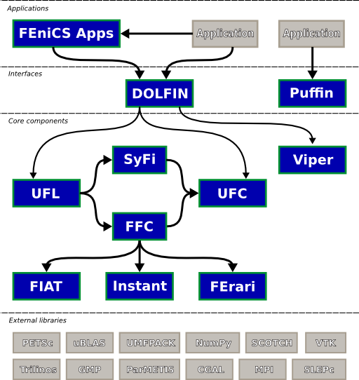

.. General introduction to the FEniCS Project.

.. _About:

########################
About the FEniCS Project
########################

The FEniCS Project is a collaborative project for the development of
innovative concepts and tools for automated scientific computing, with
a particular focus on automated solution of differential equations by
finite element methods.

The methodology and software developed as part of the FEniCS Project
are documented in a number of :doc:`research articles <../citing/index>`
and a :doc:`book <../book/index>`.

********
Features
********

FEniCS has an :ref:`extensive list of features <features>` for
automated, efficient solution of differential equations, including
automated solution of variational problems, automated error control
and adaptivity, a comprehensive library of finite elements, high
performance linear algebra and many more.

**********
Components
**********

FEniCS is organized as a collection of interoperable components that
together form the FEniCS Project. These components include the
problem-solving environment :ref:`DOLFIN <about_components_dolfin>`,
the form compiler :ref:`FFC <about_components_ffc>`, the finite
element tabulator :ref:`FIAT <about_components_fiat>`, the
just-in-time compiler :ref:`Instant <about_components_instant>`, the
code generation interface :ref:`UFC <about_components_ufc>`, the form
language :ref:`UFL <about_components_ufl>` and a range of
:ref:`additional components <about_components_additional>`. A deeper
look at these various FEniCS components can be found :ref:`here
<about_components>`.

Building on these components, software specialized to solving
different problems are organised into separate :doc:`applications
<../applications/index>`.

************
Contributors
************

The FEniCS Project is developed by :ref:`researchers from a number of
research institutes <team>` from around the world. The following
research institutes contribute significant resources to the FEniCS
Project:

* `Simula Research Laboratory <http://www.simula.no>`__
* `University of Cambridge <http://www.cam.ac.uk>`__
* `University of Chicago <http://www.uchicago.edu/index.shtml>`__
* `Texas Tech University <http://www.ttu.edu/>`__
* `KTH Royal Institute of Technology <http://www.kth.se>`__

Contributions have also been made by researchers from `Chalmers
University of Technology <http://www.chalmers.se>`__, `Delft
University of Technology <http://www.tudelft.nl>`__, `Argonne National
Laboratory <http://www.anl.gov>`__ and many other research institutes.
A full list of contributors is maintained as part of the source code
of each FEniCS component.

The following video illustrates the development of the FEniCS Project
since its inception in 2003.

.. raw:: html

    
<iframe width="425" height="349" src="http://www.youtube.com/embed/0E6DGUbRrO4" frameborder="0" allowfullscreen></iframe>

.. _about_license:

*******
License
*******

All FEniCS :ref:`core components <about_components_core>` are licensed
under the `GNU LGPL <http://www.gnu.org/licenses/lgpl.html>`__ as
published by the `Free Software Foundation <http://www.fsf.org>`__,
either version 3 of the license, or (at your option) any later
version.

All other FEniCS components are licensed under either the `GNU GPL
<http://www.gnu.org/licenses/gpl.html>`__ or the `GNU LGPL
<http://www.gnu.org/licenses/lgpl.html>`__, either version 3 of the
license, or (at your option) any later version.

Authors and institutions have given their consent to licensing under
these terms `here <http://www.fenicsproject.org/pub/copyright>`__.

*****************
About these pages
*****************

These pages have been created by the `FEniCS Web Team
<https://launchpad.net/~fenics-web-core/+mugshots>`__ with the help of
`Mattias Schläger <http://www.sch-form.com>`__ who designed the
`graphical profile <http://www.fenicsproject.org/pub/graphics>`__. The
pages are built using the `Sphinx documentation system
<http://sphinx.pocoo.org>`__ in combination with some homebrew
scripting (for extraction of C++ documentation in particular). The
sources for these pages are maintained as a `Launchpad project
<https://launchpad.net/fenics-web>`__. Comments and bug reports are
welcome as always. If you find something is in error or missing,
`please file a bug report
<https://bugs.launchpad.net/fenics-web/+filebug>`__ with Launchpad.

.. toctree::
   :hidden:

   components
   features
   team
