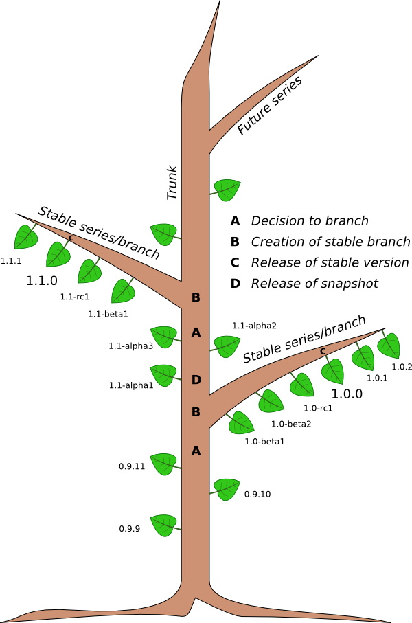

.. _development_model:

#################
Development model
#################

*This is a draft proposal for a FEniCS development model.*

***************
The big picture
***************

FEniCS development follows the model illustrated below.

We note the following important points:

* Development happens in the **trunk**.
* At any time, there may exist one or more **stable branches**.
* **Stable releases** are made from stable branches.
* **Snapshot releases** are made from trunk.
* Blueprints may be targeted to a future **series** (for which there
  is yet no branch of the source repository).

***************
Stable releases
***************

The following process should be followed for the creation of a stable
release (version X.Y.0):

1. A **suggestion** is made on the FEniCS mailing list to create a new stable release.
2. Concensus is reached that the timing is good.
3. A **release manager** is appointed.
4. The X.Y **branch** is created and X.Y-beta1 is released.
5. A number of **X.Y-betaN** releases may follow.
6. One or more release candidates **X.Y-rcN** are released.
7. The stable version **X.Y.0** is released.

A reasonable schedule for the release process is one week from the
time the suggestion is made (1) to the time when the X.Y branch is
created (2), and one month from the creation of the X.Y branch (2) to
the release of X.Y.0 (7).

At the time of branching, the following conditions should be met:

1. There should be **no blueprints** targeted to the X.Y series.
2. The buildbots should be green.
3. A release manager should have been appointed.

The release manager coordinates the work towards X.Y.0 and has the
following responsibilities:

1. Following steps (4)-(7) above.
2. Coordinating and retargeting bugs.
3. Setting reasonable deadlines.
4. Following up on deadlines.
5. Informing other developers about the release process.

The release manager is appointed in consensus among the developers. It
is natural but not necessary that the developer initiating the release
process is also the release manager.

Once X.Y.0 has been released, it may be followed by bug fix releases
X.Y.1, X.Y.2, etc.

*****************
Snapshot releases
*****************

The creation of a stable release involves a fair amount of
administration and it is also a lengthy process. Another type of
release is a **snapshot release** made directly from trunk in between
stable releases. Such an *ad hoc* release can be made at any time, as
long as the buildbots are green.

Developers may want to create snapshot releases for many reasons:

* to point a collaborator to a fixed snapshot of trunk;
* to get more testing of a new feature;
* if the ChangeLog is growing long;
* for the fun of making a release.

The following simple procedure should be followed for snapshot
releases:

1. Announce the intention to make a snapshot release on the FEniCS mailing list.
2. Wait a day.
3. Make the release.

Snapshot releases don't need to wait for new features to be completed
as long as the buildbots are green. We can always make a new snapshot
release when that feature has been implemented.

********************
Miscellaneous issues
********************

* A bug should only be marked as "fix committed" when it has been
  merged into trunk or a stable branch (not when it is pushed to a
  personal branch).
* X.Y-betaN releases are used to grind out bugs.
* X.Y-rcN releases are made when we believe there are "no" bugs.
