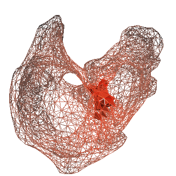
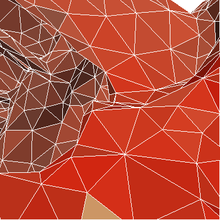
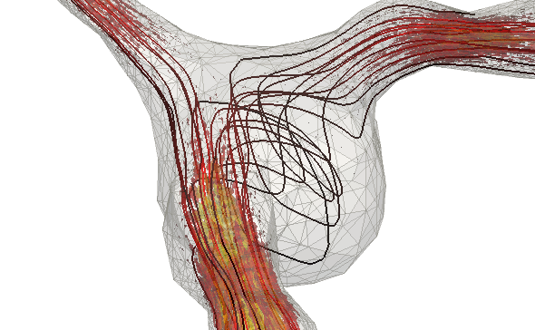

################################################
Automated adaptivity and error control in FEniCS
################################################

| Featured article 2011-08-29
| *Created by Marie E. Rognes, simulations by Anders E. Johansen*

Adaptivity and error control go hand in hand for numerical simulations
of differential equations. Controlling the error of a numerical
approximation is a prerequisite for more reliable simulations, while
adapting the discretization to local features of the problem can lead
to more efficient simulations. Goal-oriented adaptivity and error
control allow a further enhancement: numerical simulations targeted at
a specific **quantity of interest**.

Here you see an example: automated adaptive refinement steered towards
the computation of the wall stresses at a part of the human atria
modelled by an anisotropic, hyperelastic body [#]_.

*****************************
We have automated it for you!
*****************************

The FEniCS components support automated goal-oriented error control
for stationary variational problems. What does this mean? This means
that any variational problem that can be solved with a variational
solver can **just as easily** be solved with an adaptive variational
solver. The adaptive variational solver simply takes a tolerance and
the quantity of interest as additional input. So, in the most basic
case, instead of:

.. code-block:: python

    solve(F == 0, w, bc)

one can write

.. code-block:: python

    solve(F == 0, w, bc, tol=..., M=...)

You might wonder how it works? Well, in short, the adaptive
variational solver carries out a loop over meshes; starting with an
initial mesh, it estimates the error and where to best refine,
refines, and continues until the error tolerance is reached. The error
estimates and refinement indicators are based on automatically
generated **dual-weighted-residual** based estimates. In particular,
these estimates and indicators are generated (on the fly) for each
given variational problem and goal-functional, and therefore directly
tuned to the problem at hand. For more information, see [#]_.

**************
How to use it
**************

Below is a simple code example for the automated adaptive variational
solvers using the DOLFIN Python interface. The variational problem at
hand is the stationary Navier--Stokes equations over a mesh of an
aneurysm [#]_, subjected to a prescribed pressure at one of the inlet
vessels. The goal functional (or target quantity of interest) is the
outflux of one of the other vessels.

More standalone examples (including C++ examples) can be found in the
:ref:`DOLFIN demo directories <documentation>`.

.. code-block:: python

    from dolfin import *

    # Load mesh and boundary indicators from file
    mesh = Mesh("aneurysm.xml")
    bc_markers = MeshFunction("uint", mesh, "markers.xml")
    ds = Measure("ds")[bc_markers]

    # Define function spaces
    V = VectorFunctionSpace(mesh, "CG", 2)
    Q = FunctionSpace(mesh, "CG", 1)
    W = V*Q

    # Create functions
    (v, q) = TestFunctions(W)
    w = Function(W)
    (u, p) = split(w)

    # Define variational form
    n = FacetNormal(mesh)
    F = (0.01*inner(grad(u), grad(v)) + inner(grad(u)*u, v)
         - div(v)*p + q*div(u))*dx + dot(n, v)*ds(3)

    # No-slip boundary condition for the velocity
    bc = DirichletBC(W.sub(0), Constant((0.0, 0.0, 0.0)), bc_markers, 4)

    # Define goal functional
    M = inner(u,n)*ds(2)

    # Solve adaptively
    solve(F == 0, w, bc, tol=0.01, M=M)

----------------
Developers' tip:
----------------

One final tip: in our experience, (goal-oriented) adaptivity based on
mesh refinement is typically the most useful if the variational
problem at hand has local features, such as sharp interfaces or
singularities, or if the goal functional is localized to certain parts
of the computational domain.

.. rubric:: Footnotes

.. [#] Mesh of the human atria constructed at Simula Research
       Laboratory from a segmentation provided by Institute of
       Biomedical Engineering at Karlsruhe Institute of Technology of
       the The Visible Man data set, made available by the National
       Institutes of Health.

.. [#] Marie E. Rognes and Anders Logg: `Automated goal-oriented error
       control I: stationary variational problems
       <http://home.simula.no/~logg/pub/papers/RognesLogg2010a.pdf>`__,
       submitted to journal, 2010.

.. [#] Mesh of aneurysm constructed by Ida Norderhaug Drøsdal and
       Kent-Andre Mardal based on CT images provided by Søren Jakob
       Bakke at the National hospital of Norway.

