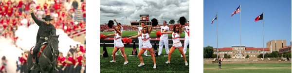

#######################
FEniCS'11 at Texas Tech
#######################

| Featured article 2011-08-26
| *Created by Robert C. Kirby*

The FEniCS project is dedicated to the automation of software for
solution of differential equations. We are pleased to co-locate the
next installment of the FEniCS meeting with the `Texas Tech Red Raider
Minisymposium <http://www.math.ttu.edu/current/redraider2011/>`__
hosted by the `Department of Mathematics and Statistics
<http://www.math.ttu.edu/>`__ at `Texas Tech University
<http://www.ttu.edu/>`__.

We welcome participation from all those interested in developing and
applying high-level, high-performance mathematical software, including
the FEniCS project and other similar projects.

The meeting will be held at the `Lubbock Embassy Suites Hotel
<http://www.lubbockembassysuites.com>`__. TTU has reserved a room
block. To request a room in the block, please contact Deanna McKinin,
Supervisor for the Department of Mathematics and Statistics. Her email
address is `deanna.mckinin@ttu.edu`.
