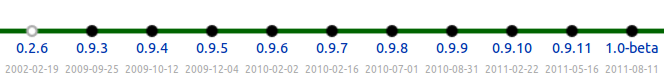

.. _featured_1_0_beta:

###############
FEniCS 1.0-beta
###############

| Featured article 2011-08-17
| *Created by Anders Logg*

******************
Long in the making
******************

After 9 years of intense development, we are (almost!) ready to make
our first official release: **FEniCS 1.0**. This is marked by the
recent release of FEniCS 1.0-beta. FEniCS 1.0-beta is the result of a
:ref:`joint research project <citing>` for the development of
innovative concepts and tools for automated scientific computing.

*********************
An evolving interface
*********************

Over the years, our focus been as much on the development of efficient
implementations (backends) as on the design of an intuitive and
**automated problem solving environment** for the solution of partial
differential equations. As a result, the FEniCS user interface has
evolved over the years, which has led to some frustration among users
when applications need to be rewritten to match an evolving
interface. But more importantly, the result is a now matured and
**polished user interface** that we believe provides a much improved
experience for FEniCS users. We feel confident that the interface has
converged and we are ready to release FEniCS 1.0. This does not mean
that the interface will remain constant forever, but we will think
twice before making any disruptive changes to the interface!

.. code-block:: python

    # Define variational problem
    a = dot(grad(u), grad(v))*dx
    L = f*v*dx

    # Compute solution
    u = Function(V)
    solve(a == L, u, bc)

***********************
Extensive documentation
***********************

Over the last couple of years, we have also worked hard to add an
important missing piece to the FEniCS Project: **good documentation**.
We can now provide an :ref:`extensive tutorial <tutorial>`, detailed
:ref:`API documentation <documentation>` and a range of
:ref:`documented demos <documentation>`. In addition, we have recently
completed the work on a :ref:`700-page book <book>` that documents the
methodology behind the FEniCS Project and highlights a number of
applications in computational science based on FEniCS.

********************
Ease of installation
********************

Installation of our software remained a challenge for many years, in
part due to the large number of third-party libraries that the FEniCS
software depends on. We therefore made ease of installation a high
priority and we can now offer :ref:`prebuilt binaries
<binary_packages>` for **GNU/Linux** (Debian and Ubuntu), **Mac OS X**
and **Windows**, as well as an :ref:`automated installation script
<installation_using_dorsal>` for other platforms.

*************
Going forward
*************

After the release of 1.0-beta, users can expect a release of
**1.0-rc1** and, perhaps, **1.0-rc2**, before the **release of
1.0**. An exact release date cannot be promised as it depends on how
long it takes for us to fix remaining bugs. Remember that we are all
scientists who work on FEniCS in between writing papers and referee
reports, teaching courses and supervising students.  The road towards
1.0 can be followed `here <https://launchpad.net/dolfin/trunk>`__.

After the release of 1.0, we look forward to adding **new and exciting
features** to FEniCS. Items of current interest include improved (and
optimized) support for parallel computing, improved adaptive mesh
refinement (and coarsening), improved support for computing on
non-matching overlapping meshes, and automated discretization of ODEs and
time-dependent PDEs.
