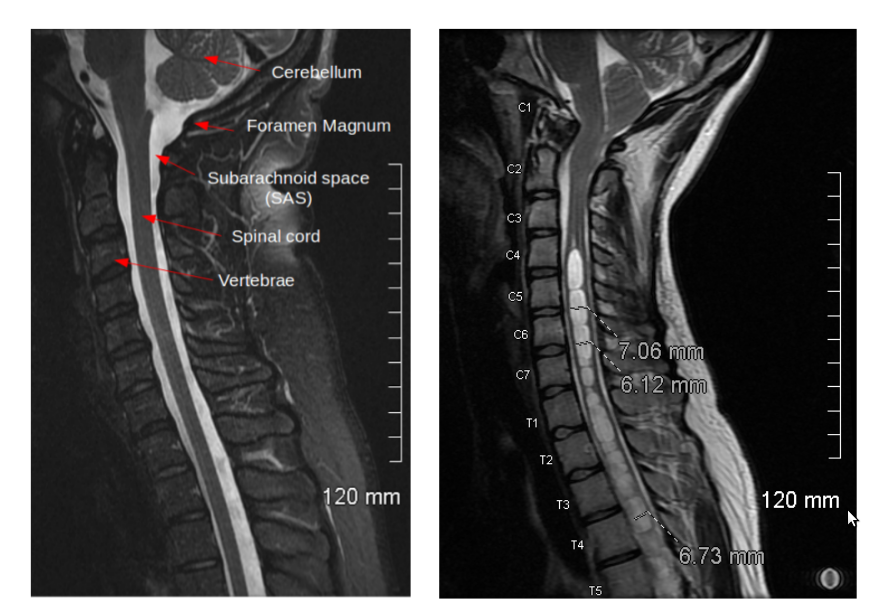
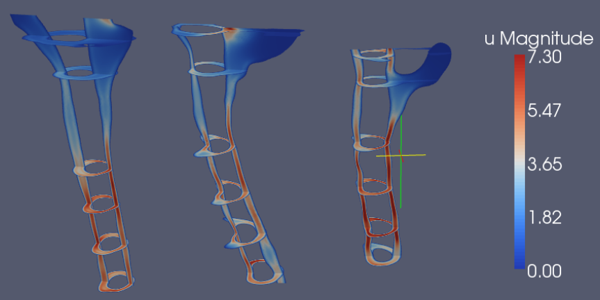

########################################################
Patient-specific simulations of cerebrospinal fluid flow
########################################################

| Featured article 2012-05-10
| *Created by G. Rutkowska, V. Haugthon, S. Linge and K.-A. Mardal*

This article briefly describes the results of a FEniCS and VMTK based
study of the flow of cerebrospinal fluid in the spinal canal in
patients with the Chiari I malformation. The study is published in the
prestigious journal AJNR, see `[1]
<http://www.ajnr.org/content/early/2012/04/19/ajnr.A3047.abstract?sid=302a30ad-18df-4c46-b52a-597166fb0263>`__.

***************************************
Chiari I malformation and syringomyelia
***************************************

The Chiari I malformation (see Figure 1) is a malformation of the
brain (or maybe skull), characterized by a downward displacement of
the lower part of the brain that may even be outside the skull. Around
1% of the population have this condition and the symptoms vary from
occasional headache to chronic pain and paralysis. The reasons for the
symptoms are believed to be associated with the flow of cerebrospinal
fluid in and out of the head that occurs as the brain expands and
shrinks to accommodate the blood pulsating in and out of the brain
during a heart cycle.  The Chiari I malformation is often associated
with syringomyelia (50%), a condition where cavities of fluid form and
grow within the spinal cord, destroying the tissue of the spinal cord
in the process. Recent findings demonstrate that CSF flow in Chiari
patients is different from normals, see `[2]
<http://radiology.rsna.org/content/232/1/229.full>`__.

Figure 1: The left image shows a sagital MR image of a healthy
individual, while the right image shows a person with the Chiari I
malformation (Cerebellum occupying the subarachnoid space close to
C1/Foramen Magnum) and syringomyelia (white cysts within the spinal
cord).

*************
VMTK + FEniCS
*************

In the current study, computational meshes from 12 individuals were
created using `VMTK <http://www.vmtk.org>`__ , a toolkit for
generating finite element meshes from medical images. VMTK has
recently been extended with tools for marking boundary conditions and
subdomains and exporting these to the DOLFIN mesh format directly. The
CFD simulation tools are based on `nsbench
<http://launchpad.net/nsbench>`__ described in Chapter 21 in the
`FEniCS book <http://www.fenicsproject.org/book>`__. See the `thesis
<http://www.duo.uio.no/sok/work.html?WORKID=132935>`__ of Gabriela
Rutkowska for more details. Figure 2 and 3 show some simulation
results, illustrating that CSF velocities are significantly higher in
Chiari patients than in healthy or post-operative individuals.

.. image:: images/pat.png

Figure 2: Peak systolic velocity magnitude in three Chiari patients.

Figure 3: Peak systolic velocity magnitude in one volunteer (left) and two postoperative patients with signs of
tonsils at Foramen magnum.

Optimal treatment of Chiari patients and the development of
syringomyelia has to date been a puzzle for clinicians.  Only recently
it has been discovered that CSF velocities in Chiari I patients differ
significantly from normals, using modern PC-MR techniques.  From an
engineering perspective, the increased velocities in Chiari patients
suggest increased or focused pressure gradients and stress, or
decreased resistance, which results in damage of the central nervous
system in the spinal cord. Using the VMTK+FEniCS pipeline from medical
images to CFD computations of velocity, pressure and stress of the
cerebrospinal fluid, we may be on the right track to solve the 100
year old enigma of this condition described by Hans Chiari. For more
info about this condition we refer to the `COH
<http://www.columnofhope.org>`__ and `CSF <http://www.csfinfo.org>`__
foundations.
