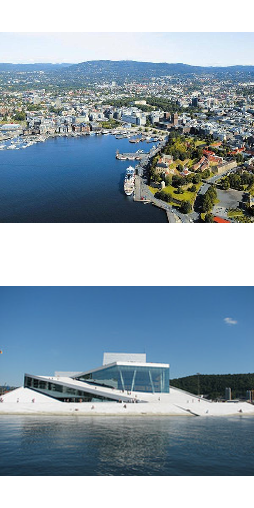
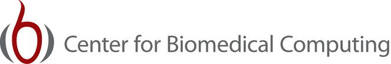

######################################################
FEniCS'12 at Simula Research Laboratory, June 5 -- 7
######################################################

| Featured article 2012-03-22
| *Created by Marie E. Rognes*

We are pleased to announce this year's edition of the annual FEniCS
workshop:

  *FEniCS'12: High-performance PDE frameworks for modern architectures*

taking place June 5 -- 7 2012 at `Simula Research Laboratory
<http://www.simula.no>`__, Oslo, Norway.

**Update** (May 14 2012): the `tentative schedule
</_static/images/featured/schedule_140512.pdf>`_ is available.

All FEniCS users, developers and other interested parties are invited
to celebrate the recent release of FEniCS 1.0 and the FEniCS Book, and
to discuss future directions for FEniCS development. A half-day FEniCS
tutorial will be offered as part of the workshop.  Participation in
the workshop and tutorial is free of charge.

We have open slots for contributed talks: if you are interested in
presenting your recent work, please email a title and a short abstract
to Marie Rognes (meg@simula.no) by **May 1 2012**.

To register for the workshop, please contact Marie Rognes
(meg@simula.no) by **May 15 2012**.

*****************
Workshop abstract
*****************

Generic software frameworks play an increasingly important role in the
numerical solution of partial differential equations. When new
hardware architectures are introduced, these software frameworks must
adapt to leverage the computational power of the new hardware and to
match the performance of specialized hand-written code.

This workshop aims to bring together experts on generic software for
partial differential equations and high performance computing on
modern architectures. Topics include

- User-friendly programming tools for many-core CPUs and GPUs
- Automated code translation and generation targeting modern hardware
- Hybrid computing using both CPUs and GPUs
- Innovative PDE software techniques
- Free/open-source software for numerical solution of PDEs

*Invited speakers*

- Scott Baden
- Andre Brodtkorb
- Carsten Burstedde
- Filipe Cruz
- Paul Kelly
- Ridgway Scott
- Andy Terrell
- Garth Wells

*Organizing committee*

-  Anders Logg
-  Marie Rognes
-  Xing Cai

*Registration*

  By email to Marie Rognes (meg@simula.no) by May 15.

\

