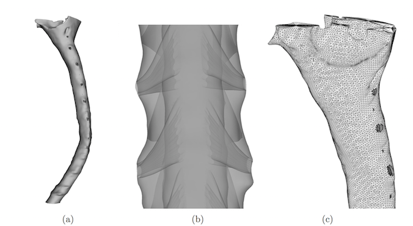
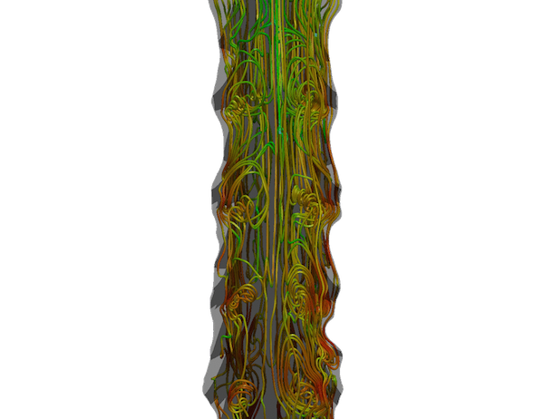

##########################################################################
Subject-specific simulations of cerebrospinal fluid flow and drug delivery
##########################################################################

| Featured article 2015-06-12
| *Created by P.T Haga, M. Mortensen, K.-A. Mardal and M. Kuchta*

The cerebrospinal fluid (CSF) surrounds the central nervous system (CNS), and drugs infused into the CSF can thus quickly be absorbed. However, because of large subject-specific variations and a complex oscillating flow, it has been proven difficult to predict and control the addition of drugs [1]_. A study has been done to simulate the flow and drug transport of the CSF in a subject-specific model of the cranial region of the spine using FEniCS. This article briefly describes the results of the study.

***********************************
Subject-specific computational mesh
***********************************
A three dimensional geometry of the cervical subarachnoid space is shown in Figure 1. The geometry was provided by Dr. Bryn Martin at the Conquer Chiari Research Center at the University of Akron, and more information can be found in [2]_. The geometry contains idealized nerve roots and denticulate ligaments (NRDL) constructed manualy based on known anatomy from literature.

**Figure 1:** SSS geometry and computational surface mesh. (a) Complete surface model. (b) Transparent model showing nerve roots and denticulate ligaments. (c) Surface elements of the final computational mesh.

****************************
Lagrangian Particle Tracking
****************************
Due to very low diffusivity of the drugs, numerical issues may arise when using the Finite Element Method on the advection-diffusion equation. Lagrangian Particle Tracking is a method where such issues are not present. This method uses discrete particles and utilizes the velocity field to compute the position of the particles. In other words, for every particle, we solve the equation

.. math::

  	\frac{\partial x_p}{\partial t} = u(x_p,t),

where :math:`x_p` is the position of one particle, and :math:`u` is the velocity field. The particle density in one cell is computed simply by using the formula

.. math::

	\rho_{\kappa} = \frac{\text{number of particles in cell}}{\text{volume of cell}}.

The Lagrangian Particle solving for FEniCS uses an object-oriented frame, meaning that all particles are represented by objects, as shown below.

.. code:: python

	class Particle:
	    'Lagrangian particle with position and some other passive properties.'
	    def __init__(self, x):
	        self.position = x
	        self.properties = {}

	    def send(self, dest):
	        'Send particle to dest.'
	        comm.Send(self.position, dest=dest)
	        comm.send(self.properties, dest=dest)

	    def recv(self, source):
	        'Receive info of a new particle sent from source.'
	        comm.Recv(self.position, source=source)
	        self.properties = comm.recv(source=source)

At every time-step, the particles are moved subject to the velocity field, given by a dolfin-function "u".

.. code:: python
	
	from LagrangianParticles import LagrangianParticles, ParticleSource

	...

	# Function space
	V = VectorFunctionSpace(mesh, 'CG', 1)

	# Initialize Lagrangian Particle Solver
	lp = LagrangianParticles(V)

	# Particle source
	source = ParticleSource(lp, \
    		random_generator=RandomCircle([0.5, 0.75], 0.15))

	while t < T:

		# Inject particles
		if t < injection_time:
			source.apply(500)

		....

		lp.step(u,u_1,dt)

		....

***************
CFD simulations
***************
The simulations were done using the Open Source high-performance Navier-Stokes solver Oasis [3]_ coupled with the Lagrangian Particle Tracking for FEniCS [4]_ made by M. Kuchta and M. Mortensen. The solver was run on Abel supercomputer using 96 cores. The resulting velocity field revealed the formation of vortical structures in conjuction with the nerve roots and denticulate ligaments, as shown in Figure 2.

**Figure 2:** Streamlines of the cerebrospinal fluid shows vorticity around the nerve roots and denticulate ligaments.

The particles were injected with a velocity corresponding to a 1 ml injection over 1 minute with a 22 gauge needle. 54 particles were injected every time-step giving a total of approximately 130.000 particles after 5 cardiac cycles. Figure 3 shows an animation of the drug concentration during the 5 first cardiac cycles. 

.. image:: images/scalar_anim.gif
	:align: center

**Figure 3:** An animation of the drug concentration for the first 5 cardiac cycles. The color represents the number of particles per :math:`mm^2`.

Sensitivity analysis of lateral and longitudinal injection sites, injection angle and injection velocity was done. This revealed a relatively large difference in drug spread with different longitudinal injection points. This result was even seen for injection points with small distance from each other. Further investigation of this phenomenon revealed that one reason for the large difference in drug spread is that jet streams are formed in certain narrow regions of the subarachnoid space. The drug was also found somewhat sensitive to different lateral injection point and injection angle, while a small sensitivity was seen for different injection velocities.

References
*************************************************************************

.. [1] Hocking, G. and Wildsmith, J. A. W. Intrathecal drug spread. British Journal of Anaesthesia, 93(4):568–578, 2004. doi: 10.1093/bja/aeh204. URL http://bja.oxfordjournals.org/content/93/4/568.short.

.. [2] Soroush Heidari Pahlavian, Theresia Yiallourou, R. Shane Tubbs, Alexander C. Bunck, Francis Loth, Mark Goodin, Mehrdad Raisee, and Bryn A. Martin. The impact of spinal cord nerve roots and denticulate ligaments on cerebrospinal fluid dynamics in the cervical spine. PLoS ONE, 9(4):e91888, 04 2014. doi: 10.1371/journal.pone.0091888. URL http://dx.doi.org/10.1371%2Fjournal.pone.0091888.

.. [3] Mikael Mortensen and Kristian Valen-Sendstad. Oasis: A high- level/high-performance open source navier–stokes solver. Computer Physics Communications, 188(0):177 – 188, 2015. ISSN 0010-4655. doi: http://dx.doi.org/10.1016/j.cpc.2014.10.026. URL http://www.sciencedirect.com/science/article/pii/S0010465514003786.

.. [4] https://github.com/MiroK/lagrangian-particles

